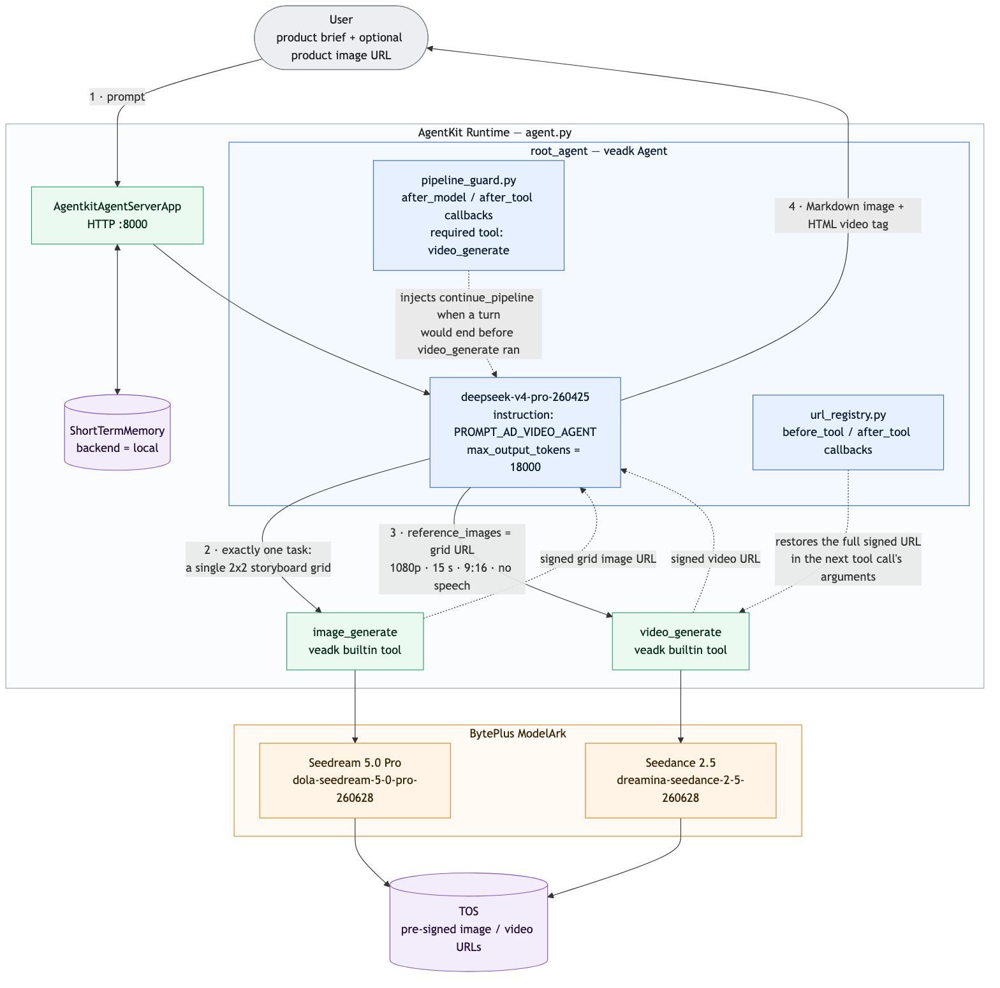

# 营销视频生成 Agent（BytePlus 版）

> English documentation: [README_en.md](README_en.md)

## 概述

本样例是一个基于 BytePlus AgentKit 与 VeADK 的单智能体电商营销视频生成器。

输入商品信息（商品名称、卖点、目标人群、使用场景、风格偏好，以及可选的商品图片 URL）后，Agent 会：

- 规划一个四段式营销故事（开场吸引 → 场景带入 → 卖点特写 → 行动号召）
- 生成一张包含四格分镜的 2x2 营销故事参考图
- 将参考图作为中间结果展示给用户
- 基于参考图生成一条连续的营销短视频（默认 9:16、1080P、15 秒，最长可到 30 秒）

本样例刻意采用轻量的单智能体架构：一个 Root Agent 直接调用内置的 `image_generate` 与 `video_generate` 工具完成完整流程。不包含候选视频生成、质量评估、视频拼接与 TOS 上传，这些能力请参考 `ad_video_gen_seq` 样例。



（架构图的 Mermaid 源码见 [README_en.md](README_en.md)）

## 核心功能

- **商品信息理解**：从商品名称、卖点、目标人群、使用场景与风格偏好中提取营销诉求
- **营销故事规划**：自动设计四段式营销故事，并映射到一张 2x2 分镜网格图上
- **商品参考图输入**：公网可访问的商品图片 URL 会以图生图参考的形式传给图像模型，保持商品外观、包装与配色一致
- **图生视频**：2x2 分镜图通过 `reference_images` 参数（而非首尾帧）传给 Dreamina Seedance 2.5，生成一条连续视频
- **可预览输出**：结果以 Markdown 图片与 HTML 视频标签返回，可在 AgentKit 调试页面直接预览
- **默认英文、跟随用户语言**：Agent 默认以英文规划与回复；用户使用其他语言时会自动切换（见 [`prompt.py`](prompt.py) 中的 `# Language` 一节）
- **视频无口播**：视频提示词只要求纯音乐与环境音，不包含对白、旁白或歌词，信息由画面、运镜与简短的画面文字传达

## Agent 能力

| 组件 | 说明 |
| --- | --- |
| **Agent 服务** | [`agent.py`](agent.py) - AgentKit 服务入口与 `root_agent` 定义 |
| **Agent 提示词** | [`prompt.py`](prompt.py) - 单智能体营销工作流提示词 |
| **自动续跑守卫** | [`pipeline_guard.py`](pipeline_guard.py) - 若模型在 `video_generate` 运行前就以纯文本结束回合，会注入 `continue_pipeline` 工具调用让流程继续，用户无需手动输入"继续" |
| **签名 URL 注册表** | [`url_registry.py`](url_registry.py) - 工具返回的 TOS 预签名 URL 常被模型在后续调用中截断导致 `403 Forbidden`；注册表记录每个工具返回的 URL，并在下一次工具调用前还原完整签名 URL |
| **模型默认值** | [`consts.py`](consts.py) - VeADK 使用的默认模型名与 API 地址 |
| **短期记忆** | 维护会话上下文，保证多轮对话连续性 |

## 目录结构说明

```bash
ad_video_gen
├── LICENSE               # 代码许可（Apache 2.0）
├── README.md             # 中文说明文档（本文件）
├── README_en.md          # 英文说明文档
├── project.yaml          # 项目信息元数据
├── agent.py              # 主程序入口，定义 root_agent 与 AgentKit 服务
├── prompt.py             # 营销视频工作流提示词
├── consts.py             # 默认模型名、API 地址与 .env 加载逻辑
├── pipeline_guard.py     # 自动续跑守卫回调
├── url_registry.py       # 签名 URL 注册表回调
├── assets
│   └── images            # 架构图等静态资源
├── .env.example          # 环境变量示例文件
├── pyproject.toml        # 项目依赖管理文件（uv）
└── requirements.txt      # 项目依赖管理文件（pip）
```

## 本地运行

**注意**：本样例在 Python 3.12 下测试通过，仓库中其他样例可能需要不同的 Python 版本，推荐使用 [mise](https://mise.jdx.dev/getting-started.html) 管理多版本 Python。

### 前置准备

**BytePlus 访问凭证**

请先配置 IAM 用户并创建 Access Key / Secret Key，同时为该用户授予以下权限：

- `AgentKitFullAccess`（AgentKit 完全访问）
- `APMPlusServerFullAccess`（APMPlus 完全访问）

在 BytePlus 控制台搜索 "ModelArk"，在 "Model activation" 页面确认以下模型已开通：

- **文本模型**：DeepSeek V4 Pro（模型 ID：`deepseek-v4-pro-260425`）
- **图像模型**：Seedream 5.0 Pro（模型 ID：`dola-seedream-5-0-pro-260628`）
- **视频模型**：Dreamina Seedance 2.5（模型 ID：`dreamina-seedance-2-5-260628`，支持最长 30 秒的视频片段）

最后在 "API Keys" 页面创建并保存一个 API Key，后续配置环境变量时会用到。

### 依赖安装

推荐使用 `uv` 管理 Python 依赖：

```bash
uv sync
```

或者使用 `pip` 安装：

```bash
pip install -r requirements.txt
```

### 环境准备

设置以下环境变量：可以直接在 shell 中 export，也可以将 [`.env.example`](.env.example) 复制为 `.env` 并填写。`.env` 会在启动时自动加载（见 [`consts.py`](consts.py)），其中的值优先于 shell 环境变量；`.env` 只对本地运行生效，云端部署需通过 `agentkit config --runtime_envs ...` 传入（见下文）：

```bash
export MODEL_AGENT_API_KEY={{your_model_agent_api_key}} # 从 BytePlus ModelArk 获取
export AGENTKIT_CLOUD_PROVIDER=byteplus
export CLOUD_PROVIDER=byteplus
```

**注意**：`AGENTKIT_CLOUD_PROVIDER` 与 `CLOUD_PROVIDER` 均为**必填**。前者由 agentkit SDK 读取，后者由 veADK 读取，用于控制默认 Endpoint、默认模型以及 `BYTEPLUS_*` 凭证到 veADK 内部 `VOLCENGINE_*` 变量的映射。缺少它们时 SDK 会回退到火山引擎（中国大陆）默认值，导致对 BytePlus 账号的调用失败。

Agent、图像与视频模型名及 API 地址默认取 [`consts.py`](consts.py) 中的值，如需覆盖：

```bash
export MODEL_AGENT_NAME=deepseek-v4-pro-260425
export MODEL_IMAGE_NAME=dola-seedream-5-0-pro-260628
export MODEL_VIDEO_NAME=dreamina-seedance-2-5-260628
```

### 调试方法

本地调试最简单的方式是使用 `veadk web`：

> `veadk web` 是一个基于 FastAPI 的 Web 调试服务。运行后会启动一个加载了本 Agent 代码的 Web 服务器，并提供聊天界面；在界面侧边栏中可以查看 Agent 的思考过程、工具调用以及模型输入输出。

在项目目录内运行：

```bash
uv run veadk web
```

浏览器访问 `http://localhost:8000`，选择 `ad_video_gen` Agent，输入提示词并发送即可。

## AgentKit 部署

**第 0 步**：如尚未安装 agentkit CLI，可在 Python 虚拟环境中安装：

```bash
uv pip install agentkit-sdk-python
```

**第 1 步**：确认当前处于 `ad_video_gen` 目录，然后配置 AgentKit。

**注意**：`agentkit` CLI 自身不读取 `.env`（只有 Agent 进程会在启动时加载），如果变量保存在 `.env` 中，请先导出到当前 shell：

```bash
set -a && source ./.env && set +a
```

这同时会导出 CLI 认证所需的 `BYTEPLUS_ACCESS_KEY` 与 `BYTEPLUS_SECRET_KEY`。

```bash
uv run agentkit config \
--agent_name ad_video_gen \
--entry_point 'agent.py' \
--runtime_envs MODEL_AGENT_API_KEY=$MODEL_AGENT_API_KEY \
--runtime_envs AGENTKIT_CLOUD_PROVIDER=byteplus \
--runtime_envs CLOUD_PROVIDER=byteplus \
--cloud_provider byteplus \
--launch_type cloud
```

**注意**：`--cloud_provider byteplus` 参数是必需的。缺少它时 CLI 默认使用火山引擎，`agentkit launch` 会在解析账号 ID 时报错 `Volcengine credentials not found (Service: sts)`。

**第 2 步**：部署 Runtime：

```bash
uv run agentkit launch
```

部署成功后：

1. 访问 [BytePlus AgentKit 控制台](https://console.byteplus.com/agentkit/region:agentkit+ap-southeast-1/overview?projectName=default)
2. 点击 **Runtime** 查看已部署的 `ad_video_gen`
3. 获取公网访问域名（形如 `https://xxxxx.apigateway-ap-southeast-1.apigw-byteplus.com`）与 API Key

也可以直接使用 `agentkit invoke` 触发 / 调试：

```bash
uv run agentkit invoke '{"prompt": "Generate a marketing video for a sparkling yuzu drink, fresh and summery, vertical 9:16"}'
```

不再需要时，可以清理已部署的 Runtime：

```bash
uv run agentkit destroy
```

## 示例提示词

- "请为一款杨梅饮品生成商品展示视频，竖屏 9:16，清新夏日风格。卖点：天然杨梅、酸甜可口、冰镇更爽，适合火锅、烧烤、聚会场景。"
- "请为奶香手撕吐司生成一条电商营销视频。使用场景：早餐、下午茶、露营野餐。核心卖点：奶香浓郁、口感松软、烤后外脆内软、适合全家分享。风格：温暖、明亮、有食欲。"
- "为一款侘寂风香薰蜡烛生成 30 秒种草视频。目标人群：喜欢极简家居和睡前放松的都市上班族。卖点：天然大豆蜡、木质香调、水泥罐可复用。视觉风格：克制、安静、高级。"

## 效果展示

Agent 的一次完整运行过程如下：

1. 根据商品描述规划四段式营销故事
2. 生成一张 2x2 分镜参考图并立即展示
3. 基于参考图生成一条连续的营销视频（可能需要数分钟）
4. 最终回复中包含参考图与可直接播放的 HTML 视频预览

整体架构与数据流见上方架构图（`assets/images/architecture.png`）。

## 常见问题

**是否支持直接上传图片或 base64 图片？**

当前样例仅支持公网可访问的图片 URL 作为商品参考图，不支持直接上传或 base64 图片。

**是否会生成多个候选视频并自动评估？**

单智能体版本默认只生成一张参考图和一条视频，不包含候选生成、质量评估、拼接与上传流程——这些能力见 `ad_video_gen_seq` 样例。

**视频比例和时长可以调整吗？**

可以。默认生成 9:16、1080P、15 秒的视频；如明确要求横屏、方形或自定义时长，Agent 会按要求生成。Dreamina Seedance 2.5 支持 4 到 30 秒的时长。

## 代码许可

本工程遵循 Apache 2.0 License
