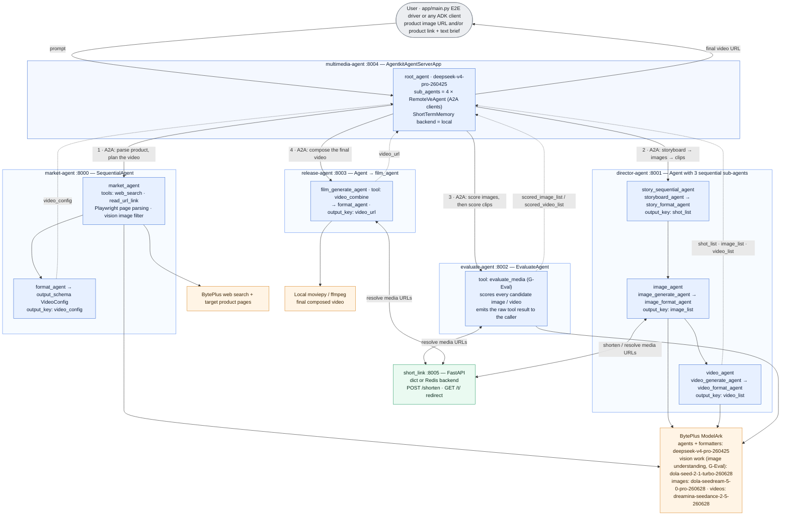

# Ad Video Generation Agent (A2A Multi-Agent) - E-commerce Marketing Videos

**IMPORTANT**: This demo was tested with Python 3.12, but other demos here require other versions of Python. We recommend installing and managing multiple versions of Python with [mise](https://mise.jdx.dev/getting-started.html).

This is a distributed multi-agent e-commerce marketing video generator based on BytePlus AgentKit and VeADK. Unlike the `ad_video_gen_seq` sample, which runs all agents inside one process, this sample splits the pipeline into **independently deployable services** that talk to each other over the **A2A (Agent-to-Agent) protocol**, each also exposing an MCP endpoint.

When given product information (a product image URL and/or a product link plus a text brief), it will:

- Parse the product assets and produce a marketing plan and video configuration script
- Design a 4-shot storyboard following the AIDA marketing model (Attention → Interest → Desire → Action)
- Generate candidate first-frame images per shot (Dola Seedream 5.0 Pro), then score and select the best ones
- Generate candidate videos per shot from the selected first frames (Dreamina Seedance 2.5), then score and select the best ones
- Compose the selected shot videos into one final video locally (moviepy/ffmpeg)

## Overview

Six services cooperate to run the pipeline. The multimedia agent is the root orchestrator: it receives user requests and dispatches each stage to a remote worker agent over A2A. Three workers resolve compact short links through the short-link service so long asset URLs never pass through (and get corrupted by) the models.



Key features include:

- **A2A microservice topology**: each worker is a standalone VeADK A2A server (`veadk.a2a.ve_a2a_server`) publishing an agent card at `/.well-known/agent-card.json`; the orchestrator connects with `RemoteVeAgent` clients
- **MCP on every worker**: each worker also mounts a streamable-HTTP MCP endpoint at `/mcp` (via FastMCP), so the same capabilities are callable as MCP tools
- **Web-based product parsing**: the market agent reads product links with a local Playwright browser (with SSRF/DoS guards) and filters product images with a vision model
- **Candidate generation and automatic evaluation**: every shot gets several candidate images/videos which are scored on aesthetics, image quality, and consistency with the reference image
- **URL shortening for LLM safety**: generated media URLs are mapped to compact short links so the models never corrupt them
- **Malformed-JSON resilience**: every service applies shared [`workarounds.py`](app/market-agent/src/workarounds.py) patches that repair malformed model output (tool-call arguments, structured output) with `json-repair` instead of aborting the run
- **English by Default**: Every agent in the pipeline (orchestrator and the four workers) is instructed to work in English by default — plans, storyboard scripts, image/video prompts, evaluation rationales, and replies. If your request is written in another language, the agents switch to that language for all of those outputs so the results are easy for you to review (see the `# Language` section in each `prompt.py`)

## Agent Capabilities

| Component | Description |
| --- | --- |
| **Multimedia Agent** | [`app/multimedia-agent/`](app/multimedia-agent/) - root orchestrator; plans the pipeline and calls the four workers over A2A |
| **Market Agent** | [`app/market-agent/`](app/market-agent/) - parses product images/links, produces the video configuration script |
| **Director Agent** | [`app/director-agent/`](app/director-agent/) - storyboard script, storyboard images, and storyboard videos |
| **Evaluate Agent** | [`app/evaluate-agent/`](app/evaluate-agent/) - scores storyboard images and videos with a vision model |
| **Release Agent** | [`app/release-agent/`](app/release-agent/) - composes the final video locally with moviepy |
| **Short-Link Service** | [`app/short_link/`](app/short_link/) - FastAPI URL shortener (in-memory dict or Redis backend) |
| **E2E Driver** | [`app/main.py`](app/main.py) - runs the full 7-step pipeline against the local services |
| **Runtime Patches** | [`workarounds.py`](app/market-agent/src/workarounds.py) - shared JSON-repair and ADK patches (one copy per service) |
| **Auto-continue Guard** | [`pipeline_guard.py`](app/director-agent/src/pipeline_guard.py) - installed in the director, evaluate, and release services: if an agent ends its turn without its mandatory tool call (`transfer_to_agent`, `image_generate`, `video_generate`, `evaluate_media`, `video_combine`), the guard injects a `continue_pipeline` tool call so the service returns a complete result (one copy per service) |
| **Cloud Provider Bootstrap** | [`consts.py`](app/market-agent/src/consts.py) - sets `CLOUD_PROVIDER=byteplus` before veadk is imported (one copy per service) |
| **Config Examples** | `app/<service>/config.yaml.example` - per-service model names, API bases, and service URLs |

## Quick Start

### Prerequisites

#### BytePlus Access Credentials

Make sure you have configured an IAM user, created a new Access Key / Secret Key pair, and that you have assigned the following permissions to the user:

- `AgentKitFullAccess` (AgentKit full access)
- `APMPlusServerFullAccess` (APMPlus full access)

In the web console, open the product search dropdown and search for "ModelArk". Under "Model activation" make sure the following models are enabled:

- **Agent (text):** DeepSeek V4 Pro (model ID: `deepseek-v4-pro-260425`) — used by all five agent services
- **Vision tools:** Dola Seed 2.1 Turbo (model ID: `dola-seed-2-1-turbo-260628`) — used by the market agent's image-understanding/image-filter tools and the evaluate agent's media-scoring tool, which all consume images or videos
- **Images:** Dola Seedream 5.0 Pro (model ID: `dola-seedream-5-0-pro-260628`)
- **Video:** Dreamina Seedance 2.5 (model ID: `dreamina-seedance-2-5-260628`)

**Finally, from the "API Keys" page, create a new key and save it, we'll need it later on (see *Configure Environment Variables* below).**

#### Web Search API Key

The market agent's `web_search` tool needs a BytePlus Searchinfinity API key. In the web console, search for "Searchinfinity", enable the service, and create an API key — it becomes `BYTEPLUS_WEB_SEARCH_API_KEY` below.

#### TOS Bucket

The director agent uploads generated storyboard images to a TOS bucket. You can use the AgentKit platform bucket `agentkit-platform-{{your_account_id}}` (replace `{{your_account_id}}` with your BytePlus account ID) or any bucket the AK/SK pair can write to.

#### ffmpeg

Video composition uses `moviepy`, which needs a working `ffmpeg` on the machine that runs the release agent (e.g. `brew install ffmpeg` on macOS, `apt-get install ffmpeg` on Debian/Ubuntu).

#### Playwright Browser

The market agent parses product web pages with a headless Chromium browser. After installing the Python dependencies (next step), install the browser with:

```bash
uv run playwright install chromium
```

On a fresh Linux machine you may also need the browser's system libraries:

```bash
uv run playwright install-deps chromium
```

### Install Dependencies

*We recommend using uv to manage Python dependencies*

Once UV is installed, set up with:

```bash
uv sync
```

### Configure Environment Variables

Set the following environment variables — either export them in your shell, or copy [`.env.example`](.env.example) to `.env` (in the project directory — shared by all services — next to a service's `config.yaml`, in its `src/` dir, or in the directory you launch from) and fill it in. `.env` is loaded automatically at startup (each service's `consts.py`, and `app/short_link/app.py`) and is optional; values in `.env` take precedence over variables exported in the shell, and anything missing from `.env` falls back to the shell environment. `.env` only applies to local runs — for cloud deploys pass values through `agentkit config --runtime_envs ...` (see below):

```bash
export MODEL_AGENT_API_KEY={{your_model_agent_api_key}}        # Get from BytePlus ModelArk
export BYTEPLUS_ACCESS_KEY={{your_access_key}}                 # For TOS image upload (director)
export BYTEPLUS_SECRET_KEY={{your_secret_key}}                 # For TOS image upload (director)
export DATABASE_TOS_BUCKET=agentkit-platform-{{your_account_id}}
export BYTEPLUS_WEB_SEARCH_API_KEY={{your_web_search_api_key}} # Get from BytePlus Searchinfinity, required by the market agent's web_search tool
export AGENTKIT_CLOUD_PROVIDER=byteplus
export CLOUD_PROVIDER=byteplus
```

> **Note:** `AGENTKIT_CLOUD_PROVIDER` and `CLOUD_PROVIDER` are both **mandatory** — export them in every shell you start a service from, and pass both through to each deployed runtime. `AGENTKIT_CLOUD_PROVIDER` is read by the agentkit SDK, while veADK reads `CLOUD_PROVIDER` — it controls veADK's default endpoints, models, and the mapping of `BYTEPLUS_*` credentials onto the `VOLCENGINE_*` variables veADK uses internally. Without them the SDKs fall back to their Volcano Engine (mainland China) defaults and calls against your BytePlus account fail. Each service's [`consts.py`](app/market-agent/src/consts.py) sets `CLOUD_PROVIDER=byteplus` as a last-resort fallback inside that process, but that does not cover the agentkit SDK or the tools when run standalone, so do not rely on it.

Then create each service's `config.yaml` from its example (service URLs and model defaults are pre-filled; fill in `api_key`, or leave it empty if you exported `MODEL_AGENT_API_KEY` — environment variables take precedence over `config.yaml` keys):

```bash
for svc in market-agent director-agent evaluate-agent release-agent multimedia-agent; do
  cp app/$svc/config.yaml.example app/$svc/config.yaml
done
```

The model names can be overridden per service in its `config.yaml` or with environment variables (the values below are the defaults this sample is designed for):

```bash
export MODEL_AGENT_NAME=deepseek-v4-pro-260425
export MODEL_VISION_NAME=dola-seed-2-1-turbo-260628   # market agent's image tools
export MODEL_EVALUATE_ITEM=dola-seed-2-1-turbo-260628 # evaluate agent's scoring tool
export MODEL_IMAGE_NAME=dola-seedream-5-0-pro-260628
export MODEL_VIDEO_NAME=dreamina-seedance-2-5-260628
```

## Local Execution

Start the six services, each from its own directory (one terminal per service, or append `&` to background them). Start the short-link service and the four workers first — **the multimedia agent must start last**, because it fetches the workers' A2A agent cards at startup:

```bash
(cd app/short_link          && uv run python -m uvicorn app:app    --host 127.0.0.1 --port 8005 --loop asyncio)
(cd app/market-agent/src    && uv run python -m uvicorn app:app    --host 127.0.0.1 --port 8000 --loop asyncio)
(cd app/director-agent/src  && uv run python -m uvicorn app:app    --host 127.0.0.1 --port 8001 --loop asyncio)
(cd app/evaluate-agent/src  && uv run python -m uvicorn app:app    --host 127.0.0.1 --port 8002 --loop asyncio)
(cd app/release-agent/src   && uv run python -m uvicorn app:app    --host 127.0.0.1 --port 8003 --loop asyncio)
(cd app/multimedia-agent/src && uv run python -m uvicorn server:app --host 127.0.0.1 --port 8004 --loop asyncio)
```

You can check that a worker is up by fetching its agent card, e.g. `curl http://127.0.0.1:8000/.well-known/agent-card.json`.

Then run the end-to-end pipeline driver:

```bash
uv run python app/main.py
```

The driver creates a session on the multimedia agent and walks through the 7 pipeline steps, saving every intermediate result under `tmp-json/local-<timestamp>/`.

### Example Prompts

The driver's default request is:

> Generate a promotional video (Product Showcase Video) for a Christmas limited dark chocolate gift box, warm festive style. Product image: `http://lf3-static.bytednsdoc.com/obj/eden-cn/lm_sth/ljhwZthlaukjlkulzlp/ark/assistant/images/ad_chocolate.png`

Edit `user_need` at the bottom of [`app/main.py`](app/main.py) to try your own product.

**Expected Behavior:**

1. **Video configuration** — the market agent parses the product image/link and returns a video configuration script (product info, selling points, video type)
2. **Storyboard script** — the director agent designs a 4-shot AIDA storyboard
3. **Storyboard images** — the director agent generates candidate first-frame images per shot
4. **Image evaluation** — the evaluate agent scores the images; the driver picks the best per shot
5. **Storyboard videos** — the director agent generates 4 candidate videos per shot from the selected first frames
6. **Video evaluation** — the evaluate agent scores the videos; the driver picks the best per shot
7. **Final video** — the release agent composes the selected shot videos into the final video (saved under `merged_videos/`)

## AgentKit Deployment

Each worker is an independently deployable AgentKit runtime: the deployable unit is the service's `src/` directory, whose `requirements.txt` describes its footprint and whose `app.py` (workers) or `server.py` (multimedia) is the entry point.

> **Note**: `config.yaml` is not deployed with the runtime — pass every setting the service needs (model names, API bases, service URLs) via `--runtime_envs`. This multi-runtime deployment follows the standard AgentKit pattern below but has been verified locally only; deploy one service at a time and test with `agentkit invoke` as you go.

**Step 0:** If you haven't installed agentkit yet, you can do it locally (inside the Python virtual environment) with:

```bash
uv pip install agentkit-sdk-python
```

**Step 1:** Deploy the short-link service (or keep it running on any host every worker can reach) and note its public URL — it becomes `SHORTEN_URL_SERVICE_URL` for the director, evaluate, and release agents.

**Step 2:** Deploy the four workers, one at a time, from each service's `src/` directory.

**Note**: We assume here that `MODEL_AGENT_API_KEY`, `BYTEPLUS_ACCESS_KEY`, `BYTEPLUS_SECRET_KEY`, `DATABASE_TOS_BUCKET`, `BYTEPLUS_WEB_SEARCH_API_KEY`, and `SHORTEN_URL_SERVICE_URL` are defined in your shell environment. The `agentkit` CLI does **not** read `.env` itself (only the agent process loads it at startup), so if you keep your values in `.env`, export them into your current shell first, from the project root (`ad_video_gen_a2a`), before changing into each service's `src/` directory:

```bash
set -a && source ./.env && set +a
```

This also exports `BYTEPLUS_ACCESS_KEY` and `BYTEPLUS_SECRET_KEY`, which the CLI needs in order to authenticate with BytePlus during `agentkit config` and `agentkit launch`.

**Note**: The `--cloud_provider byteplus` flag in the commands below is required. Without it the CLI defaults to Volcano Engine, and `agentkit launch` fails with `Volcengine credentials not found (Service: sts)` while trying to resolve your account ID.

For example, for the director agent:

```bash
cd app/director-agent/src
uv run agentkit config \
--agent_name director_agent \
--entry_point 'app.py' \
--runtime_envs MODEL_AGENT_API_KEY=$MODEL_AGENT_API_KEY \
--runtime_envs MODEL_AGENT_NAME=deepseek-v4-pro-260425 \
--runtime_envs MODEL_AGENT_API_BASE=https://ark.ap-southeast.bytepluses.com/api/v3 \
--runtime_envs MODEL_IMAGE_NAME=dola-seedream-5-0-pro-260628 \
--runtime_envs MODEL_VIDEO_NAME=dreamina-seedance-2-5-260628 \
--runtime_envs BYTEPLUS_ACCESS_KEY=$BYTEPLUS_ACCESS_KEY \
--runtime_envs BYTEPLUS_SECRET_KEY=$BYTEPLUS_SECRET_KEY \
--runtime_envs DATABASE_TOS_BUCKET=$DATABASE_TOS_BUCKET \
--runtime_envs SHORTEN_URL_SERVICE_URL=$SHORTEN_URL_SERVICE_URL \
--runtime_envs AGENTKIT_CLOUD_PROVIDER=byteplus \
--runtime_envs CLOUD_PROVIDER=byteplus \
--cloud_provider byteplus \
--launch_type cloud
uv run agentkit launch
```

Repeat for `market_agent` (keep the model, AK/SK, and `CLOUD_PROVIDER` variables and add `BYTEPLUS_WEB_SEARCH_API_KEY=$BYTEPLUS_WEB_SEARCH_API_KEY`), `evaluate_agent` (add `SHORTEN_URL_SERVICE_URL` and `MODEL_EVALUATE_ITEM=dola-seed-2-1-turbo-260628`), and `release_agent` (add `SHORTEN_URL_SERVICE_URL`). After each launch, note the runtime's public access domain from the [BytePlus AgentKit Console](https://console.byteplus.com/agentkit/region:agentkit+ap-southeast-1/overview?projectName=default) (e.g. `https://xxxxx.apigateway-ap-southeast-1.apigw-byteplus.com`).

**Step 3:** Deploy the multimedia agent last, pointing it at the four workers' public URLs:

```bash
cd app/multimedia-agent/src
uv run agentkit config \
--agent_name multimedia_agent \
--entry_point 'server.py' \
--runtime_envs MODEL_AGENT_API_KEY=$MODEL_AGENT_API_KEY \
--runtime_envs MODEL_AGENT_NAME=deepseek-v4-pro-260425 \
--runtime_envs MODEL_AGENT_API_BASE=https://ark.ap-southeast.bytepluses.com/api/v3 \
--runtime_envs REMOTE_AGENT_MARKET_AGENT_URL={{market_agent_url}} \
--runtime_envs REMOTE_AGENT_DIRECTOR_AGENT_URL={{director_agent_url}} \
--runtime_envs REMOTE_AGENT_EVALUATE_AGENT_URL={{evaluate_agent_url}} \
--runtime_envs REMOTE_AGENT_RELEASE_AGENT_URL={{release_agent_url}} \
--runtime_envs AGENTKIT_CLOUD_PROVIDER=byteplus \
--runtime_envs CLOUD_PROVIDER=byteplus \
--cloud_provider byteplus \
--launch_type cloud
uv run agentkit launch
```

### Test the Deployed Agent

You can directly use `agentkit invoke` (from the multimedia agent's directory) to trigger / debug the pipeline. The command is:

```bash
uv run agentkit invoke '{"prompt": "Generate a promotional video (Product Showcase Video) for a Christmas limited dark chocolate gift box, warm festive style. Product image: http://lf3-static.bytednsdoc.com/obj/eden-cn/lm_sth/ljhwZthlaukjlkulzlp/ark/assistant/images/ad_chocolate.png"}'
```

## Cleanup / Teardown

Local: stop the six uvicorn processes (Ctrl-C in each terminal, or `kill %1 %2 ...` if backgrounded) and remove the driver's output with `rm -rf tmp-json merged_videos`.

Cloud: remove each deployed runtime by running the following from the same service directory you deployed it from (multimedia agent first, then the workers, then the short-link service host):

```bash
uv run agentkit destroy
```

## FAQ

### Why does the sample use both DeepSeek V4 Pro and Dola Seed 2.1 Turbo?

The agent LLMs never look at images directly — vision runs through dedicated tool-level model calls (the market agent's image understanding/filtering, and the evaluate agent's media scoring). So the agents use the text-only DeepSeek V4 Pro, while those tools default to the vision-capable Dola Seed 2.1 Turbo (`MODEL_VISION_NAME` / `MODEL_EVALUATE_ITEM`).

### A service crashes at import with "SHORTEN_URL_SERVICE_URL is not set"

The director, evaluate, and release agents require the short-link service URL at import time. Make sure you copied `config.yaml.example` to `config.yaml` (it pre-fills `shorten_url_service_url: http://127.0.0.1:8005`) or exported `SHORTEN_URL_SERVICE_URL`.

### The market agent fails at startup with a Playwright error

Run `uv run playwright install chromium`, and on Linux also `uv run playwright install-deps chromium` (the browser needs system libraries such as `libatk`).

### The multimedia agent fails at startup with a connection error

It fetches the four workers' A2A agent cards at startup, so ports 8000-8003 must already be serving. Start it last.

### Where does the final video go?

The release agent composes the video locally with moviepy and saves it under `merged_videos/` in the repository; the returned `video_url` points at that file. The intermediate storyboard images are uploaded to your TOS bucket and returned as short links.

### Which ports must be free?

8000 (market), 8001 (director), 8002 (evaluate), 8003 (release), 8004 (multimedia), 8005 (short link).
