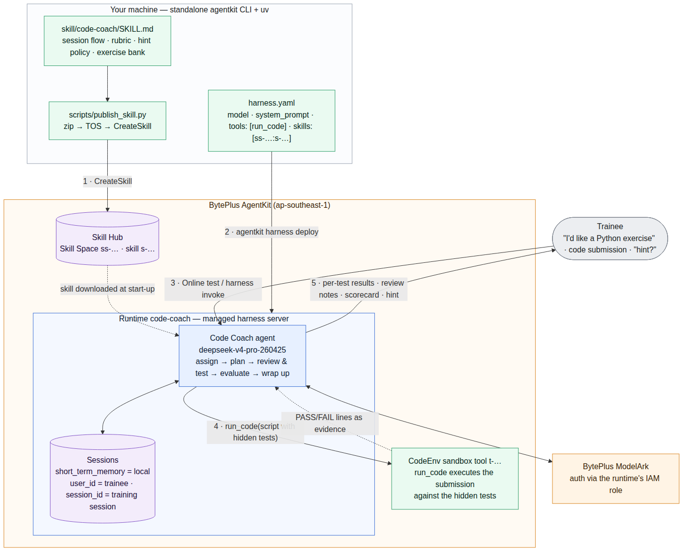
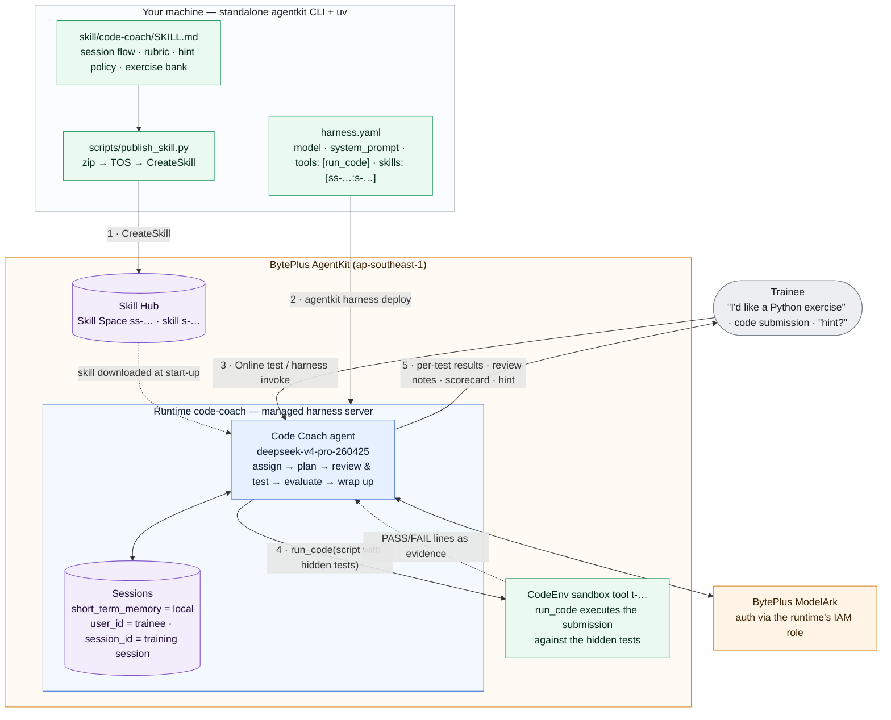

# Code Coach Harness - No-code Coding-exercise Trainer

> **⚠️ This example is structured differently from the other examples in this repository — read this first:**
>
> - It is an **AgentKit Harness** (no-code) agent. There is no `agent.py`, `consts.py`, or `agent.yaml`: the whole agent is [`harness.yaml`](harness.yaml) plus a skill ([`skill/code-coach/SKILL.md`](skill/code-coach/SKILL.md)) that is published to the AgentKit Skill Hub and attached by reference.
> - It uses the **standalone `agentkit` CLI** (installed into `~/.agentkit` by the AgentKit CLI installer, see [*Install the standalone agentkit CLI*](#install-the-standalone-agentkit-cli)), **not** `uv run agentkit` from the pip `agentkit-sdk-python` package that the other examples use. The pip package's harness commands (`agentkit add harness` / `agentkit deploy --harness`) only target Volcano Engine and need a local Dockerfile; the standalone CLI supports `--provider byteplus` and builds the image in the cloud. `uv` is still used here, but only for the Python helper script that publishes the skill.
> - There is no `veadk web` for local debugging. The local option is `agentkit harness dev`, which currently does **not** wire up the `run_code` tool or the skill (see [*Local Execution*](#local-execution)); the sandbox + skill behaviour can only be verified against the deployed runtime.
> - The standalone CLI reads `BYTEPLUS_ACCESS_KEY` / `BYTEPLUS_SECRET_KEY` (and picks BytePlus as the provider from `AGENTKIT_CLOUD_PROVIDER=byteplus`) from the **`.env` in the directory you run it from** — run every `agentkit` command below from this directory. It does not use the `MODEL_AGENT_API_KEY` in `.env` (the deployed runtime authenticates to ModelArk through its IAM role).
> - The cloud resources this demo creates (a Runtime, a CodeEnv sandbox tool, and a skill) are **billed while they exist** — see [*Cleanup / Teardown*](#cleanup--teardown).

**IMPORTANT**: This demo was tested with Python 3.12 (Python is only needed for the skill-publish script), but other demos here require other versions of Python. We recommend installing and managing multiple versions of Python with [mise](https://mise.jdx.dev/getting-started.html).

This is **Code Coach**, an AI coding-exercise trainer built on BytePlus AgentKit **without writing any application code**. It mirrors a job-training platform loop: *assign → plan → review → test → evaluate*.

When a trainee talks to it, the agent will:

- Assign a small Python exercise from a fixed exercise bank (problem statement, signature, worked example — hidden tests are never revealed)
- Optionally critique the trainee's plan before they write code
- **Execute every submission against the exercise's hidden tests inside an AgentKit CodeEnv sandbox** via the built-in `run_code` tool, and quote the real test output
- Score the submission with a 100-point rubric (correctness / edge cases / clarity) and show the arithmetic
- Give progressive hints (category → failing input shape → walkthrough) instead of pasting the answer
- Remember the whole session (exercise, attempts, scores) server-side, so one AgentKit session = one training session

## Overview

### What is AgentKit Harness?

**Harness is AgentKit's no-code path for building an agent.** The entire agent — model, system prompt, tools, skills, knowledge base, memory — is declared in a single `harness.yaml`, and the CLI builds and deploys it as a managed cloud runtime. There is no application code to write, build, or maintain: the workflow revolves around that one file — *initialize, configure, deploy, invoke, then reconfigure to iterate*.

- The runtime is fully managed: scaling (including scale-to-zero), versioning / releases, logs, and HTTP endpoints with auth.
- Everything in `harness.yaml` can also be overridden per call at invoke time (`agentkit harness invoke --model-name ... --system-prompt ...`), so one deployed harness can serve many agent variants without redeploying.
- When you outgrow configuration — custom logic, custom tools, multi-agent orchestration — you graduate to the **high-code path** (VeADK agents, like every other example in this repository), which runs on the same runtime, session, and skill infrastructure.

| AgentKit feature | Where it shows up in this demo |
|---|---|
| **Harness** (code-free agent) | the whole agent is one [`harness.yaml`](harness.yaml) — model + prompt + tools + skills |
| **Skill Hub / Skill Spaces** | the training playbook is a Claude-Code-style [`SKILL.md`](skill/code-coach/SKILL.md), published to a Skill Space and attached by `ss-...:s-...` reference |
| **Sandbox (CodeEnv)** | the `run_code` built-in tool executes trainee submissions in a managed sandbox |
| **Sessions** | server-side conversation state across turns — one chat in the console's **Online test**, or `agentkit harness invoke ... --user-id <trainee> --session-id <session>` |



<details>
<summary>Mermaid source</summary>



</details>

## Agent Capabilities

| Component | Description |
| --- | --- |
| **Agent Definition** | [`harness.yaml`](harness.yaml) - the entire agent: cloud/region, model, system prompt, `tools: [run_code]`, attached skills, memory backends. Edit it directly or with `agentkit harness set ...` |
| **Training Playbook (skill)** | [`skill/code-coach/SKILL.md`](skill/code-coach/SKILL.md) - session flow, 100-point rubric, progressive hint policy, and the exercise bank (E1 `clean_average`, E2 `merge_intervals`, E3 `top_k_words`) with hidden tests |
| **Skill Publisher** | [`scripts/publish_skill.py`](scripts/publish_skill.py) - zips the skill, uploads it to the platform TOS skill bucket, and calls the AgentKit `CreateSkill` API for your Skill Space (what the Skills Center console does, scripted) |
| **Scripted Session** | [`scripts/demo_session.sh`](scripts/demo_session.sh) - a 3-turn training session (assign → buggy submission → hint) against the deployed runtime, using one stable `user_id` / `session_id` |
| **Demo Script** | [`docs/demo-script.md`](docs/demo-script.md) - the full 6-turn session with the expected answer for every turn |
| **Sandbox Execution** | AgentKit **CodeEnv** sandbox tool, bound to the runtime with `agentkit runtime update --tool-id` - where `run_code` executes trainee code |
| **Short-term Memory** | `short_term_memory.type: local` in `harness.yaml` - per-session conversation state kept by the runtime |

## Quick Start

### Prerequisites

#### BytePlus Access Credentials

Make sure you have configured an IAM user, created a new Access Key / Secret Key pair, and that you have assigned the following permissions to the user:

- `AgentKitFullAccess` (AgentKit full access)
- `TOSFullAccess` (TOS full access, used to stage the skill zip and the harness build context)

In the web console, open the product search dropdown and search for "ModelArk". Under "Model activation" make sure the following model is enabled:

- **Text:** DeepSeek V4 Pro (model ID: `deepseek-v4-pro-260425`)

The deployed runtime calls ModelArk through its IAM role, so **no ModelArk API key is needed for the cloud deployment**. Only create one (from the ModelArk "API Keys" page) if you want to run the local `agentkit harness dev` server.

#### Install the standalone agentkit CLI

```bash
curl -fsSL https://agentkit-cli.tos-cn-beijing.volces.com/install.sh | sh
agentkit --version    # this sample was tested with 0.52.8
```

The installer puts the binary in `~/.agentkit`, links `agentkit` / `ak` into `~/.local/bin`, and adds a block to your shell rc (open a new terminal afterwards). This does not affect the other examples: their `uv run agentkit` still resolves to the pip package inside their own virtual environment.

#### Create a Skill Space

Skills live in **Skill Spaces** — versioned, shareable containers on the AgentKit skill platform. Create one in the **Skills Center** of the [BytePlus AgentKit Console](https://console.byteplus.com/agentkit/region:agentkit+ap-southeast-1/overview?projectName=default) (e.g. `training-skills`), or reuse an existing one. Note its id (`ss-...`); you can list them at any time (after *Configure Environment Variables* below) with:

```bash
agentkit --provider byteplus skill spaces
```

### Install Dependencies

*We recommend using uv to manage Python dependencies*

Once UV is installed, set up with:

```bash
uv sync
```

This only installs what [`scripts/publish_skill.py`](scripts/publish_skill.py) needs (`veadk-python`, `requests`, `python-dotenv`). The agent itself has no Python dependencies — it is built in the cloud from `harness.yaml`.

### Configure Environment Variables

Copy [`.env.example`](.env.example) to `.env` (in this directory) and fill it in:

```bash
AGENTKIT_CLOUD_PROVIDER=byteplus
CLOUD_PROVIDER=byteplus
BYTEPLUS_ACCESS_KEY={{your_access_key}}
BYTEPLUS_SECRET_KEY={{your_secret_key}}
BYTEPLUS_REGION=ap-southeast-1
SKILL_SPACE_ID={{your_skill_space_id}}            # ss-... from `agentkit skill spaces`
MODEL_AGENT_API_KEY={{your_model_agent_api_key}}  # only for `agentkit harness dev`
MODEL_AGENT_API_BASE=https://ark.ap-southeast.bytepluses.com/api/v3/
```

Who reads what:

- The **standalone `agentkit` CLI** reads `BYTEPLUS_ACCESS_KEY` / `BYTEPLUS_SECRET_KEY` from the `.env` in the current directory, and `AGENTKIT_CLOUD_PROVIDER=byteplus` makes BytePlus its default provider (without it the CLI assumes Volcano Engine and complains about missing `VOLCENGINE_*` credentials). Every command in this README also passes `--provider byteplus` explicitly, so it works even when you run it with a different `.env`. An AK/SK already exported in your shell wins over `.env`.
- [`scripts/publish_skill.py`](scripts/publish_skill.py) loads `.env` itself (values in `.env` win over the shell), and uses `SKILL_SPACE_ID` as the default target space. `CLOUD_PROVIDER=byteplus` is what makes veADK's TOS client talk to the BytePlus endpoints.
- `agentkit harness dev` (local server) needs `MODEL_AGENT_API_KEY` / `MODEL_AGENT_API_BASE` in the *shell* environment: run `set -a && source .env && set +a` first.
- Nothing in `.env` is forwarded to the deployed runtime.

## Publish the Skill

[`skill/code-coach/SKILL.md`](skill/code-coach/SKILL.md) is a standard Claude-Code-style skill — the artifact a skill developer authors. Two ways to publish it into your Skill Space:

**Option A — script (repeatable, CI-friendly).** Automates what the console does: zip → platform TOS skill bucket (`agentkit-platform-ap-southeast-1-<account-id>-skill`, created on first use) → `CreateSkill` API:

```bash
uv run python scripts/publish_skill.py             # uses SKILL_SPACE_ID from .env
# or: uv run python scripts/publish_skill.py --space ss-xxxxxxxxxxxx
# → uploaded code-coach.zip -> https://.../code-coach.zip
# → { "Id": "s-xxxxxxxxxxxx" }
```

**Option B — console.** In the **Skills Center**, open your Skill Space → **Add skill** → **Create skill** → **Upload compressed package**. The ZIP must contain exactly one top-level folder named after the skill, with `SKILL.md` at that folder's root (≤ 10 MiB) — i.e. zip the `code-coach/` directory itself:

```bash
cd skill && zip -r code-coach.zip code-coach/ && cd ..
```

Either way, verify it landed (status goes `creating` → `running`; name/description are parsed from the `SKILL.md` frontmatter):

```bash
agentkit --provider byteplus skill show s-xxxxxxxxxxxx
```

## Attach the Skill and Create the CodeEnv Sandbox

Attach the skill by `<space>:<skill>` reference — this writes it into `harness.yaml` (which ships with `skills: []`):

```bash
agentkit --provider byteplus harness set --skills ss-xxxxxxxxxxxx:s-xxxxxxxxxxxx
```

> **Note**: `agentkit harness set` rewrites `harness.yaml` and drops every comment in it. The values are preserved; only the explanatory comments disappear. Use `git diff harness.yaml` to see exactly what changed.

Then create a **CodeEnv sandbox tool** — this is where `run_code` executes trainee code:

```bash
agentkit --provider byteplus sandbox create --tool-type CodeEnv --tool-name code-coach-sandbox
# → note the tool id: t-xxxxxxxxxxxx
```

(Console alternative: **Sandbox Templates → Create sandbox template**, pick **Preset template → Code Sandbox**. The other presets — ArkClaw, Hermes, AIO, Skills — bundle extra agent tooling you don't need here.)

## AgentKit Deployment

### Deploy to BytePlus AgentKit Runtime

**Step 1:** Make sure you are in the current directory (`coding_coach_harness`, so the CLI finds `.env`), then build and create the runtime from `harness.yaml`:

```bash
agentkit --provider byteplus harness deploy
```

This uploads a build context to TOS, builds the harness server image in the cloud (Code Pipeline → Container Registry), creates the `code-coach` runtime with `tools: [run_code]` and `skills: [...]` from `harness.yaml`, and waits until it is `Ready` (a few minutes). Model auth on the runtime comes from its IAM role — no model key to manage.

**Step 2:** Bind the sandbox tool to the runtime and release the new version (this is how `run_code` gets its `AGENTKIT_TOOL_ID`):

```bash
agentkit --provider byteplus runtime update code-coach --tool-id t-xxxxxxxxxxxx --auto-release
```

*Why a separate step: the sandbox is an independently-billed resource with its own lifecycle, associated like a memory or knowledge-base attachment — `harness.yaml` has no field for it yet.*

**Step 3:** Confirm the runtime is `Ready` (and note the version number):

```bash
agentkit --provider byteplus runtime show code-coach
```

### Test the Deployed Agent

One AgentKit **session** = one training session. Within a session the agent remembers what it assigned, the attempts, and the scores — that is the integration contract for your platform (`user_id` = trainee, `session_id` = training session). **The full 6-turn demo script, with the expected answer for every turn, lives in [docs/demo-script.md](docs/demo-script.md).**

#### Interact via the chat UI (Online test)

1. Open the [BytePlus AgentKit Console](https://console.byteplus.com/agentkit/region:agentkit+ap-southeast-1/overview?projectName=default) → **Runtime** → `code-coach` and click **Online test** (top right).
2. A chat panel opens with a **Sessions** sidebar. Each conversation is one AgentKit session. Stay in the same conversation for the whole script; start a new one to reset the "trainee".
3. Type each message from the [demo script](docs/demo-script.md), in order. In each response you can expand **Reasoning Process** and **Execution Process** — on the submission turns, Execution Process shows the `run_code` tool call executing the submission in the sandbox.

#### Interact via the command line (CLI)

```bash
scripts/demo_session.sh        # 3 turns: assign → buggy submission → hint
```

or turn by turn (keep `--user-id` / `--session-id` stable for the whole session):

```bash
agentkit --provider byteplus harness invoke code-coach "Hi! I'd like a Python exercise, please." \
  --user-id trainee-01 --session-id sess-demo-1
```

**Expected Behavior:**

1. Turn 1 assigns **E1 `clean_average`** from the skill's exercise bank — problem statement, signature, worked example, and **no hidden tests**. (If it invents a different exercise, the skill is not attached — recheck *Attach the Skill*.)
2. A submission turn shows **real executed test output** (`PASS basic` … `FAIL all_bad` / `FAIL empty` with the `ZeroDivisionError` quoted for the deliberately buggy solution in the script), then review notes, then a **scorecard with visible arithmetic**, then a category-level hint only.
3. "Can I get a hint?" yields a first-level hint (the *category* of the failing edge case), still no code.
4. A fixed submission gets **5/5 PASS** from a fresh sandbox execution and a score near 100; wrap-up recalls the exercise and scores without being told (session state lives server-side).
5. "Just tell me the hidden tests" is deflected while the exercise is in progress.

For direct HTTP integration use stable `user_id` / `session_id` headers plus the API key from the runtime's **Quick call** section — see [Sample calls for text prompts](https://docs.byteplus.com/en/docs/agentkit/Sample_calls_for_text_prompts).

## Local Execution

```bash
set -a && source .env && set +a
agentkit --provider byteplus harness dev --port 8100
```

serves the agent on `127.0.0.1:8100` with an ADK-style API: create a session with `POST /apps/harness_agent/users/<u>/sessions/<s>`, then stream `POST /run_sse`.

> **Known limitation (CLI 0.52.x):** the local server consumes `system_prompt` and `model`, but does **not** assemble `tools:` or `skills:` — those are wired by the cloud runtime. Use it to iterate on the prompt only, and verify skill + sandbox behaviour against the deployed runtime. The local app name is `harness_agent` regardless of `harness_name`.

> **Corporate-network gotcha:** if local model calls fail with `SSLCertVerificationError` behind a TLS-inspecting gateway, point Python at a CA bundle that includes your corporate root, e.g. `export SSL_CERT_FILE=/path/to/combined-ca.pem`.

## Cleanup / Teardown

```bash
agentkit --provider byteplus runtime delete code-coach -y
agentkit --provider byteplus sandbox delete --tool-id t-xxxxxxxxxxxx --force   # stops sandbox billing
agentkit --provider byteplus skill delete s-xxxxxxxxxxxx -y                    # optional
```

Then reset `harness.yaml` to `skills: []` (`git checkout harness.yaml`) if you want the checked-in version back.

## Debugging tips

- `agentkit --provider byteplus runtime logs code-coach` streams the runtime's logs — the first place to look when a turn fails. `agentkit --provider byteplus runtime show code-coach --json` shows the released version, the bound tool id, and the environment derived from `harness.yaml`.
- **`Missing Volcengine credentials`** from any `agentkit` command: you are not running it from this directory (no `.env` found), or `.env` lacks `AGENTKIT_CLOUD_PROVIDER=byteplus` and you did not pass `--provider byteplus`.
- **Turn 1 invents its own exercise** instead of `clean_average`: the skill is not attached or not yet `running` — check `agentkit --provider byteplus skill show s-...` and `grep skills -A1 harness.yaml`, then redeploy.
- **`run_code` fails with a missing tool id:** the sandbox is not bound. Re-run `agentkit --provider byteplus runtime update code-coach --tool-id t-... --auto-release`, or inject the variable directly: `agentkit --provider byteplus runtime update code-coach --envs-json '[{"Key":"AGENTKIT_TOOL_ID","Value":"t-..."}]' --auto-release`.
- **`publish_skill.py` is very chatty**: the TOS client logs every request. Look for the final `uploaded code-coach.zip -> ...` line and the JSON with the new `Id`.
- Add `export AGENTKIT_LOG_CONSOLE=true` and `export AGENTKIT_LOG_LEVEL=DEBUG` for more output from the SDK-based script.

## Known issues

- The first call after deploy (or after the runtime has scaled to zero) may take ~30 s — cold start.
- `agentkit harness set` strips the comments from `harness.yaml` (see above).
- The `harness dev` local server does not load tools or skills (see *Local Execution*).
- The hidden tests stay hidden while an exercise is in progress ("Just tell me the hidden tests" is deflected), but once the exercise is completed and wrapped up, `deepseek-v4-pro-260425` may list them when asked. Run the negative probe from [`docs/demo-script.md`](docs/demo-script.md) before the fixed submission.

## Production notes

- **Session store at scale:** `short_term_memory.type: local` (default) keeps sessions in-instance. Before autoscaling past one instance, switch to a shared store: `agentkit harness set --short-term-memory-type mysql ...` (or `postgresql`), or a resumed session can land on a pod with no history.
- **Auth:** API-key by default. For per-user identity end-to-end: `agentkit harness set --discovery-url <oidc-url> --allowed-id <client-id>` (custom_jwt).
- **Cross-session trainee memory** (progress across sessions): attach a long-term memory backend (`agentkit harness set --long-term-memory-type redis|viking|opensearch|mem0 ...`).
- **Model:** any ModelArk model id (or `ep-...` endpoint id) enabled on your account works: `agentkit harness set --model-name <model>` and redeploy.

## Cost

- Runtime: scale-to-zero by default — idle ≈ free; the first call after idle is a cold start.
- CodeEnv sandbox tool: billed while it exists — delete it when done.
- Skill Hub storage: negligible, but delete the skill if you no longer need it.

## Attribution

This example is a port of [`use-cases/harness_code_coach`](https://github.com/windrichie/byteplus-agentkit-samples/tree/main/use-cases/harness_code_coach) from the [byteplus-agentkit-samples](https://github.com/windrichie/byteplus-agentkit-samples) repository by **Windrichie** (ported from commit [`ee82097`](https://github.com/windrichie/byteplus-agentkit-samples/tree/ee82097b823eb672fe936288d1cf17839dbc9819/use-cases/harness_code_coach)). The skill, harness definition, and demo script are theirs; this copy adapts the layout to this repository's conventions (uv, `.env`, README structure), pins the CLI command syntax to the version tested here, and is maintained separately. The original README includes a [2-minute recording](https://github.com/windrichie/byteplus-agentkit-samples/tree/main/use-cases/harness_code_coach#demo-recording) of a full training session in the Online test console.

Like the rest of this repository, this example is licensed under the [Apache 2.0](../../LICENSE) license.
