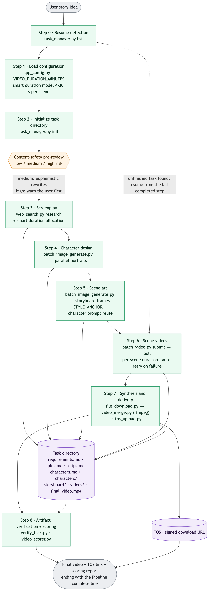
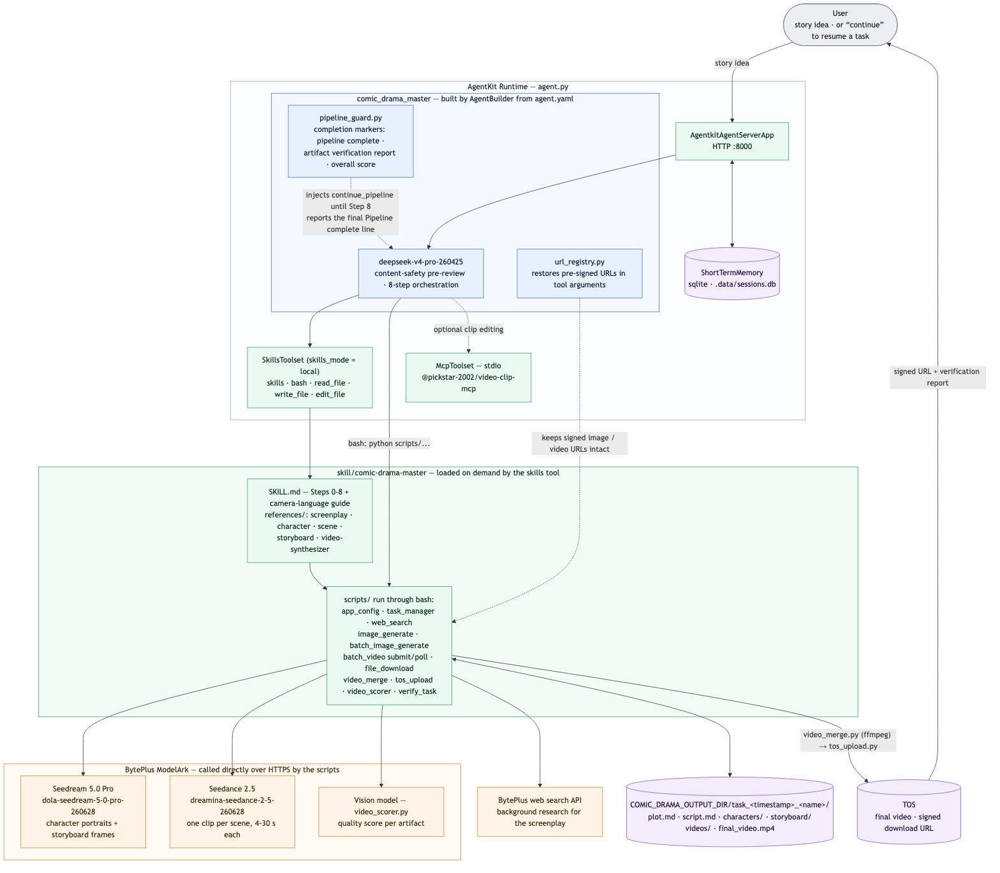
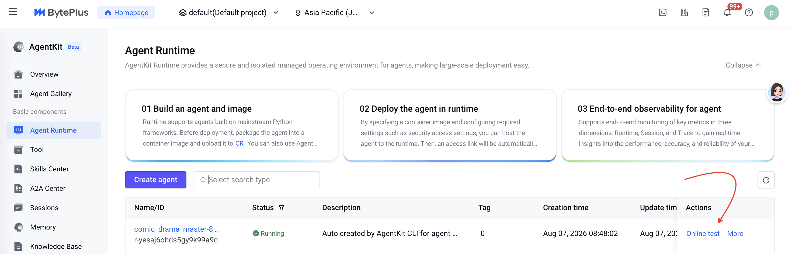
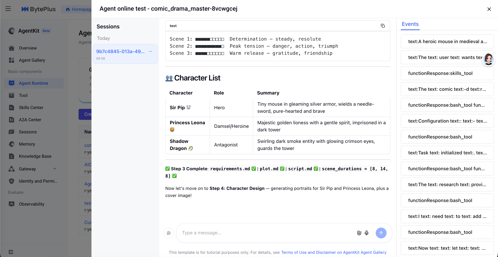

# 漫剧生成 Agent（BytePlus 版）

> English documentation: [README_en.md](README_en.md)

## 概述

本样例是一个基于 BytePlus AgentKit 构建的 AI 漫剧（Comic Drama）自动化制作 Agent。

只需输入一个故事创意，Agent 就会自动完成从剧本创作、角色设计、分镜图生成、分镜视频生成到最终视频合成的完整流水线，最终交付一部完整的漫剧视频，并附带 TOS 下载链接。

**注意**：本样例在 Python 3.12 下测试通过（Python 3.14 不可用），推荐使用 [mise](https://mise.jdx.dev/getting-started.html) 安装并管理多版本 Python。

制作流水线：



系统架构：



（两张图的 Mermaid 源码见 [README_en.md](README_en.md)）

## 核心功能

- **端到端自动化**：从创意到成片的 8 步流水线，无需人工干预
- **智能时长分配**：每个分镜动态分配 4~30 秒时长，节奏更自然
- **专业镜头语言**：内置导演级运镜策略（变速、360° 环绕、跟踪镜头等）
- **内容安全预审**：自动进行风险评估，对敏感内容做前置处理
- **风格一致性**：全流程维护 STYLE_ANCHOR，并严格复用角色提示词
- **默认英文、跟随用户语言**：Agent 默认以英文工作——回复、生成的文档、图像与视频提示词以及片中角色台词均为英文；用户使用其他语言时会整体切换到该语言，便于审阅
- **产出校验**：每一步完成后自动进行文件完整性检查与 AI 质量打分
- **多题材支持**：神话、武侠、修仙、都市、科幻、儿童故事等 10+ 题材
- **MCP 工具集成**：通过 `@pickstar-2002/video-clip-mcp` 提供视频剪辑能力
- **断点续跑**：任务中断后可从最后一个完成的步骤继续
- **无人值守运行**：整条流水线在单次对话中从故事创意跑到成片；若模型在步骤之间以纯文本结束回合（否则用户需要手动输入"继续"），`pipeline_guard.py` 中的运行时守卫会注入 `continue_pipeline` 工具调用让流程自动继续
- **并行图像生成**：角色立绘与分镜图支持并行生成，显著提升效率
- **失败自动重试**：分镜视频生成失败会自动重试，提高成功率

## Agent 能力

| 组件 | 说明 |
| --- | --- |
| **Agent 服务** | [`agent.py`](agent.py) - AgentKit 服务入口：注册 MCP 视频剪辑工具、加载技能、配置会话存储 |
| **Agent 配置** | [`agent.yaml`](agent.yaml) - 模型与系统指令定义，由 AgentBuilder 构建 `comic_drama_master` |
| **漫剧制作技能** | [`skill/comic-drama-master/`](skill/comic-drama-master/SKILL.md) - 8 步全流程技能规范（SKILL.md + references 规范文档 + scripts 执行脚本） |
| **自动续跑守卫** | [`pipeline_guard.py`](pipeline_guard.py) - 若模型在步骤之间以纯文本结束回合，会注入 `continue_pipeline` 工具调用让流水线继续，用户无需手动输入"继续" |
| **签名 URL 注册表** | [`url_registry.py`](url_registry.py) - 工具返回的 TOS 预签名 URL 常被模型截断导致 `403 Forbidden`；注册表记录每个 URL 并在下一次工具调用前还原完整签名 |
| **模型默认值** | [`consts.py`](consts.py) - 默认模型名、API 地址与 `.env` 自动加载逻辑 |
| **MCP 视频剪辑** | `@pickstar-2002/video-clip-mcp` - 通过 `npx` 以本地 stdio 方式启动的视频剪辑 MCP 工具 |
| **短期记忆** | 基于 sqlite 的 `ShortTermMemory`，维护会话上下文，保证多轮对话连续性 |

## 目录结构说明

```bash
comic_drama_gen
├── LICENSE                   # 代码许可（Apache 2.0）
├── README.md                 # 中文说明文档（本文件）
├── README_en.md              # 英文说明文档
├── project.yaml              # 项目信息元数据
├── agent.py                  # 主程序入口（MCP 工具注册、技能加载、会话存储）
├── agent.yaml                # Agent 配置（模型、系统指令）
├── consts.py                 # 默认模型名、API 地址与 .env 自动加载逻辑
├── pipeline_guard.py         # 自动续跑守卫回调
├── url_registry.py           # 签名 URL 注册表回调
├── .env.example              # 环境变量示例文件
├── pyproject.toml            # 项目依赖管理文件（uv）
├── requirements.txt          # 项目依赖管理文件（pip）
├── assets
│   └── images                # 流水线图、架构图与运行截图等静态资源
├── scripts
│   └── setup.sh              # 云端部署构建脚本（预装 video-clip-mcp）
└── skill
    └── comic-drama-master
        ├── SKILL.md          # 总导演技能规范（8 步全流程）
        ├── examples
        │   └── examples.md   # 完整使用示例
        ├── references        # 各环节规范文档
        │   ├── character-designer.md    # 角色设计规范
        │   ├── scene-designer.md        # 场景美术规范
        │   ├── screenplay-generator.md  # 剧本生成规范
        │   ├── storyboard-director.md   # 分镜导演规范
        │   └── video-synthesizer.md     # 视频合成规范
        └── scripts           # 技能执行脚本（通过 bash 调用）
            ├── app_config.py            # 视频时长配置读取
            ├── task_manager.py          # 任务目录管理（FIFO 清理，最多 16 个任务）
            ├── batch_image_generate.py  # 批量并行图像生成
            ├── batch_video.py           # 批量视频任务提交 / 轮询
            ├── create_video_task.py     # 单个视频任务创建
            ├── query_video_task.py      # 视频任务状态查询
            ├── image_generate.py        # 图像生成（base64 直接保存）
            ├── web_search.py            # 网络搜索（用于剧本调研）
            ├── video_merge.py           # ffmpeg 视频合并
            ├── video_scorer.py          # AI 质量打分（5 个维度）
            ├── verify_task.py           # 产出完整性校验
            ├── tos_upload.py            # TOS 上传
            ├── file_download.py         # 批量文件下载
            └── get_aksk.py              # AK/SK 凭证获取
```

## 本地运行

### 前置准备

**BytePlus 访问凭证**

1. 登录 [BytePlus 控制台](https://console.byteplus.com)
2. 进入 "Identity and Access Management" → "Users" → 新建用户或搜索已有用户 → 点击用户名进入 "User Details" → 进入 "Keys" → 新建密钥或复制已有 AK/SK
3. 为该用户配置 AgentKit 依赖服务的访问权限：在 "User Details" 页面 → "Permissions" → "Add Permission"，授予以下策略
    - `AgentKitFullAccess`（AgentKit 完全访问）
    - `APMPlusServerFullAccess`（APMPlus 完全访问）
4. 获取该用户的 ModelArk API Key：搜索 "ModelArk" 产品进入控制台 → "API Key Management" → 创建或复制已有 API Key
5. 在 ModelArk 控制台的 "Model activation" 页面开通以下预置推理接入点：
   - **Agent 模型**：`deepseek-v4-pro-260425`
   - **图像生成模型**：`dola-seedream-5-0-pro-260628`（列表中显示为 "Dola-Seedream-5.0-pro"）
   - **视频生成模型**：`dreamina-seedance-2-5-260628`（列表中显示为 "Dreamina-Seedance-2.5"，支持最长 30 秒的视频片段）

**Node.js 环境**

- 安装 Node.js 18+ 与 npm（[Node.js 安装](https://nodejs.org/en)）
- 确保终端中 `npx` 命令可用
- MCP 视频工具（`@pickstar-2002/video-clip-mcp`）会在 Agent 运行时通过 `npx` 自动启动，无需手动安装

**ffmpeg**

视频合并（流水线第 7 步）使用 `ffmpeg` / `ffprobe`，请通过包管理器安装，例如：

```bash
# macOS
brew install ffmpeg
# Debian/Ubuntu
sudo apt-get install -y ffmpeg
```

**TOS 存储桶**

在 [BytePlus TOS 控制台](https://console.byteplus.com/tos) 创建一个 TOS 存储桶，用于存放生成的图片与视频文件。AgentKit 默认桶名形如 `agentkit-platform-{{your_account_id}}`。

### 依赖安装

推荐使用 `uv` 管理 Python 依赖：

```bash
uv sync
```

如果在中国大陆遇到网络问题，可以改用：

```bash
uv sync --index-url https://pypi.tuna.tsinghua.edu.cn/simple
```

### 环境准备

支持两种配置方式。

**方式一：`.env` 文件（推荐）**

将 [`.env.example`](.env.example) 复制为 `comic_drama_gen/` 目录（或启动目录）下的 `.env` 并填写：

```bash
BYTEPLUS_ACCESS_KEY=your_ak
BYTEPLUS_SECRET_KEY=your_sk
MODEL_AGENT_API_KEY=your_ark_api_key
DATABASE_TOS_BUCKET=agentkit-platform-{{your_account_id}}
AGENTKIT_CLOUD_PROVIDER=byteplus
CLOUD_PROVIDER=byteplus

# Optional
COMIC_DRAMA_OUTPUT_DIR=./my-comic-drama
VIDEO_DURATION_MINUTES=0.5
DEFAULT_VIDEO_MODEL_NAME=dreamina-seedance-2-5-260628
```

> `.env` 会在启动时自动加载（基于 `python-dotenv`）。`.env` 中的值优先于 shell 中 export 的变量；`.env` 中缺失的项回退到 shell 环境。该文件是可选的——不存在时只使用 shell 环境。`consts.py` 会先在项目目录、再在当前工作目录查找 `.env`（两者都存在时，同名键以项目目录文件为准）。

**方式二：直接 export**

```bash
# Required
export BYTEPLUS_ACCESS_KEY=your_ak
export BYTEPLUS_SECRET_KEY=your_sk
export MODEL_AGENT_API_KEY=your_ark_api_key
export AGENTKIT_CLOUD_PROVIDER=byteplus
export CLOUD_PROVIDER=byteplus

# TOS bucket (for uploading generated videos)
export DATABASE_TOS_BUCKET=agentkit-platform-{{your_account_id}}

# Optional
export COMIC_DRAMA_OUTPUT_DIR=./my-comic-drama
export VIDEO_DURATION_MINUTES=0.5
export DEFAULT_VIDEO_MODEL_NAME=dreamina-seedance-2-5-260628
```

**注意**：`AGENTKIT_CLOUD_PROVIDER` 与 `CLOUD_PROVIDER` 均为**必填**——请在 `.env` 中设置或在每个运行本样例的 shell 中 export，并在部署时一并传给云端 Runtime。前者由 agentkit SDK 读取，后者由 veADK 读取，用于控制 veADK 的默认 Endpoint、默认模型以及 `BYTEPLUS_*` 凭证到 veADK 内部 `VOLCENGINE_*` 变量的映射。缺少它们时 SDK 会回退到火山引擎（中国大陆）默认值，导致对 BytePlus 账号的调用失败。`consts.py` 会在 Agent 进程内兜底设置 `CLOUD_PROVIDER=byteplus`，但这覆盖不到 agentkit SDK 以及独立运行的技能脚本，请勿依赖。

**环境变量参考：**

| 变量 | 必填 | 默认值 | 说明 |
|----------|----------|---------|-------------|
| `BYTEPLUS_ACCESS_KEY` | ✅ | — | BytePlus Access Key |
| `BYTEPLUS_SECRET_KEY` | ✅ | — | BytePlus Secret Key |
| `AGENTKIT_CLOUD_PROVIDER` | ✅ | — | 将 agentkit SDK 指向 BytePlus |
| `CLOUD_PROVIDER` | ✅ | — | 将 veADK 的默认 Endpoint 与模型指向 BytePlus（`consts.py` 有 `byteplus` 兜底，但仍建议显式设置） |
| `MODEL_AGENT_API_KEY` | ✅ | — | ModelArk API Key（`ARK_API_KEY` 也可用，二者会互相镜像） |
| `DATABASE_TOS_BUCKET` | ✅ | — | TOS 存储桶名称 |
| `COMIC_DRAMA_OUTPUT_DIR` | ❌ | 项目目录下的 `output/` | 输出根目录 |
| `VIDEO_DURATION_MINUTES` | ❌ | `0.5` | 视频时长（分钟），支持 0.5/1/2/3/4（0.5 = 30 秒） |
| `DEFAULT_VIDEO_MODEL_NAME` | ❌ | `dreamina-seedance-2-5-260628` | 视频生成模型名 |

### 调试方法

**方式一：使用 veadk web（推荐）**

> `veadk web` 是一个基于 FastAPI 的 Web 调试服务。运行后会启动一个加载了本 Agent 代码的 Web 服务器，并提供聊天界面；在界面侧边栏中可以查看 Agent 的思考过程、工具调用以及模型输入输出。

在项目目录（`comic_drama_gen`）内运行：

```bash
uv run veadk web
```

浏览器访问 `http://localhost:8000`，选择 `comic_drama_gen` Agent，输入故事创意并发送。

**方式二：直接 API 调用**

```bash
uv run agent.py
# Service listens on 0.0.0.0:8000 by default
```

创建会话：

```bash
curl -X POST 'http://localhost:8000/apps/comic_drama_master/users/u_123/sessions/s_1' \
  -H 'Content-Type: application/json'
```

发送消息：

```bash
curl 'http://localhost:8000/run_sse' \
  -H 'Content-Type: application/json' \
  -d '{
    "appName": "comic_drama_master",
    "userId": "u_123",
    "sessionId": "s_1",
    "newMessage": {
      "role": "user",
      "parts": [{"text": "Sun Wukong battles Erlang Shen, Chinese anime 3D realistic style"}]
    },
    "streaming": true
  }'
```

每个任务完成后，`COMIC_DRAMA_OUTPUT_DIR`（默认为项目目录下的 `output/`）中会生成如下产物：

```
{COMIC_DRAMA_OUTPUT_DIR}/
└── task_20260222_143000_sun_wukong_battle/
    ├── requirements.md   # 需求文档（含 web_search 调研摘要）
    ├── plot.md           # 章节式剧情大纲（含智能时长分配）
    ├── script.md         # 完整台词剧本（含逐秒时间戳与分章时长）
    ├── characters.md     # 角色设计（STYLE_ANCHOR + 角色提示词 + 立绘）
    ├── cover.jpg         # 封面图
    ├── cover.md          # 封面信息
    ├── final_video.md    # 最终交付文档（含 TOS 链接）
    ├── storyboard/       # 分镜图（scene_01.jpg ~ scene_NN.jpg）
    ├── characters/       # 角色立绘（char_*.jpg）
    ├── videos/           # 分镜视频（scene_01.mp4 ~ scene_NN.mp4，智能时长 4~30 秒）
    └── final/            # 合成后的漫剧（*_final.mp4）
```

## AgentKit 部署

**第 0 步**：如尚未安装 agentkit CLI，可在 Python 虚拟环境中安装：

```bash
uv pip install agentkit-sdk-python
```

**第 1 步**：确认当前处于 `comic_drama_gen` 目录，然后配置 AgentKit。

**注意**：以下命令假设 `DATABASE_TOS_BUCKET` 与 `MODEL_AGENT_API_KEY` 已在环境中定义。`agentkit` CLI 自身不读取 `.env`（只有 Agent 进程会在启动时加载），如果变量保存在 `.env` 中，请先导出到当前 shell：

```bash
set -a && source ./.env && set +a
```

这同时会导出 `agentkit config` / `agentkit launch` 认证所需的 `BYTEPLUS_ACCESS_KEY` 与 `BYTEPLUS_SECRET_KEY`。

```bash
uv run agentkit config \
  --agent_name comic_drama_master \
  --entry_point 'agent.py' \
  --runtime_envs DATABASE_TOS_BUCKET=$DATABASE_TOS_BUCKET \
  --runtime_envs MODEL_AGENT_API_KEY=$MODEL_AGENT_API_KEY \
  --runtime_envs AGENTKIT_CLOUD_PROVIDER=byteplus \
  --runtime_envs CLOUD_PROVIDER=byteplus \
  --cloud_provider byteplus \
  --launch_type cloud
```

**注意**：`--cloud_provider byteplus` 参数是必需的。缺少它时 CLI 默认使用火山引擎，`agentkit launch` 会在解析账号 ID 时报错 `Volcengine credentials not found (Service: sts)`。

> **重要**：shell 中 export 的环境变量**不会**自动上传到云端 Runtime——只有 `agentkit.yaml` 中的 `runtime_envs` 条目（加上部署时合并进来的本地 `.env` 内容）会到达云端。若 `runtime_envs` 中缺少 `MODEL_AGENT_API_KEY`，部署后的 Agent 将没有 ModelArk API Key，所有图像/视频生成调用都会返回 401。`agent.py` 启动时会将 `MODEL_AGENT_API_KEY` 镜像为 `ARK_API_KEY`，因此这一个变量即可覆盖 LLM、图像与视频调用。

**第 2 步**：修改 `agentkit.yaml` 部署配置。

> 目的：修改后会在镜像构建阶段预装 video-clip-mcp，加速 Runtime 启动。

```bash
# On Linux
sed -i 's/docker_build: {}/docker_build:\n  build_script: "scripts\/setup.sh"/' agentkit.yaml

# On macOS
sed -i '' 's/docker_build: {}/docker_build:/' agentkit.yaml && sed -i '' '/docker_build:/a\
  build_script: "scripts\/setup.sh"' agentkit.yaml
```

**第 3 步**：部署 Runtime：

```bash
uv run agentkit launch
```

部署成功后：

1. 访问 [BytePlus AgentKit 控制台](https://console.byteplus.com/agentkit/region:agentkit+ap-southeast-1/overview?projectName=default)
2. 点击 **Runtime** 查看已部署的 `comic_drama_master`
3. 获取公网访问域名与 API Key，即可通过 API 调用

也可以直接使用 `agentkit invoke` 触发 / 调试：

```bash
uv run agentkit invoke '{"prompt": "Sun Wukong battles Erlang Shen, Chinese anime 3D realistic style"}'
```

或通过公网 API 调试。创建会话：

```bash
curl --location --request POST 'https://xxxxx.apigateway-ap-southeast-1.apigw-byteplus.com/apps/comic_drama_master/users/u_123/sessions/s_124' \
--header 'Content-Type: application/json' \
--header 'Authorization: <your_api_key>' \
--data ''
```

发送消息：

```bash
curl --location 'https://xxxxx.apigateway-ap-southeast-1.apigw-byteplus.com/run_sse' \
--header 'Authorization: <your_api_key>' \
--header 'Content-Type: application/json' \
--data '{
    "appName": "comic_drama_master",
    "userId": "u_123",
    "sessionId": "s_124",
    "newMessage": {
        "role": "user",
        "parts": [{
            "text": "Sun Wukong battles Erlang Shen, Chinese anime 3D realistic style"
        }]
    },
    "streaming": true
}'
```

不再需要时，可以清理已部署的 Runtime：

```bash
uv run agentkit destroy
```

## 示例提示词

| 题材 | 示例提示词 |
|-------|---------------|
| 中国神话 | `Sun Wukong battles Erlang Shen, Chinese anime 3D realistic style` |
| 武侠 | `Legend of the Condor Heroes, Guo Jing vs Ouyang Feng, live-action version` |
| 修仙 | `Han Li forming his Nascent Soul in A Record of a Mortal's Journey to Immortality, 2 min video` |
| 历史 | `Jing Ke's last night before assassinating the King of Qin` |
| 都市 | `Office Showdown: Intern's rise to tech CEO, Japanese anime 2D style` |
| 科幻 | `Interstellar agents saving Earth` |
| 儿童 | `Little fox searching for star fragments` |

## 效果展示

AgentKit 的 Agent 列表页面提供了调试入口，点击即可通过可视化 UI 调试 Agent 的各项能力。一次完整运行的实际效果如下：





Agent 会依次完成剧本创作、角色设计、分镜图与分镜视频生成，最后合成完整漫剧并上传 TOS，在最终回复中给出签名下载链接、校验报告与质量评分。

## 常见问题

**视频生成任务失败（`OutputVideoSensitiveContentDetected`）？**

- 当题材包含武侠/战争/暴力元素时，Agent 会自动使用委婉的替代表达
- 如反复失败，可在提示词中显式要求"使用温和的表达方式"

**`uv sync` 失败？**

- 确认已安装 Python 3.12+
- 尝试使用镜像源：`uv sync --index-url https://pypi.tuna.tsinghua.edu.cn/simple --refresh`

**TOS 上传失败？**

- 确认 `BYTEPLUS_ACCESS_KEY`、`BYTEPLUS_SECRET_KEY` 与 `DATABASE_TOS_BUCKET` 均已正确设置
- 确认账号具备 TOS 存储桶的读写权限

**任务目录太多？**

- `task_manager.py` 自动保留最新的 16 个任务（FIFO 清理策略）
- 可通过 `COMIC_DRAMA_OUTPUT_DIR` 环境变量分离测试与正式输出

**`.env` 文件不生效？**

- 确认 `.env` 位于 `comic_drama_gen/` 目录或启动目录中
- `.env` 中的值会覆盖 `export` 设置的变量；若某个值看起来不对，检查 `.env` 中是否有过期条目
- `python-dotenv` 是固定依赖；若导入失败请重新执行 `uv sync` / `pip install -r requirements.txt`

**`npx` 命令找不到？**

- 安装 Node.js 18+ 与 npm
- 确认终端中 `npx --version` 可正常运行

**MCP 工具连接报错？**

- 确认默认 MCP 端口没有冲突
- 查看 Node.js 进程日志获取详细错误信息

**已知问题**

- 全片视频风格不一定完全一致：各分镜参考图是独立生成的，可能带来风格差异
- 图像与视频生成偶尔会超时，需要重试

**相关资源**

- [BytePlus AgentKit](https://docs.byteplus.com/en/docs/agentkit)
- [BytePlus TOS 对象存储](https://www.byteplus.com/en/product/TOS)
- [BytePlus AgentKit 控制台](https://console.byteplus.com/agentkit/region:agentkit+ap-southeast-1/overview?projectName=default)

## 代码许可

本工程遵循 Apache 2.0 License
