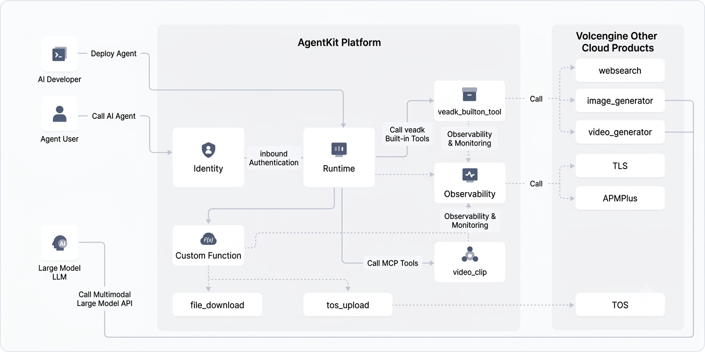
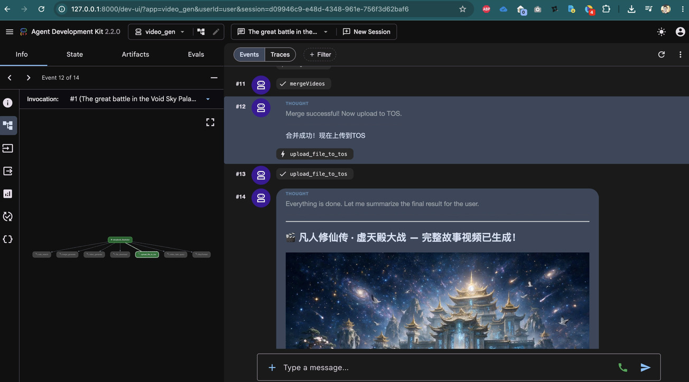
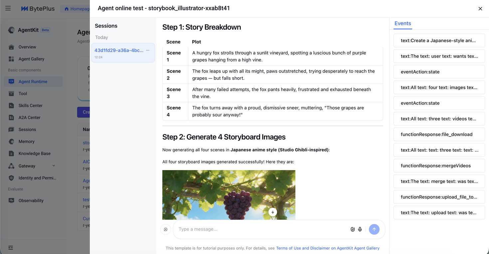
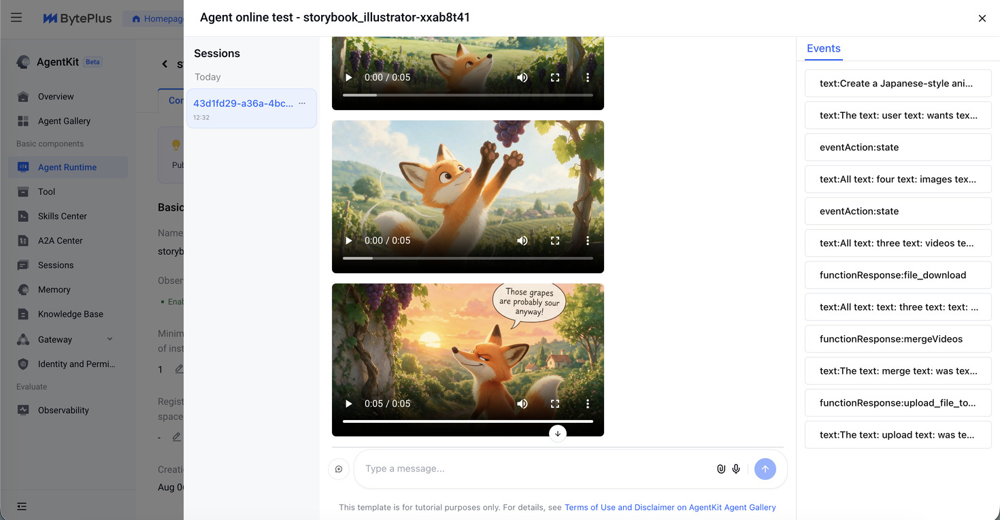

# Video Generation Agent - Video Story Generator

**IMPORTANT**: This demo was tested with Python 3.12, but other demos here require other versions of Python. We recommend installing and managing multiple versions of Python with [mise](https://mise.jdx.dev/getting-started.html). 

This is a "Fable Storybook Video Generation" Agent based on Volcano Engine AgentKit.

When given a user-input fable storyline, it will: 

- Generate four cartoon-style storyboard illustrations
- Generate three transitional video segments with adjacent storyboards as the start and end frames
- Stitch the three video segments sequentially into a complete film using a local MCP tool
- Upload the finished film to Volcano Engine TOS and return an accessible signed URL

## Overview

## Core Features

This use case demonstrates how to build a production-level video generation system with the following capabilities:

- **Intelligent Story Assistant**: Based on the story or plot provided by the user, it understands and refines the storyline, combines it with background information retrieval, splits the story into three scenes, and rewrites the story description.
- **Storyboard Generation**: Based on the story description, it uses the large model's text-to-image capability to generate storyboard images.
- **Video Generation**: Based on the storyboard images, it pairs them sequentially according to the three scenes and uses the large model to generate three storyboard videos.
- **Product Hosting**: Downloads the storyboard videos locally, uses a local MCP tool to stitch them into a complete story video, and uploads the merged video to TOS object storage, generating an accessible preview link.
- **Observability**: Integrates OpenTelemetry tracing and APMPlus monitoring.

The system architecture is as follows:



```text
User Request
    ↓
AgentKit Runtime
    ↓
Video Story Generator
    ├── Image Generation Tool (Visual AI)
    ├── Video Generation Tool (Visual AI)
    ├── File Download Tool (Batch Download)
    ├── Video Stitching Tool (MCP)
    └── TOS Upload Tool (Storage & Sharing)
```

Key features include:

- **Intelligent Storyboard Generation**: Automatically decomposes the narrative into 4 visual keyframes, maintaining style consistency and character continuity.
- **Seamless Video Transitions**: Uses advanced visual AI models to generate smooth transitional videos between frames.
- **Local MCP Tool Integration**: Utilizes the Model Context Protocol for efficient local video processing without cloud dependencies.
- **Automatic Upload & Sharing**: Uploads the completed video to TOS and generates a time-limited signed URL for secure sharing.
- **Iterative Optimization**: Maintains conversation context, allowing users to request adjustments to style, pacing, or content.

## Agent Capabilities

| Component | Description |
| --- | --- |
| **Agent Service** | [`agent.py`](agent.py) - Main application, includes MCP tool registration |
| **Agent Configuration** | [`agent.yaml`](agent.yaml) - Model settings, system instructions, and tool list |
| **Custom Tools** | [`tool/`](tool/) - File download and TOS upload utility tools |
| **MCP Integration** | `@pickstar-2002/video-clip-mcp` - Local video stitching service |
| **Short-term Memory** | Session context maintenance to preserve conversational continuity |

## Quick Start

### Prerequisites

#### Node.js Environment

- Install Node.js 18+ and npm ([Node.js Installation](https://nodejs.org/en))
- Ensure the `npx` command is available in the terminal

#### BytePlus Access Credentials

Make sure you have configured an IAM user, created a new Access Key / Secret Key pair, and that you have assigned the following permissions to the user: 

- `AgentKitFullAccess` (AgentKit full access)
- `APMPlusServerFullAccess` (APMPlus full access)

In the web console, open the product search dropdown and search for "Ark" (on VolcanoEngine) or "ModelArk" (on BytePlus). Under "Model activation" make sure the following models are enabled: 

- DeepSeek V4 Pro (model ID: `deepseek-v4-pro-260425`)
- Seedream 5.0 Pro (model ID: `dola-seedream-5-0-pro-260628`)
- Seedance 2.5 (model ID: `dreamina-seedance-2-5-260628`) — supports video clips up to 30 seconds long

**Finally, from the "API Keys" page, create a new key and save it, we'll need it later on (see *Configure Environment Variables* below).**

### Install Dependencies

*We recommend using uv to manage Python dependencies*

Once UV is installed, set up with: 

```bash
uv sync
```

If you are in China and have connectivity issues, you can use this command instead: 

```bash
uv sync --index-url https://pypi.tuna.tsinghua.edu.cn/simple
```

**Note:** The MCP video tool (`@pickstar-2002/video-clip-mcp`) will be automatically started via `npx` when the agent is running. No manual installation is required.

### Configure Environment Variables

Set the following environment variables — either export them in your shell, or copy [`.env.example`](.env.example) to `.env` (in the project directory or in the directory you launch from) and fill it in. `.env` is loaded automatically at startup (see [`consts.py`](consts.py)) and is optional; values in `.env` take precedence over variables exported in the shell, and anything missing from `.env` falls back to the shell environment. `.env` only applies to local runs — for cloud deploys pass values through `agentkit config --runtime_envs ...` (see below):

```bash
export BYTEPLUS_ACCESS_KEY={your_ak}
export BYTEPLUS_SECRET_KEY={your_sk}
export DATABASE_TOS_BUCKET=agentkit-platform-{{your_account_id}}
export MODEL_AGENT_API_KEY={{your_model_agent_api_key}} # Get from BytePlus ModelArk, required for local debugging
export DOWNLOAD_DIR=/tmp
export AGENTKIT_CLOUD_PROVIDER=byteplus
export CLOUD_PROVIDER=byteplus
export BYTEPLUS_WEB_SEARCH_API_KEY={{your_web_search_api_key}} # Get from BytePlus Searchinfinity, required by the web_search tool
```

**Note:** `AGENTKIT_CLOUD_PROVIDER` and `CLOUD_PROVIDER` are both **mandatory** — export them in every shell you run this sample from, and pass both through to the deployed runtime. `AGENTKIT_CLOUD_PROVIDER` is read by the agentkit SDK, while veADK reads `CLOUD_PROVIDER` — it controls veADK's default endpoints, models, and the mapping of `BYTEPLUS_*` credentials onto the `VOLCENGINE_*` variables veADK uses internally. Without them the SDKs fall back to their Volcano Engine (mainland China) defaults and calls against your BytePlus account fail. `consts.py` sets `CLOUD_PROVIDER=byteplus` as a last-resort fallback inside the agent process, but that does not cover the agentkit SDK or the tools when run standalone, so do not rely on it.

**Note:** `BYTEPLUS_WEB_SEARCH_API_KEY` is required by the agent's `web_search` tool when `CLOUD_PROVIDER=byteplus`. Without it, web searches fail (the agent keeps running, but every search returns an error). You can get an API key from the BytePlus **Searchinfinity** service — see the [Searchinfinity API Reference](https://docs.byteplus.com/en/docs/searchinfinity/Searchinfinity_API_Reference) for how to obtain and use the key.

**TOS Bucket Configuration:**

- **Default bucket**: `agentkit-platform-{{your_account_id}}`
  - Where `{{your_account_id}}` needs to be replaced with your BytePlus account ID
  - Example: `DATABASE_TOS_BUCKET=agentkit-platform-12345678901234567890`
- **If you need to customize, you can modify the `bucket_name` parameter in [`tool/tos_upload.py`](tool/tos_upload.py) or pass it in during the tool call.**

## Local Execution

The simplest way to debug locally is with `veadk web`:

> `veadk web` is a web service based on FastAPI for debugging Agent applications. When you run this command, it starts a web server that loads and runs your agentkit agent code, while also providing a chat interface where you can interact with the agent. In the sidebar or a specific panel of the interface, you can view the details of the agent's execution, including the Thought Process, Tool calls, and model input/output.

Running it from within the project directory is straightforward: 

```bash
uv run veadk web
```

Visit `http://localhost:8000` in your browser, select the `video_gen` agent, enter a prompt, and click "Send". The interface looks and behaves exactly like the Google ADK test tool: 



### Example Prompts

- **Chinese Idioms**: "A live-action version of Houyi shooting the suns, Chang'e flying to the moon, and Wu Gang chopping the tree (后羿射日,嫦娥奔月,吴刚伐木真人版)"
- **Classic Stories**: "A storybook of The Foolish Old Man Who Removed the Mountains and Jingwei Filling the Sea (愚公移山与精卫填海绘本故事)"
- **Wuxia Novels**: "A live-action video story of The Legend of the Condor Heroes (射雕英雄传的真人版视频故事)"
- **Xuanhuan Novels**: "Han Li forming his Nascent Soul in A Record of a Mortal's Journey to Immortality (凡人修仙传韩立结婴)"
- **3D Animation**: "The great battle in the Void Sky Palace from A Record of a Mortal's Journey to Immortality, in 3D animation style (凡人修仙传虚天殿大战,3D 动漫风格)"

**Expected Behavior:**

1. Generate 4 illustration storyboard frames
2. Create 3 transitional video segments between consecutive frames
3. Start the local MCP tool to stitch the videos
4. Upload the final video to TOS
5. Return a signed URL for viewing

## AgentKit Deployment

### Deploy to Volcano Engine AgentKit Runtime

**Step 0:** If you haven't installed agentkit yet, you can do it locally (inside the Python virtual environment) with:

```bash
uv pip install agentkit-sdk-python
```

**Step 1:** Make sure you are in the current directory (`video_gen`), then configure AgentKit:

**Note**: We assume here that `DATABASE_TOS_BUCKET` and `MODEL_AGENT_API_KEY` are defined in your environment

```bash
uv run agentkit config \
--agent_name storybook_illustrator \
--entry_point 'agent.py' \
--runtime_envs DATABASE_TOS_BUCKET=$DATABASE_TOS_BUCKET \
--runtime_envs MODEL_AGENT_API_KEY=$MODEL_AGENT_API_KEY \
--runtime_envs AGENTKIT_CLOUD_PROVIDER=byteplus \
--runtime_envs CLOUD_PROVIDER=byteplus \
--launch_type cloud
```

**Step 2:** Modify the `agentkit.yaml` deployment configuration

> Purpose: After modification, it will pre-install video-clip-mcp during the image build phase to accelerate runtime startup.

```bash
# On Linux
sed -i 's/docker_build: {}/docker_build:\n  build_script: "scripts\/setup.sh"/' agentkit.yaml

# On macOS
sed -i '' 's/docker_build: {}/docker_build:/' agentkit.yaml && sed -i '' '/docker_build:/a\
  build_script: "scripts\/setup.sh"' agentkit.yaml
```

**Step 3:** Deploy the runtime: 

```bash
uv run agentkit launch
```

### Test the Deployed Agent

After successful deployment:

1. Visit the [BytePlus AgentKit Console](https://console.byteplus.com/agentkit/region:agentkit+ap-southeast-1/overview?projectName=default)
2. Click **Runtime** to view the deployed agent `storybook_illustrator`
3. Get the public access domain name (e.g., `https://xxxxx.apigateway-ap-southeast-1.apigw-byteplus.com`) and API Key

#### Interact via the chat UI

The agent runtime includes a simple web UI (chat window) where you can interact directly with the agent. Here are some examples:





#### Interact via the command line (CLI)

You can directly use `agentkit invoke` to trigger / debug the agent. The command is:

```bash
uv run agentkit invoke '{"prompt": "Story of a panda's adventure, in a Chinese animation style"}'
```

## Cleanup / Teardown

You can remove your depoyed AgentKit runtime with:

```bash
uv run agentkit destroy
```

## Debugging tips

Having trouble understadning why AgentKit isn't doing what you expect? Try adding these environment variables to enable additional debug output:

```bash
export AGENTKIT_LOG_CONSOLE=true
export AGENTKIT_LOG_LEVEL=DEBUG
```

## Known issues

Stylistic differences between video clips have been mitigated by generating the first storyboard image alone and then passing it as a style reference (the `image` field of the image_generate tool) when generating the remaining three storyboard images. Some minor style variation between clips can still occur, since video clips are generated independently from each image pair.