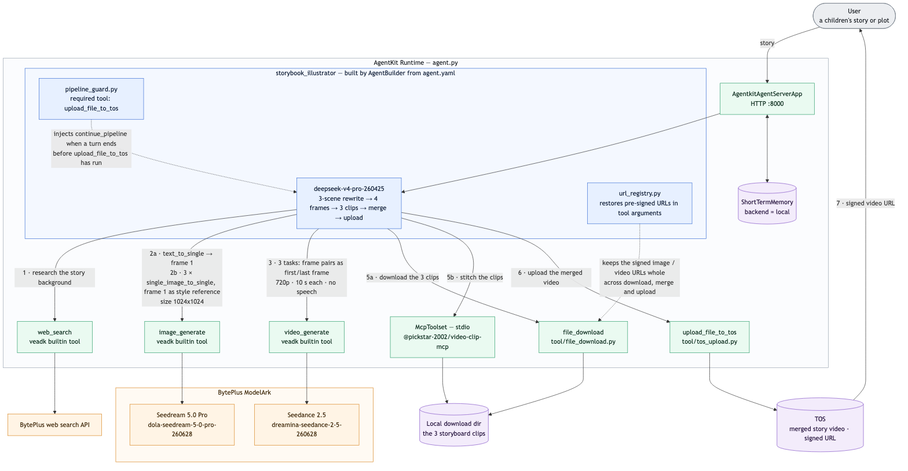

# 绘本故事视频生成 Agent（BytePlus 版）

> English documentation: [README_en.md](README_en.md)

## 概述

本样例是一个基于 BytePlus AgentKit 与 VeADK 的"绘本故事视频生成"（Fable Storybook）Agent。

输入一个童话故事或故事情节后，Agent 会：

- 将故事拆分为三个场景，并生成四张 3D 卡通风格的分镜插画
- 以相邻分镜作为首尾帧，生成三段过渡视频
- 调用本地 MCP 工具将三段视频按顺序拼接为一部完整成片
- 将成片上传到 BytePlus TOS 对象存储，并返回可访问的签名 URL



（架构图的 Mermaid 源码见 [README_en.md](README_en.md)）

## 核心功能

- **智能故事助手**：理解并提炼用户提供的故事或情节，结合背景信息检索（`web_search`），将故事拆分为三个场景并改写为适合 5-15 岁儿童的内容
- **分镜插画生成**：基于故事描述，使用大模型文生图能力生成四张分镜插画；先单独生成第一张，再将其作为风格参考图生成其余三张，保证风格与角色形象一致
- **视频生成**：将四张分镜图按顺序两两配对作为首尾帧，一次性提交三个任务，生成三段 720P 分镜视频
- **成片托管**：将分镜视频下载到本地，通过本地 MCP 工具（`@pickstar-2002/video-clip-mcp`）拼接为完整故事视频，再上传到 TOS 对象存储并生成限时签名预览链接
- **可观测性**：集成 OpenTelemetry 链路追踪与 APMPlus 监控
- **迭代优化**：维护会话上下文，用户可以继续要求调整风格、节奏或内容
- **默认英文、跟随用户语言**：Agent 默认以英文思考、规划与回复（见 [`agent.yaml`](agent.yaml)）；用户使用其他语言时会自动切换为该语言输出
- **视频无口播**：Seedance 2.5 原生生成音频，视频提示词只要求纯音乐与环境音效，明确排除对白、旁白、歌词、字幕与画面文字，故事完全通过画面、运镜、音乐与环境音传达

## Agent 能力

| 组件 | 说明 |
| --- | --- |
| **Agent 服务** | [`agent.py`](agent.py) - 主程序入口，包含 MCP 工具注册 |
| **Agent 配置** | [`agent.yaml`](agent.yaml) - 模型设置、系统提示词与工具列表 |
| **自动续跑守卫** | [`pipeline_guard.py`](pipeline_guard.py) - 若模型在成片上传 TOS 之前就以纯文本结束回合，会注入 `continue_pipeline` 工具调用让流程继续，用户无需手动输入"继续" |
| **签名 URL 注册表** | [`url_registry.py`](url_registry.py) - 图像/视频工具返回的 TOS 预签名 URL 常被模型截断查询串导致 `403 Forbidden`；注册表记录每个工具返回的 URL，并在下一次工具调用前还原完整签名 URL |
| **自定义工具** | [`tool/`](tool/) - 文件下载与 TOS 上传工具 |
| **MCP 集成** | `@pickstar-2002/video-clip-mcp` - 本地视频拼接服务 |
| **短期记忆** | 维护会话上下文，保证多轮对话连续性 |

## 目录结构说明

```bash
video_gen
├── LICENSE               # 代码许可（Apache 2.0）
├── README.md             # 中文说明文档（本文件）
├── README_en.md          # 英文说明文档
├── project.yaml          # 项目信息元数据
├── agent.py              # 主程序入口，注册 MCP 工具并定义 AgentKit 服务
├── agent.yaml            # Agent 配置（模型、系统提示词与工具列表）
├── consts.py             # 默认模型名、API 地址与 .env 加载逻辑
├── pipeline_guard.py     # 自动续跑守卫回调
├── url_registry.py       # 签名 URL 注册表回调
├── tool
│   ├── file_download.py  # 文件下载工具
│   └── tos_upload.py     # TOS 上传工具
├── scripts
│   └── setup.sh          # 镜像构建阶段预装 video-clip-mcp 的脚本
├── assets
│   └── images            # 架构图与运行效果截图
├── .env.example          # 环境变量示例文件
├── pyproject.toml        # 项目依赖管理文件（uv）
└── requirements.txt      # 项目依赖管理文件（pip）
```

## 本地运行

**注意**：本样例在 Python 3.12 下测试通过，仓库中其他样例可能需要不同的 Python 版本，推荐使用 [mise](https://mise.jdx.dev/getting-started.html) 管理多版本 Python。

### 前置准备

**Node.js 环境**

- 安装 Node.js 18+ 与 npm（[Node.js 安装](https://nodejs.org/en)）
- 确保终端中 `npx` 命令可用

**BytePlus 访问凭证**

请先配置 IAM 用户并创建 Access Key / Secret Key，同时为该用户授予以下权限：

- `AgentKitFullAccess`（AgentKit 完全访问）
- `APMPlusServerFullAccess`（APMPlus 完全访问）

在 BytePlus 控制台搜索 "ModelArk"，在 "Model activation" 页面确认以下模型已开通：

- **文本模型**：DeepSeek V4 Pro（模型 ID：`deepseek-v4-pro-260425`）
- **图像模型**：Seedream 5.0 Pro（模型 ID：`dola-seedream-5-0-pro-260628`）
- **视频模型**：Seedance 2.5（模型 ID：`dreamina-seedance-2-5-260628`，支持最长 30 秒的视频片段）

最后在 "API Keys" 页面创建并保存一个 API Key，后续配置环境变量时会用到。

### 依赖安装

推荐使用 `uv` 管理 Python 依赖：

```bash
uv sync
```

如果在中国大陆访问 PyPI 有网络问题，可以改用清华镜像：

```bash
uv sync --index-url https://pypi.tuna.tsinghua.edu.cn/simple
```

**注意**：MCP 视频工具（`@pickstar-2002/video-clip-mcp`）会在 Agent 运行时通过 `npx` 自动启动，无需手动安装。

### 环境准备

设置以下环境变量：可以直接在 shell 中 export，也可以将 [`.env.example`](.env.example) 复制为 `.env` 并填写。`.env` 会在启动时自动加载（见 [`consts.py`](consts.py)），其中的值优先于 shell 环境变量；`.env` 只对本地运行生效，云端部署需通过 `agentkit config --runtime_envs ...` 传入（见下文）：

```bash
export BYTEPLUS_ACCESS_KEY={your_ak}
export BYTEPLUS_SECRET_KEY={your_sk}
export DATABASE_TOS_BUCKET=agentkit-platform-{{your_account_id}}
export MODEL_AGENT_API_KEY={{your_model_agent_api_key}} # 从 BytePlus ModelArk 获取，本地调试必需
export DOWNLOAD_DIR=/tmp
export AGENTKIT_CLOUD_PROVIDER=byteplus
export CLOUD_PROVIDER=byteplus
export BYTEPLUS_WEB_SEARCH_API_KEY={{your_web_search_api_key}} # 从 BytePlus Searchinfinity 获取，web_search 工具必需
```

**注意**：`AGENTKIT_CLOUD_PROVIDER` 与 `CLOUD_PROVIDER` 均为**必填**。前者由 agentkit SDK 读取，后者由 veADK 读取，用于控制默认 Endpoint、默认模型以及 `BYTEPLUS_*` 凭证到 veADK 内部 `VOLCENGINE_*` 变量的映射。缺少它们时 SDK 会回退到火山引擎（中国大陆）默认值，导致对 BytePlus 账号的调用失败。`consts.py` 会在 Agent 进程内兜底设置 `CLOUD_PROVIDER=byteplus`，但覆盖不到 agentkit SDK 与独立运行的工具，请勿依赖。

**注意**：`BYTEPLUS_WEB_SEARCH_API_KEY` 是 `web_search` 工具在 `CLOUD_PROVIDER=byteplus` 时的必需凭证。缺少它时联网搜索会失败（Agent 仍可继续运行，但每次搜索返回错误）。API Key 可从 BytePlus **Searchinfinity** 服务获取，参见 [Searchinfinity API Reference](https://docs.byteplus.com/en/docs/searchinfinity/Searchinfinity_API_Reference)。

**TOS Bucket 配置**：

- **默认 Bucket**：`agentkit-platform-{{your_account_id}}`
  - 其中 `{{your_account_id}}` 需替换为你的 BytePlus 账号 ID
  - 示例：`DATABASE_TOS_BUCKET=agentkit-platform-12345678901234567890`
- 如需自定义，可修改 [`tool/tos_upload.py`](tool/tos_upload.py) 中的 `bucket_name` 参数，或在工具调用时传入。

### 调试方法

本地调试最简单的方式是使用 `veadk web`：

> `veadk web` 是一个基于 FastAPI 的 Web 调试服务。运行后会启动一个加载了本 Agent 代码的 Web 服务器，并提供聊天界面；在界面侧边栏中可以查看 Agent 的思考过程、工具调用以及模型输入输出。

在项目目录内运行：

```bash
uv run veadk web
```

浏览器访问 `http://localhost:8000`，选择 `video_gen` Agent，输入提示词并发送即可。

## AgentKit 部署

**第 0 步**：如尚未安装 agentkit CLI，可在 Python 虚拟环境中安装：

```bash
uv pip install agentkit-sdk-python
```

**第 1 步**：确认当前处于 `video_gen` 目录，然后配置 AgentKit。

**注意**：此处假设 `DATABASE_TOS_BUCKET` 与 `MODEL_AGENT_API_KEY` 已在环境中定义。`agentkit` CLI 自身不读取 `.env`（只有 Agent 进程会在启动时加载），如果变量保存在 `.env` 中，请先导出到当前 shell：

```bash
set -a && source ./.env && set +a
```

这同时会导出 CLI 认证所需的 `BYTEPLUS_ACCESS_KEY` 与 `BYTEPLUS_SECRET_KEY`。

```bash
uv run agentkit config \
--agent_name storybook_illustrator \
--entry_point 'agent.py' \
--runtime_envs DATABASE_TOS_BUCKET=$DATABASE_TOS_BUCKET \
--runtime_envs MODEL_AGENT_API_KEY=$MODEL_AGENT_API_KEY \
--runtime_envs AGENTKIT_CLOUD_PROVIDER=byteplus \
--runtime_envs CLOUD_PROVIDER=byteplus \
--cloud_provider byteplus \
--launch_type cloud
```

**注意**：`--cloud_provider byteplus` 参数是必需的。缺少它时 CLI 默认使用火山引擎，`agentkit launch` 会在解析账号 ID 时报错 `Volcengine credentials not found (Service: sts)`。

**第 2 步**：修改 `agentkit.yaml` 部署配置。

> 目的：修改后会在镜像构建阶段预装 video-clip-mcp，加速 Runtime 启动。

```bash
# On Linux
sed -i 's/docker_build: {}/docker_build:\n  build_script: "scripts\/setup.sh"/' agentkit.yaml

# On macOS
sed -i '' 's/docker_build: {}/docker_build:/' agentkit.yaml && sed -i '' '/docker_build:/a\
  build_script: "scripts\/setup.sh"' agentkit.yaml
```

**第 3 步**：部署 Runtime：

```bash
uv run agentkit launch
```

部署成功后：

1. 访问 [BytePlus AgentKit 控制台](https://console.byteplus.com/agentkit/region:agentkit+ap-southeast-1/overview?projectName=default)
2. 点击 **Runtime** 查看已部署的 `storybook_illustrator`
3. 获取公网访问域名（形如 `https://xxxxx.apigateway-ap-southeast-1.apigw-byteplus.com`）与 API Key

Agent Runtime 自带一个简单的 Web UI（聊天窗口），可以直接与 Agent 交互；也可以使用 `agentkit invoke` 从命令行触发 / 调试：

```bash
uv run agentkit invoke '{"prompt": "The adventure of a panda, in a Chinese animation style"}'
```

不再需要时，可以清理已部署的 Runtime：

```bash
uv run agentkit destroy
```

## 示例提示词

- **中国神话**："后羿射日,嫦娥奔月,吴刚伐木真人版"
- **经典故事**："愚公移山与精卫填海绘本故事"
- **武侠小说**："射雕英雄传的真人版视频故事"
- **玄幻小说**："凡人修仙传韩立结婴"
- **3D 动画**："凡人修仙传虚天殿大战,3D 动漫风格"

可以使用任意语言输入提示词。Agent 默认以英文回复、规划并撰写图像/视频提示词；用户使用其他语言时会切换为该语言。生成的视频包含音乐与环境音，但没有口播。

## 效果展示

Agent 的一次完整运行过程如下：

1. 生成 4 张分镜插画
2. 以相邻分镜为首尾帧生成 3 段过渡视频
3. 启动本地 MCP 工具拼接视频
4. 将成片上传到 TOS
5. 返回可观看的签名 URL

本地 `veadk web` 调试界面（与 Google ADK 测试工具一致）：


部署后 AgentKit Runtime 自带 Web UI 的交互效果：


## 常见问题

**三段视频之间的画面风格为什么会有差异？**

样例已经通过"先单独生成第一张分镜图，再将其作为风格参考（image_generate 工具的 `image` 字段）生成其余三张"来缓解风格漂移。由于三段视频是基于各自的首尾帧独立生成的，片段之间仍可能存在轻微的风格差异，属于预期现象。

**AgentKit 行为不符合预期，如何排查？**

可以设置以下环境变量开启更详细的调试输出：

```bash
export AGENTKIT_LOG_CONSOLE=true
export AGENTKIT_LOG_LEVEL=DEBUG
```

## 代码许可

本工程遵循 Apache 2.0 License
