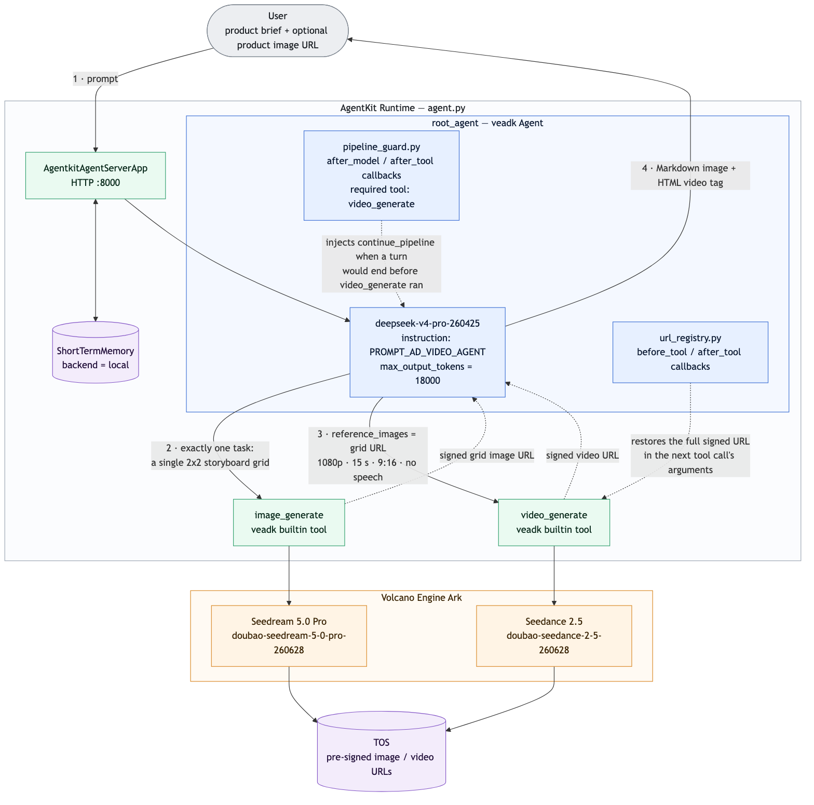
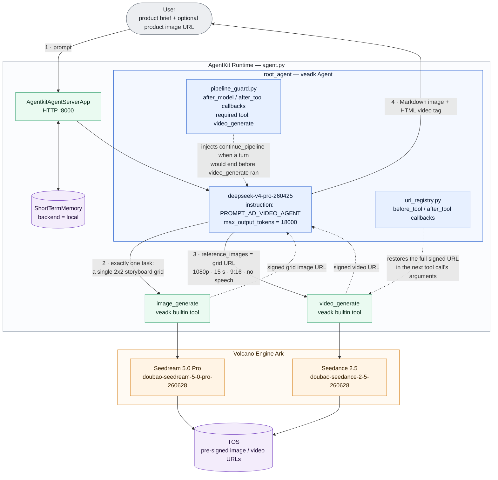

# Ad Video Generation Agent - E-commerce Marketing Videos

**IMPORTANT**: This demo was tested with Python 3.12, but other demos here require other versions of Python. We recommend installing and managing multiple versions of Python with [mise](https://mise.jdx.dev/getting-started.html).

This is a single-agent e-commerce marketing video generator based on Volcano Engine AgentKit and VeADK.

When given product information (product name, selling points, target audience, usage scenarios, style preferences, and an optional product image URL), it will:

- Plan a 4-part marketing story (hook → scenario → selling-point close-up → call-to-action)
- Generate one 2x2-grid marketing story reference image containing all four storyboard panels
- Show the reference image to the user as an intermediate result
- Generate one continuous marketing short video from the reference image (9:16, 1080P, 15 seconds by default, up to 30 seconds on request)

## Overview

This sample uses a deliberately lightweight single-agent architecture: one Root Agent directly calls the built-in `image_generate` and `video_generate` tools to complete the full workflow — marketing story planning, reference image generation, image-to-video generation, and result preview. There is no candidate generation, quality evaluation, video stitching, or TOS upload; for those, see the `ad_video_gen_seq` and `ad_video_gen_a2a` samples.



<details>
<summary>Mermaid source</summary>



</details>

Key features include:

- **Product information understanding**: extracts marketing requirements from product name, selling points, target audience, usage scenarios, and style preferences
- **Marketing story planning**: automatically designs a 4-part marketing story mapped onto a single 2x2 storyboard grid
- **Product image reference input**: publicly accessible product image URLs are passed to the image model as image-to-image references, preserving product appearance, packaging, and colors
- **Image-to-video generation**: the 2x2 grid image is passed to Seedance 2.5 via `reference_images` (not as a first/last frame) to generate one continuous video
- **Preview-ready output**: results are returned as Markdown images and an HTML video tag, previewable directly in the AgentKit debug page
- **English by Default**: The agent plans, writes its image/video prompts, and replies in English by default; if you write in another language it switches to that language for all of its output so the results are easy to review (see the `# Language` section in [`prompt.py`](prompt.py))
- **No speech in the video**: the video prompt asks for instrumental background music and ambient sound only — no dialogue, voiceover, narration, or lyrics — so the message is carried by visuals, motion, and short on-screen text

## Agent Capabilities

| Component | Description |
| --- | --- |
| **Agent Service** | [`agent.py`](agent.py) - AgentKit service entry and `root_agent` definition |
| **Agent Prompt** | [`prompt.py`](prompt.py) - The single-agent marketing workflow prompt |
| **Auto-continue Guard** | [`pipeline_guard.py`](pipeline_guard.py) - keeps the multi-step run going in one turn: if the model ends a turn with a text-only progress note before `video_generate` has run, the guard injects a `continue_pipeline` tool call so the user never has to type "continue" |
| **Signed-URL Registry** | [`url_registry.py`](url_registry.py) - the image/video tools return pre-signed TOS URLs whose signature is in the query string; models often drop or truncate that query string when copying a URL into a later tool call, which TOS rejects with `403 Forbidden`. The registry records every URL a tool returns and restores the full signed URL before the next tool runs |
| **Model Defaults** | [`consts.py`](consts.py) - Default model names and API bases for VeADK |
| **Short-term Memory** | Session context maintenance to preserve conversational continuity |

## Quick Start

### Prerequisites

#### Volcano Engine Access Credentials

Make sure you have configured an IAM user, created a new Access Key / Secret Key pair, and that you have assigned the following permissions to the user:

- `AgentKitFullAccess` (AgentKit full access)
- `APMPlusServerFullAccess` (APMPlus full access)

In the web console, open the product search dropdown and search for "Ark" (方舟). Under "Model activation" make sure the following models are enabled:

- **Text:** DeepSeek V4 Pro (model ID: `deepseek-v4-pro-260425`)
- **Images:** Seedream 5.0 Pro (model ID: `doubao-seedream-5-0-pro-260628`)
- **Video:** Seedance 2.5 (model ID: `doubao-seedance-2-5-260628`) — supports video clips up to 30 seconds long

**Finally, from the "API Keys" page, create a new key and save it, we'll need it later on (see *Configure Environment Variables* below).**

### Install Dependencies

*We recommend using uv to manage Python dependencies*

Once UV is installed, set up with:

```bash
uv sync
```

If you are in China and have connectivity issues, you can use this command instead:

```bash
uv sync --index-url https://pypi.tuna.tsinghua.edu.cn/simple
```

### Configure Environment Variables

Set the following environment variables — either export them in your shell, or copy [`.env.example`](.env.example) to `.env` (in the project directory or in the directory you launch from) and fill it in. `.env` is loaded automatically at startup (see [`consts.py`](consts.py)) and is optional; values in `.env` take precedence over variables exported in the shell, and anything missing from `.env` falls back to the shell environment. `.env` only applies to local runs — for cloud deploys pass values through `agentkit config --runtime_envs ...` (see below):

```bash
export MODEL_AGENT_API_KEY={{your_model_agent_api_key}} # Get from Volcano Engine Ark (方舟)
```

The agent, image, and video model names and API bases default to the values in [`consts.py`](consts.py) (`deepseek-v4-pro-260425`, `doubao-seedream-5-0-pro-260628`, and `doubao-seedance-2-5-260628` on the cn-beijing Ark endpoint). To override any of them, set the corresponding environment variables before starting the agent:

```bash
export MODEL_AGENT_NAME=deepseek-v4-pro-260425
export MODEL_IMAGE_NAME=doubao-seedream-5-0-pro-260628
export MODEL_VIDEO_NAME=doubao-seedance-2-5-260628
```

## Local Execution

The simplest way to debug locally is with `veadk web`:

> `veadk web` is a web service based on FastAPI for debugging Agent applications. When you run this command, it starts a web server that loads and runs your agentkit agent code, while also providing a chat interface where you can interact with the agent. In the sidebar or a specific panel of the interface, you can view the details of the agent's execution, including the Thought Process, Tool calls, and model input/output.

Running it from within the project directory is straightforward:

```bash
uv run veadk web
```

Visit `http://localhost:8000` in your browser, select the `ad_video_gen` agent, enter a prompt, and click "Send".

### Example Prompts

- "Please generate a product showcase video for a bayberry drink, vertical 9:16, fresh summer style. Selling points: natural bayberry, sweet and sour, refreshing when chilled, suitable for hot pot, barbecue, and gatherings."
- "Please generate an e-commerce marketing video for milky soft pull-apart toast. Usage scenarios: breakfast, afternoon tea, camping picnic. Key selling points: rich milky aroma, soft texture, crispy outside and soft inside after toasting, suitable for family sharing. Style: warm, bright, appetizing."
- "Generate a 30-second product seeding video for a wabi-sabi scented candle. Target audience: urban professionals who like minimalist home decor and bedtime relaxation. Selling points: natural soy wax, woody scent, reusable cement jar. Visual style: restrained, quiet, premium."

**Expected Behavior:**

1. The agent plans a 4-part marketing story from your product description
2. It generates one 2x2 storyboard reference image and displays it immediately
3. It then generates one continuous marketing video from the reference image (this can take several minutes)
4. The final answer contains the reference image and an HTML video preview

## AgentKit Deployment

### Deploy to Volcano Engine AgentKit Runtime

**Step 0:** If you haven't installed agentkit yet, you can do it locally (inside the Python virtual environment) with:

```bash
uv pip install agentkit-sdk-python
```

**Step 1:** Make sure you are in the current directory (`ad_video_gen`), then configure AgentKit:

**Note**: We assume here that `MODEL_AGENT_API_KEY` is defined in your shell environment

```bash
uv run agentkit config \
--agent_name ad_video_gen \
--entry_point 'agent.py' \
--runtime_envs MODEL_AGENT_API_KEY=$MODEL_AGENT_API_KEY \
--launch_type cloud
```

**Step 2:** Deploy the runtime:

```bash
uv run agentkit launch
```

### Test the Deployed Agent

After successful deployment:

1. Visit the [Volcano Engine AgentKit Console](https://console.volcengine.com/agentkit/region:agentkit+cn-beijing/runtime)
2. Click **Runtime** to view the deployed agent `ad_video_gen`
3. Get the public access domain name (e.g., `https://xxxxx.apigateway-cn-beijing.volceapi.com`) and API Key

You can directly use `agentkit invoke` to trigger / debug the agent. The command is:

```bash
uv run agentkit invoke '{"prompt": "Generate a marketing video for a sparkling yuzu drink, fresh and summery, vertical 9:16"}'
```

## Cleanup / Teardown

You can remove your deployed AgentKit runtime with:

```bash
uv run agentkit destroy
```

## FAQ

### Does it support direct image upload or base64 images?

The current sample only supports publicly accessible image URLs as product references. Direct image upload and base64 images are not supported.

### Does it generate multiple candidate videos and evaluate them automatically?

The current single-agent version generates one reference image and one video by default. It does not include candidate generation, quality evaluation, stitching, or upload workflows — see `ad_video_gen_seq` and `ad_video_gen_a2a` for those.

### Can the video aspect ratio and duration be adjusted?

Yes. By default, the agent generates a 9:16, 1080P, 15-second video. If you explicitly ask for a landscape or square ratio, or a custom duration, the agent uses your requested format. Seedance 2.5 supports durations from 4 up to 30 seconds.
