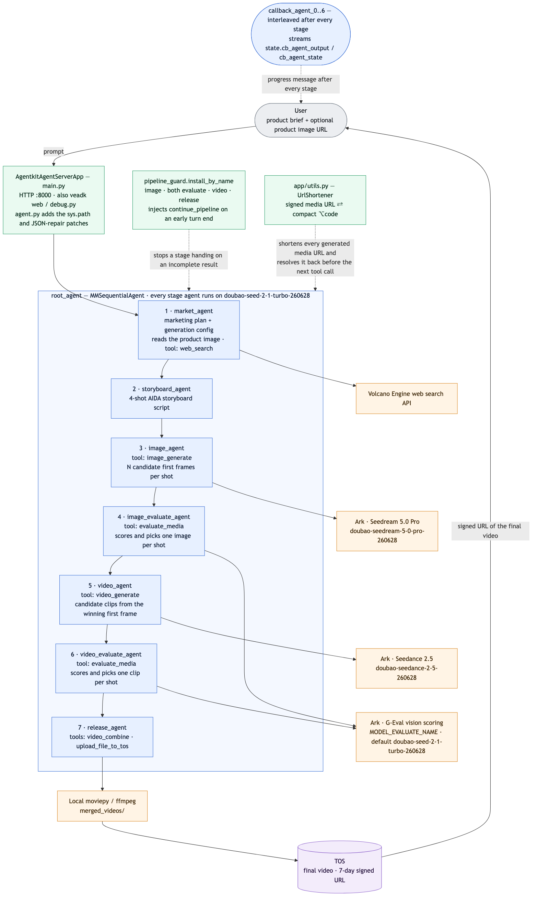

# 营销视频生成 Agent（顺序多智能体版）

> English documentation: [README_en.md](README_en.md)

## 概述

本样例是一个基于火山引擎 AgentKit 与 VeADK 的顺序多智能体电商营销视频生成器。

输入商品信息（商品名称、卖点、目标人群、使用场景，以及可选的商品图片 URL）后，流水线会：

- 产出营销方案与生成配置（分辨率、画幅比例、每个镜头的候选数量）
- 按照 AIDA 营销模型（Attention → Interest → Desire → Action）设计四镜头分镜脚本
- 为每个镜头生成多张候选首帧图，自动打分并挑选最优一张
- 以选中的首帧图为引导，为每个镜头生成多条候选视频（Seedance 2.5，单条 4–30 秒），再打分挑选最优一条
- 在本地将各镜头的最优视频拼接为一条成片，上传到 TOS 并返回可播放的签名 URL

与轻量的单智能体样例 `ad_video_gen` 不同，本样例用 `SequentialAgent` 构建了完整的生产级流水线：一个 Root Agent 按固定顺序编排七个子智能体，包含候选生成、基于模型的质量评估、视频拼接与 TOS 上传，且每个阶段结束后都会向用户流式返回进度消息。



（架构图的 Mermaid 源码见 [README_en.md](README_en.md)）

## 核心功能

- **带图像理解的营销策划**：策划子智能体在阅读文字需求的同时读取商品图片（URL），并可通过 web_search 工具检索平台相关的营销建议
- **候选生成与自动评估**：每个镜头生成多张候选图 / 多条候选视频，按美学、画质与参考图一致性打分，自动选出最优素材
- **首帧引导的视频生成**：每个镜头视频由 Seedance 2.5 基于选中的首帧图生成；支持 4 到 30 秒的片段（默认每镜头 5–10 秒）
- **本地合成与 TOS 上传**：选中的镜头视频用 moviepy 拼接为一条成片，上传到 TOS 桶并返回有效期 7 天的签名 URL
- **面向 LLM 的 URL 短码**：超长的素材 URL 会映射为紧凑的 `⌥xxxxx` 短码，避免模型在传递过程中截断或篡改
- **默认英文、跟随用户语言**：所有阶段智能体默认以英文工作——营销方案、分镜脚本、图像/视频提示词、评估理由与回复；用户使用其他语言时会自动切换（见各阶段 `prompt.py` 中的 `# Language` 一节）

## Agent 能力

| 组件 | 说明 |
| --- | --- |
| **Agent 模块** | [`agent.py`](agent.py) - sys.path 引导、模型默认值、ADK 兼容补丁，以及供 `veadk web` 使用的 `root_agent` 导出 |
| **自动续跑守卫** | [`pipeline_guard.py`](pipeline_guard.py) - 安装在图像 / 评估 / 视频 / 发布子智能体上：若某阶段没有调用其必需工具（`image_generate`、`evaluate_media`、`video_generate`、`video_combine` + `upload_file_to_tos`）就结束回合，守卫会注入 `continue_pipeline` 工具调用，避免把不完整的结果交给下一阶段 |
| **服务入口** | [`main.py`](main.py) - AgentKit 服务入口（`AgentkitAgentServerApp`） |
| **调试脚本** | [`debug.py`](debug.py) - 从命令行一次性运行完整流水线 |
| **根编排** | [`app/root/`](app/root/) - `SequentialAgent`，各阶段之间穿插进度回调 |
| **营销策划** | [`app/market/`](app/market/) - 营销方案、生成配置、商品图片 URL 检测 |
| **分镜脚本** | [`app/storyboard/`](app/storyboard/) - AIDA 四镜头脚本生成 |
| **图像生成** | [`app/image/`](app/image/) - 批量生成候选首帧图 |
| **质量评估** | [`app/eval/`](app/eval/) - 视觉模型对图像与视频打分 |
| **视频生成** | [`app/video/`](app/video/) - 批量首帧引导视频生成 |
| **成片发布** | [`app/release/`](app/release/) - 视频拼接（moviepy）与 TOS 上传 |
| **配置示例** | [`config.yaml.example`](config.yaml.example) - 模型名、AK/SK 与 TOS 桶 |
| **环境加载** | [`consts.py`](consts.py) - 启动时自动加载 `.env`（项目目录优先，其值覆盖 shell 环境变量） |

## 目录结构说明

```bash
ad_video_gen_seq
├── LICENSE               # 代码许可（Apache 2.0）
├── README.md             # 中文说明文档（本文件）
├── README_en.md          # 英文说明文档
├── project.yaml          # 项目信息元数据
├── main.py               # AgentKit 服务入口（AgentkitAgentServerApp）
├── agent.py              # sys.path 引导、模型默认值、ADK 兼容补丁与 root_agent 导出
├── debug.py              # 命令行一次性运行完整流水线的调试脚本
├── consts.py             # .env 加载逻辑（启动时自动加载）
├── pipeline_guard.py     # 自动续跑守卫回调
├── __init__.py           # 包初始化文件
├── app                   # 多智能体流水线包（每个子目录含 agent/prompt/hook 等）
│   ├── root              # SequentialAgent 根编排，穿插进度回调
│   ├── market            # 1. 营销策划子智能体（读商品图，工具：web_search）
│   ├── storyboard        # 2. AIDA 四镜头分镜脚本子智能体
│   ├── image             # 3. 候选首帧图生成子智能体（工具：image_generate）
│   ├── eval              # 4/6. 图像与视频质量评估子智能体（工具：evaluate_media）
│   ├── video             # 5. 首帧引导视频生成子智能体（工具：video_generate）
│   ├── release           # 7. 成片拼接与 TOS 上传子智能体
│   └── utils.py          # UrlShortener：签名 URL 与短码的双向映射
├── assets
│   └── images            # 架构图等静态资源
├── config.yaml.example   # 配置文件示例（模型名、AK/SK、TOS 桶）
├── .env.example          # 环境变量示例文件
├── pyproject.toml        # 项目依赖管理文件（uv）
└── requirements.txt      # 项目依赖管理文件（pip）
```

## 本地运行

**注意**：本样例在 Python 3.12 下测试通过，仓库中其他样例可能需要不同的 Python 版本，推荐使用 [mise](https://mise.jdx.dev/getting-started.html) 管理多版本 Python。

### 前置准备

**火山引擎访问凭证**

请先配置 IAM 用户并创建 Access Key / Secret Key，同时为该用户授予以下权限：

- `AgentKitFullAccess`（AgentKit 完全访问）
- `APMPlusServerFullAccess`（APMPlus 完全访问）

在火山引擎控制台搜索"方舟"（Ark），在"开通管理"页面确认以下模型已开通：

- **Agent / 评估（视觉）模型**：Doubao Seed 2.1 Turbo（模型 ID：`doubao-seed-2-1-turbo-260628`）——本样例的 Agent 模型必须支持视觉输入（不同于单智能体样例 `ad_video_gen` 使用的纯文本模型 DeepSeek V4 Pro `deepseek-v4-pro-260425`），因为策划子智能体要读取商品图片，评估工具要为生成的图像与视频打分
- **图像模型**：Seedream 5.0 Pro（模型 ID：`doubao-seedream-5-0-pro-260628`）
- **视频模型**：Seedance 2.5（模型 ID：`doubao-seedance-2-5-260628`，支持最长 30 秒的视频片段）

最后在"API Key 管理"页面创建并保存一个 API Key，后续配置环境变量时会用到。

**TOS 桶**

最终合成的视频会上传到一个 TOS 桶。可以使用 AgentKit 平台桶 `agentkit-platform-{{your_account_id}}`（将 `{{your_account_id}}` 替换为你的火山引擎账号 ID），也可以使用该 AK/SK 有写权限的任意桶。

**ffmpeg**

视频拼接使用 `moviepy`，运行 Agent 的机器上需要可用的 `ffmpeg`（例如 macOS 上执行 `brew install ffmpeg`）。

### 依赖安装

推荐使用 `uv` 管理 Python 依赖：

```bash
uv sync
```

如果在国内访问 PyPI 较慢，可以改用清华镜像：

```bash
uv sync --index-url https://pypi.tuna.tsinghua.edu.cn/simple
```

### 环境准备

设置以下环境变量：可以直接在 shell 中 export，也可以将 [`.env.example`](.env.example) 复制为 `.env`（放在项目目录或启动目录中）并填写。`.env` 会在启动时自动加载（见 [`consts.py`](consts.py)），其中的值优先于 shell 环境变量，缺失项回退到 shell 环境；`.env` 只对本地运行生效，云端部署需通过 `agentkit config --runtime_envs ...` 传入（见下文）：

```bash
export MODEL_AGENT_API_KEY={{your_model_agent_api_key}} # 从火山方舟（Ark）获取
export VOLCENGINE_ACCESS_KEY={{your_access_key}}        # 用于 TOS 上传
export VOLCENGINE_SECRET_KEY={{your_secret_key}}        # 用于 TOS 上传
export DATABASE_TOS_BUCKET=agentkit-platform-{{your_account_id}}
```

**注意**：营销策划子智能体的 `web_search` 工具复用同一对 `VOLCENGINE_ACCESS_KEY` / `VOLCENGINE_SECRET_KEY`（部署到 AgentKit 后也可回退到 Runtime 的 IAM 角色），不需要单独的搜索 API Key。

模型名与 API 地址可用以下环境变量覆盖（下列值即本样例设计使用的默认值）：

```bash
export MODEL_AGENT_NAME=doubao-seed-2-1-turbo-260628
export MODEL_EVALUATE_NAME=doubao-seed-2-1-turbo-260628
export MODEL_IMAGE_NAME=doubao-seedream-5-0-pro-260628
export MODEL_VIDEO_NAME=doubao-seedance-2-5-260628
```

也可以将 [`config.yaml.example`](config.yaml.example) 复制为 `config.yaml` 并填写——VeADK 启动时会把 YAML 键拍平为同名环境变量（已设置的环境变量优先）：

```bash
cp config.yaml.example config.yaml
```

### 调试方法

本地调试最简单的方式是使用 `veadk web`：

> `veadk web` 是一个基于 FastAPI 的 Web 调试服务。运行后会启动一个加载了本 Agent 代码的 Web 服务器，并提供聊天界面；在界面侧边栏中可以查看 Agent 的思考过程、工具调用以及模型输入输出。

在项目目录内运行：

```bash
uv run veadk web
```

浏览器访问 `http://localhost:8000`，选择 `ad_video_gen_seq` Agent，输入提示词并发送即可。

也可以从命令行一次性运行完整流水线（示例提示词在 [`debug.py`](debug.py) 底部，可自行修改）：

```bash
uv run python debug.py
```

或在本地 8000 端口启动 AgentKit API 服务：

```bash
uv run python main.py
```

## AgentKit 部署

**第 0 步**：如尚未安装 agentkit CLI，可在 Python 虚拟环境中安装：

```bash
uv pip install agentkit-sdk-python
```

**第 1 步**：确认当前处于 `ad_video_gen_seq` 目录，然后配置 AgentKit。

**注意**：以下命令假设 `MODEL_AGENT_API_KEY`、`VOLCENGINE_ACCESS_KEY`、`VOLCENGINE_SECRET_KEY`、`DATABASE_TOS_BUCKET` 已在 shell 环境中定义。`agentkit` CLI 自身会从运行目录的 `.env` 中读取 `VOLCENGINE_ACCESS_KEY` / `VOLCENGINE_SECRET_KEY` 用于认证（详见 [`.env.example`](.env.example) 顶部说明），但 `--runtime_envs` 中引用的 `$VAR` 由 shell 展开，因此这些变量仍需先导出到当前 shell，例如：

```bash
set -a && source ./.env && set +a
```

```bash
uv run agentkit config \
--agent_name ad_video_gen_seq \
--entry_point 'main.py' \
--runtime_envs MODEL_AGENT_API_KEY=$MODEL_AGENT_API_KEY \
--runtime_envs VOLCENGINE_ACCESS_KEY=$VOLCENGINE_ACCESS_KEY \
--runtime_envs VOLCENGINE_SECRET_KEY=$VOLCENGINE_SECRET_KEY \
--runtime_envs DATABASE_TOS_BUCKET=$DATABASE_TOS_BUCKET \
--launch_type cloud
```

**第 2 步**：部署 Runtime：

```bash
uv run agentkit launch
```

部署成功后：

1. 访问[火山引擎 AgentKit 控制台](https://console.volcengine.com/agentkit/region:agentkit+cn-beijing/runtime)
2. 点击 **Runtime** 查看已部署的 `ad_video_gen_seq`
3. 获取公网访问域名（形如 `https://xxxxx.apigateway-cn-beijing.volceapi.com`）与 API Key

也可以直接使用 `agentkit invoke` 触发 / 调试：

```bash
uv run agentkit invoke '{"prompt": "Please generate a marketing video for a sparkling yuzu drink, fresh summer style. Product image: https://ark-tutorial.tos-cn-beijing.volces.com/multimedia/%E6%9D%A8%E6%A2%85%E9%A5%AE%E6%96%99.jpg"}'
```

不再需要时，可以清理已部署的 Runtime：

```bash
uv run agentkit destroy
```

## 示例提示词

- "请为巧克力生成一条圣诞营销视频。商品名称：圣诞限定黑巧克力礼盒。目标人群：追求节日风味、甜蜜分享与能量补给的巧克力爱好者。使用场景：圣诞下午茶、节日聚会、温暖送礼。主要成分：精选可可豆、纯可可脂、优质牛奶、天然香草，无人工色素与防腐剂。口感：入口即化、丝滑浓郁、可可香气浓烈、微苦回甘。http://lf3-static.bytednsdoc.com/obj/eden-cn/lm_sth/ljhwZthlaukjlkulzlp/ark/assistant/images/ad_chocolate.png"
- "请生成一条面包营销视频。商品名称：奶香手撕吐司。使用场景：早餐搭配、下午茶点心、日常代餐。目标人群：上班族、学生、家庭用户。主要成分：高筋面粉、牛奶、鸡蛋、黄油、酵母、糖。特点：奶香浓郁、内里松软、蜂窝气孔均匀、烤后外皮带微焦斑点。http://lf3-static.bytednsdoc.com/obj/eden-cn/lm_sth/ljhwZthlaukjlkulzlp/ark/assistant/images/ad_bread.jpeg"
- "请根据商品图为一款侘寂风香薰蜡烛生成电商营销视频。商品名称：侘寂风香薰蜡烛。使用场景：客厅装饰、卧室助眠、书房放松。目标人群：极简家居爱好者、都市上班族、香氛收藏者。主要成分：天然大豆蜡、精油、水泥罐、纸质标签。特点：原始水泥质感、黑白极简标签、柔和烛光、罐体可复用、低调质朴。http://lf3-static.bytednsdoc.com/obj/eden-cn/lm_sth/ljhwZthlaukjlkulzlp/ark/assistant/images/ad_candle.jpeg"

## 效果展示

流水线的一次完整运行过程如下：

1. 营销策划子智能体分析商品需求（以及商品图片，如有提供），输出营销方案与生成配置
2. 分镜子智能体设计 4 个 AIDA 镜头
3. 图像子智能体为每个镜头生成多张候选首帧图（内联展示），图像评估子智能体为每个镜头挑选最优一张
4. 视频子智能体基于选中的首帧图为每个镜头生成多条候选视频（可能需要数分钟），视频评估子智能体为每个镜头挑选最优一条
5. 发布子智能体将各镜头的最优视频拼接为一条成片，上传到 TOS，并返回可直接播放的 HTML 视频预览

每个阶段结束后都会向用户流式返回进度消息。注意：每次请求仅支持**一张**商品图片 URL；检测到多张图片时流水线会提前停止并提示重试。

整体架构与数据流见上方架构图（`assets/images/architecture.png`）。

## 常见问题

**生成的视频可以有多长？**

默认每个镜头生成 5–10 秒的片段。Seedance 2.5 支持 4 到 30 秒的片段，可以在提示词中明确要求更长的镜头。最终成片是四个选中镜头片段的拼接。

**是否支持直接上传图片或 base64 图片？**

商品参考图应为公网可访问的图片 URL。通过聊天界面内联发送的图片数据会先上传到你的 TOS 桶再以 URL 形式引用，这需要配置好 TOS 相关环境变量。每次请求最多支持一张商品图片。

**为什么 Agent 模型用 Doubao Seed 2.1 Turbo 而不是 DeepSeek V4 Pro？**

所有子智能体共享同一个 Agent 模型，其中两个角色需要视觉能力：营销策划子智能体要读取商品图片，评估工具要为生成的图像与视频打分。纯文本模型无法胜任，因此本样例的 Agent 与评估角色使用支持视觉的 Doubao Seed 2.1 Turbo。

**最终视频保存在哪里？**

拼接后的视频会上传到 `DATABASE_TOS_BUCKET` 配置的 TOS 桶，Agent 返回有效期 7 天的预签名 URL。上传完成后本地中间文件会被清理。

## 代码许可

本工程遵循 Apache 2.0 License
