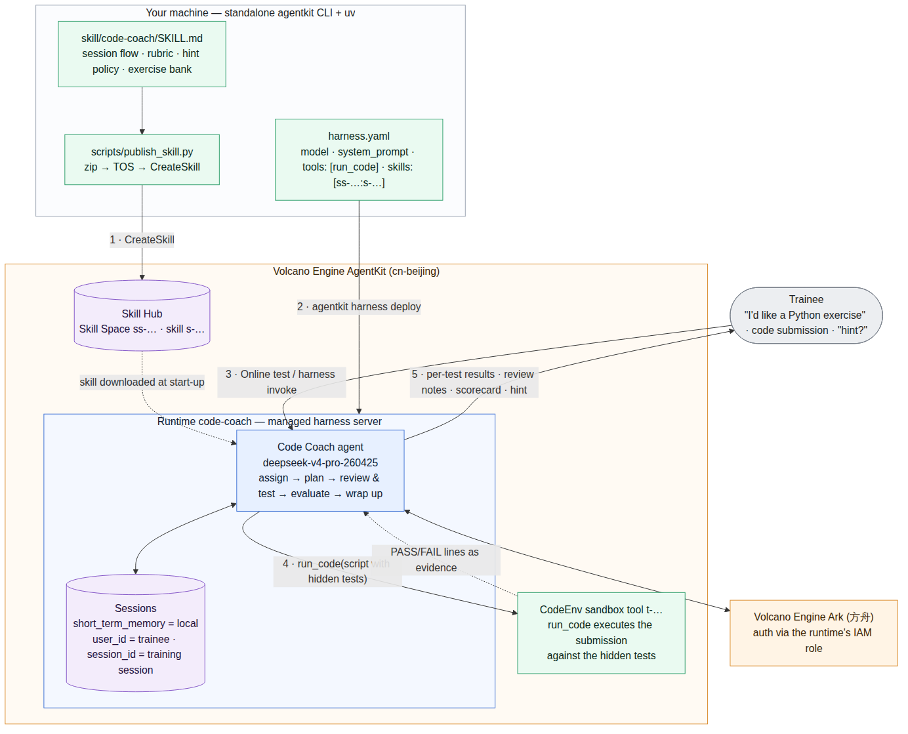
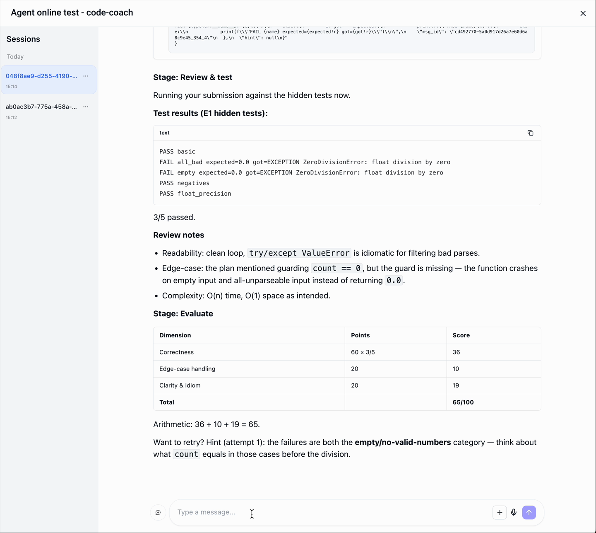
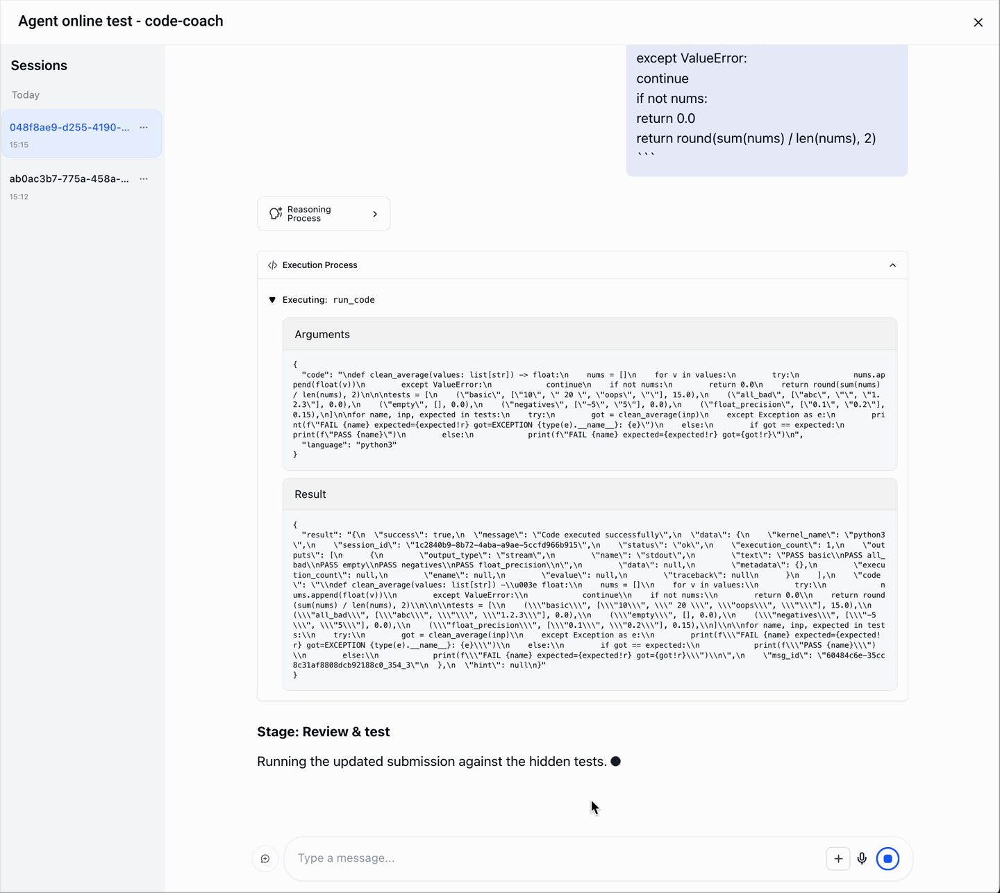

# Code Coach 编程练习教练（AgentKit Harness 无代码版）

> English documentation: [README_en.md](README_en.md)

## 概述

本样例是 **Code Coach**：一个基于火山引擎 AgentKit **Harness（无代码路径）** 构建的 AI 编程练习教练，**不需要编写任何应用代码**。它复刻了职业培训平台的完整闭环：*布置练习 → 计划点评 → 评审与测试 → 打分 → 总结*。

学员与它对话时，Agent 会：

- 从固定的练习题库中布置一道小型 Python 练习（题目描述、函数签名、示例——隐藏测试永不透露）
- （可选）在学员写代码前点评其解题计划
- 通过内置 `run_code` 工具，**在 AgentKit CodeEnv 沙箱中把每次提交跑一遍该题的隐藏测试**，并引用真实的测试输出
- 按 100 分制评分标准（正确性 / 边界情况 / 代码清晰度）打分，并展示计算过程
- 采用渐进式提示（类别 → 失败输入的形态 → 详细讲解），而不是直接贴答案
- 服务端记住整个会话（练习、提交、得分），一个 AgentKit 会话 = 一次培训会话

**本样例与仓库中其他样例的结构不同，请先阅读：**

- 它是 **AgentKit Harness（无代码）** Agent：没有 `agent.py`、`consts.py` 或 `agent.yaml`，整个 Agent 就是 [`harness.yaml`](harness.yaml) 加上一个技能（[`skill/code-coach/SKILL.md`](skill/code-coach/SKILL.md)），技能发布到 AgentKit Skill Hub 后按引用挂载。
- 它使用**独立安装的 `agentkit` CLI**（由 AgentKit CLI 安装器装入 `~/.agentkit`，见下文"前置准备"），**而不是**其他样例使用的 pip 包 `agentkit-sdk-python` 的 `uv run agentkit`。pip 包的 harness 命令（`agentkit add harness` / `agentkit deploy --harness`）需要本地 Dockerfile 且完全无法部署到 BytePlus；独立 CLI 在云端构建镜像并同时支持两朵云，因此本样例的两个副本都使用它。本样例仍然使用 `uv`，但只用于发布技能的 Python 辅助脚本。
- 没有 `veadk web` 本地调试。本地选项是 `agentkit harness dev`，但它目前**不会**接入 `run_code` 工具和技能（见"调试方法"）；沙箱 + 技能行为只能对已部署的运行时验证。
- 独立 CLI 从**运行命令所在目录的 `.env`** 读取 `VOLCENGINE_ACCESS_KEY` / `VOLCENGINE_SECRET_KEY`——下文所有 `agentkit` 命令都请在本目录内执行。它不使用 `.env` 中的 `MODEL_AGENT_API_KEY`（已部署的运行时通过其 IAM 角色访问方舟）。
- 本样例创建的云端资源（Runtime、CodeEnv 沙箱工具、技能）**存续期间会持续计费**——用完请按"AgentKit 部署"末尾的清理步骤下线。

**什么是 AgentKit Harness？** Harness 是 AgentKit 的无代码建 Agent 路径：模型、系统提示词、工具、技能、知识库、记忆全部声明在一个 `harness.yaml` 里，由 CLI 在云端构建并部署为托管运行时。运行时全托管（含缩容到零、版本发布、日志、带鉴权的 HTTP 端点）；`harness.yaml` 中的一切也可以在调用时按次覆盖（`agentkit harness invoke --model-name ... --system-prompt ...`）。当配置不够用时（自定义逻辑、自定义工具、多智能体编排），可以升级到**高代码路径**（VeADK Agent，即本仓库其他样例），它们运行在同一套运行时、会话与技能基础设施上。

| AgentKit 特性 | 在本样例中的体现 |
|---|---|
| **Harness**（无代码 Agent） | 整个 Agent 就是一个 [`harness.yaml`](harness.yaml)——模型 + 提示词 + 工具 + 技能 |
| **Skill Hub / 技能空间** | 培训手册是一个 Claude-Code 风格的 [`SKILL.md`](skill/code-coach/SKILL.md)，发布到技能空间后按 `ss-...:s-...` 引用挂载 |
| **沙箱（CodeEnv）** | `run_code` 内置工具在托管沙箱中执行学员提交的代码 |
| **会话（Sessions）** | 服务端跨轮次保存对话状态——控制台 **Online test** 中的一段对话，或 `agentkit harness invoke ... --user-id <学员> --session-id <会话>` |



（架构图的 Mermaid 源码见 [README_en.md](README_en.md)）

**代码来源**：本样例移植自 **Windrichie** 的 [byteplus-agentkit-samples](https://github.com/windrichie/byteplus-agentkit-samples) 仓库中的 [`use-cases/harness_code_coach`](https://github.com/windrichie/byteplus-agentkit-samples/tree/main/use-cases/harness_code_coach)（移植自 commit [`ee82097`](https://github.com/windrichie/byteplus-agentkit-samples/tree/ee82097b823eb672fe936288d1cf17839dbc9819/use-cases/harness_code_coach)，Apache 2.0 许可）。技能、Harness 定义与演示脚本均出自原作者；本副本按照本仓库的约定调整了目录布局（uv、`.env`、README 结构），固定了在本样例实测版本下的 CLI 命令语法，并独立维护。

## 核心功能

- **无代码 Agent 定义**：模型、系统提示词、工具与技能全部声明在 [`harness.yaml`](harness.yaml) 中，无任何应用代码
- **练习布置**：从技能内置的题库（E1 `clean_average`、E2 `merge_intervals`、E3 `top_k_words`）中布置练习，隐藏测试永不透露
- **沙箱真实执行**：每次提交都通过 `run_code` 在 CodeEnv 沙箱中跑一遍隐藏测试，逐条输出 `PASS` / `FAIL` 及真实报错
- **评分卡**：100 分制评分标准（正确性 / 边界情况 / 清晰度），并展示计算过程
- **渐进式提示**：先给失败类别，再给失败输入的形态，最后才是讲解——不直接给答案
- **服务端会话记忆**：`short_term_memory.type: local`，同一 `session_id` 内 Agent 记得布置过的题目、提交与得分

## Agent 能力

| 组件 | 说明 |
| --- | --- |
| **Agent 定义** | [`harness.yaml`](harness.yaml) - 整个 Agent：云/区域、模型、系统提示词、`tools: [run_code]`、挂载的技能、记忆后端。可直接编辑，也可用 `agentkit harness set ...` 修改 |
| **培训手册（技能）** | [`skill/code-coach/SKILL.md`](skill/code-coach/SKILL.md) - 会话流程、100 分评分标准、渐进式提示策略，以及含隐藏测试的题库 |
| **技能发布脚本** | [`scripts/publish_skill.py`](scripts/publish_skill.py) - 打包技能、上传到平台 TOS 技能桶并调用 AgentKit `CreateSkill` API（把 Skills Center 控制台的操作脚本化） |
| **脚本化会话** | [`scripts/demo_session.sh`](scripts/demo_session.sh) - 对已部署运行时执行 3 轮培训会话（布置 → 含 bug 的提交 → 提示），使用固定的 `user_id` / `session_id` |
| **演示脚本** | [`docs/demo-script.md`](docs/demo-script.md) - 完整 6 轮会话及每轮的预期回答 |
| **沙箱执行** | AgentKit **CodeEnv** 沙箱工具，通过 `agentkit runtime update --tool-id` 绑定到运行时 - `run_code` 执行学员代码的地方 |
| **短期记忆** | `harness.yaml` 中的 `short_term_memory.type: local` - 由运行时保存的会话级对话状态 |

## 目录结构说明

```bash
coding_coach_harness
├── LICENSE               # 代码许可（Apache 2.0）
├── README.md             # 中文说明文档（本文件）
├── README_en.md          # 英文说明文档
├── project.yaml          # 项目信息元数据
├── harness.yaml          # Harness 定义：整个 Agent（模型、提示词、工具、技能）
├── skill
│   └── code-coach
│       └── SKILL.md      # 培训手册技能：流程、评分标准、提示策略与题库
├── scripts
│   ├── publish_skill.py  # 技能发布脚本（zip → TOS → CreateSkill）
│   └── demo_session.sh   # 对已部署运行时的 3 轮脚本化会话
├── docs
│   └── demo-script.md    # 完整 6 轮演示脚本及预期输出
├── assets
│   └── images            # 架构图与运行截图
├── .env.example          # 环境变量示例文件
├── pyproject.toml        # 项目依赖管理文件（uv，仅供发布脚本使用）
└── requirements.txt      # 项目依赖管理文件（pip）
```

## 本地运行

**注意**：本样例在 Python 3.12 下测试通过（Python 只有发布技能的脚本需要），仓库中其他样例可能需要不同的 Python 版本，推荐使用 [mise](https://mise.jdx.dev/getting-started.html) 管理多版本 Python。

### 前置准备

**火山引擎访问凭证**

请先配置 IAM 用户并创建 Access Key / Secret Key，同时为该用户授予以下权限：

- `AgentKitFullAccess`（AgentKit 完全访问）
- `TOSFullAccess`（TOS 完全访问，用于暂存技能 zip 与 harness 构建上下文）

在火山引擎控制台搜索"方舟"（Ark），在模型开通页面确认以下模型已开通：

- **文本模型**：DeepSeek V4 Pro（模型 ID：`deepseek-v4-pro-260425`）

已部署的运行时通过其 IAM 角色调用方舟，**云端部署不需要方舟 API Key**。只有想运行本地 `agentkit harness dev` 服务时才需要在方舟控制台的 API Key 页面创建一个。

**安装独立版 agentkit CLI**

```bash
curl -fsSL https://agentkit-cli.tos-cn-beijing.volces.com/install.sh | sh
agentkit --version    # this sample was tested with 0.52.8
```

安装器会把二进制放入 `~/.agentkit`，将 `agentkit` / `ak` 链接到 `~/.local/bin`，并在 shell rc 中追加一段配置（之后请新开一个终端）。这不影响其他样例：它们的 `uv run agentkit` 仍解析到各自虚拟环境内的 pip 包。

**创建技能空间（Skill Space）**

技能存放在**技能空间**中——AgentKit 技能平台上带版本、可共享的容器。请在 [火山引擎 AgentKit 控制台](https://console.volcengine.com/agentkit/region:agentkit+cn-beijing/overview) 的 **Skills Center** 中创建一个（例如 `training-skills`），或复用已有的。记下它的 id（`ss-...`）；完成下文"环境准备"后可随时列出：

```bash
agentkit --provider volcengine skill spaces
```

### 依赖安装

推荐使用 `uv` 管理 Python 依赖：

```bash
uv sync
```

若在国内网络环境下遇到连接问题，可改用：

```bash
uv sync --index-url https://pypi.tuna.tsinghua.edu.cn/simple
```

这只安装 [`scripts/publish_skill.py`](scripts/publish_skill.py) 需要的依赖（`veadk-python`、`requests`、`python-dotenv`）。Agent 本身没有任何 Python 依赖——它在云端由 `harness.yaml` 构建。

### 环境准备

将 [`.env.example`](.env.example) 复制为 `.env`（放在本目录）并填写：

```bash
VOLCENGINE_ACCESS_KEY={{your_access_key}}
VOLCENGINE_SECRET_KEY={{your_secret_key}}
VOLCENGINE_REGION=cn-beijing
SKILL_SPACE_ID={{your_skill_space_id}}            # ss-... from `agentkit skill spaces`
MODEL_AGENT_API_KEY={{your_model_agent_api_key}}  # only for `agentkit harness dev`
MODEL_AGENT_API_BASE=https://ark.cn-beijing.volces.com/api/v3/
```

各变量的读取方：

- **独立版 `agentkit` CLI** 从当前目录的 `.env` 读取 `VOLCENGINE_ACCESS_KEY` / `VOLCENGINE_SECRET_KEY`。火山引擎本就是 CLI 的默认云厂商，但本文档中每条命令仍显式传了 `--provider volcengine`，以便在 shell 导出了 `AGENTKIT_CLOUD_PROVIDER=byteplus`（例如 BytePlus 演示的遗留）时也能正常工作。shell 中已导出的 AK/SK 或 `agentkit login` SSO 会话优先于 `.env`。
- [`scripts/publish_skill.py`](scripts/publish_skill.py) 自行加载 `.env`（`.env` 中的值优先于 shell），并以 `SKILL_SPACE_ID` 作为默认目标空间。若 shell 导出了 `CLOUD_PROVIDER=byteplus`（BytePlus 演示的遗留），请先 `unset CLOUD_PROVIDER AGENTKIT_CLOUD_PROVIDER`——否则它会把 veADK 的 TOS 客户端指向 BytePlus 端点。
- `agentkit harness dev`（本地服务）需要 *shell 环境* 中的 `MODEL_AGENT_API_KEY` / `MODEL_AGENT_API_BASE`：先执行 `set -a && source .env && set +a`。
- `.env` 中的任何内容都不会被转发到已部署的运行时。

### 调试方法

```bash
set -a && source .env && set +a
agentkit --provider volcengine harness dev --port 8100
```

会在 `127.0.0.1:8100` 以 ADK 风格 API 提供服务：先 `POST /apps/harness_agent/users/<u>/sessions/<s>` 创建会话，再流式请求 `POST /run_sse`。

> **已知限制（CLI 0.52.x）**：本地服务会使用 `system_prompt` 与 `model`，但**不会**装配 `tools:` 与 `skills:`——它们由云端运行时接线。因此本地只适合迭代提示词；技能 + 沙箱行为请对已部署的运行时验证。本地应用名固定为 `harness_agent`，与 `harness_name` 无关。

> **企业网络注意**：若本地模型调用在 TLS 拦截网关后报 `SSLCertVerificationError`，请把 Python 指向包含企业根证书的 CA 包，例如 `export SSL_CERT_FILE=/path/to/combined-ca.pem`。

## AgentKit 部署

### 第 1 步：发布技能

[`skill/code-coach/SKILL.md`](skill/code-coach/SKILL.md) 是一个标准的 Claude-Code 风格技能。两种发布方式：

**方式 A——脚本（可重复、适合 CI）。** 自动化控制台的操作：zip → 平台 TOS 技能桶（`agentkit-platform-cn-beijing-<account-id>-skill`，首次使用时创建）→ `CreateSkill` API：

```bash
uv run python scripts/publish_skill.py             # uses SKILL_SPACE_ID from .env
# or: uv run python scripts/publish_skill.py --space ss-xxxxxxxxxxxx
# → uploaded code-coach.zip -> https://.../code-coach.zip
# → { "Id": "s-xxxxxxxxxxxx" }
```

**方式 B——控制台。** 在 **Skills Center** 中打开你的技能空间 → **Add skill** → **Create skill** → **Upload compressed package**。ZIP 必须只含一个以技能名命名的顶层文件夹，`SKILL.md` 位于该文件夹根部（≤ 10 MiB）——即直接压缩 `code-coach/` 目录：

```bash
cd skill && zip -r code-coach.zip code-coach/ && cd ..
```

无论哪种方式，都请确认技能创建成功（状态从 `creating` 变为 `running`；名称/描述解析自 `SKILL.md` 的 frontmatter）：

```bash
agentkit --provider volcengine skill show s-xxxxxxxxxxxx
```

### 第 2 步：挂载技能并创建 CodeEnv 沙箱

按 `<space>:<skill>` 引用挂载技能——这会写入 `harness.yaml`（初始为 `skills: []`）：

```bash
agentkit --provider volcengine harness set --skills ss-xxxxxxxxxxxx:s-xxxxxxxxxxxx
```

> **注意**：`agentkit harness set` 会重写 `harness.yaml` 并丢掉其中所有注释（值会保留，只是说明性注释消失）。可用 `git diff harness.yaml` 查看具体变更。

然后创建一个 **CodeEnv 沙箱工具**——`run_code` 执行学员代码的地方：

```bash
agentkit --provider volcengine sandbox create --tool-type CodeEnv --tool-name code-coach-sandbox
# → note the tool id: t-xxxxxxxxxxxx
```

（控制台方式：**Sandbox Templates → Create sandbox template**，选择 **Preset template → Code Sandbox**。其余预置模板——ArkClaw、Hermes、AIO、Skills——附带本样例用不到的额外 Agent 工具。）

### 第 3 步：部署运行时

确认当前处于本目录（`coding_coach_harness`，CLI 才能找到 `.env`），然后从 `harness.yaml` 构建并创建运行时：

```bash
agentkit --provider volcengine harness deploy
```

这会把构建上下文上传到 TOS，在云端构建 harness 服务镜像（Code Pipeline → Container Registry），按 `harness.yaml` 创建带 `tools: [run_code]` 和 `skills: [...]` 的 `code-coach` 运行时，并等待其 `Ready`（约几分钟）。运行时的模型鉴权来自其 IAM 角色——无需管理模型 Key。

把沙箱工具绑定到运行时并发布新版本（`run_code` 由此获得它的 `AGENTKIT_TOOL_ID`）：

```bash
agentkit --provider volcengine runtime update code-coach --tool-id t-xxxxxxxxxxxx --auto-release
```

*为什么是单独一步：沙箱是独立计费、独立生命周期的资源，像记忆或知识库一样以关联方式挂载——`harness.yaml` 目前没有对应字段。*

确认运行时 `Ready`（并记下版本号）：

```bash
agentkit --provider volcengine runtime show code-coach
```

### 第 4 步：测试已部署的 Agent

一个 AgentKit **会话** = 一次培训会话。同一会话内 Agent 记得布置过的题、提交与得分——这就是与培训平台集成的契约（`user_id` = 学员，`session_id` = 培训会话）。**完整 6 轮演示脚本及每轮预期回答见 [docs/demo-script.md](docs/demo-script.md)。**

**通过聊天界面（Online test）**：打开 [火山引擎 AgentKit 控制台](https://console.volcengine.com/agentkit/region:agentkit+cn-beijing/runtime) → **Runtime** → `code-coach`，点击右上角 **Online test**。每段对话就是一个 AgentKit 会话；整个脚本保持在同一对话中，新开对话即重置"学员"。每条回复都可以展开 **Reasoning Process** 与 **Execution Process**——在提交代码的轮次，Execution Process 会显示 `run_code` 在沙箱中执行提交的过程。

**通过命令行（CLI）**：

```bash
scripts/demo_session.sh        # 3 turns: assign → buggy submission → hint
```

或逐轮调用（整个会话保持 `--user-id` / `--session-id` 不变）：

```bash
agentkit --provider volcengine harness invoke code-coach "Hi! I'd like a Python exercise, please." \
  --user-id trainee-01 --session-id sess-demo-1
```

如需直接 HTTP 集成，请使用稳定的 `user_id` / `session_id` 请求头，以及运行时 **Quick call** 区域给出的 API Key 与端点（形如 `https://xxxxx.apigateway-cn-beijing.volceapi.com`）。

### 清理 / 下线

本样例创建的云端资源存续期间会持续计费，不再需要时请清理：

```bash
agentkit --provider volcengine runtime delete code-coach -y
agentkit --provider volcengine sandbox delete --tool-id t-xxxxxxxxxxxx --force   # stops sandbox billing
agentkit --provider volcengine skill delete s-xxxxxxxxxxxx -y                    # optional
```

若想恢复仓库中的初始版本，再把 `harness.yaml` 重置回 `skills: []`（`git checkout harness.yaml`）。

## 示例提示词

在同一会话中按顺序发送（Agent 以英文授课；完整 6 轮脚本见 [docs/demo-script.md](docs/demo-script.md)）：

- "Hi! I'd like a Python exercise, please."（布置练习——应布置题库中的 E1 `clean_average`）
- "Plan: loop with try/except float(v), accumulate total and count, guard count==0, return the rounded average. O(n) time, O(1) space."（计划点评）
- 提交一段解答代码，例如故意缺少空输入保护的 `clean_average` 实现（见 [docs/demo-script.md](docs/demo-script.md) 第 3 轮）——Agent 会在沙箱中真实执行隐藏测试并打分
- "Can I get a hint on what I'm missing?"（渐进式提示——只给失败类别，不给代码）
- "Let's wrap up. What exercise was I working on, and how did I do?"（总结——验证服务端会话记忆）

## 效果展示

一次完整培训会话（6 轮）的运行过程如下：

1. 第 1 轮布置题库中的 **E1 `clean_average`**——题目、签名、示例，**不透露隐藏测试**
2. 第 2 轮对学员的解题计划做简短点评（指出空输入、取整等边界风险）
3. 第 3 轮学员提交带边界 bug 的代码：Agent 通过 `run_code` 在沙箱中真实执行隐藏测试，输出 `PASS basic` … `FAIL all_bad` / `FAIL empty`（引用 `ZeroDivisionError`），随后给出评审意见、带计算过程的评分卡，以及仅到"类别"级别的提示
4. 第 4 轮索要提示，得到指向失败边界类别的一级提示，仍不给代码
5. 第 5 轮提交修复版，获得来自新一次沙箱执行的 **5/5 PASS** 和接近满分的成绩
6. 第 6 轮总结：Agent 不需要重复上下文即可说出题目与成绩——会话状态保存在服务端

第 3 轮（本演示的核心：真实测试失败 + 评分卡）在控制台 Online test 中的效果：





## 常见问题

**任何 `agentkit` 命令报 `Missing Volcengine credentials`？**

不是在本目录下运行（找不到 `.env`）。若报的是 `Missing BytePlus credentials`，说明 shell 导出了 `AGENTKIT_CLOUD_PROVIDER=byteplus` 且命令没有传 `--provider volcengine`。

**第 1 轮没有布置 `clean_average`，而是自己编了一道题？**

技能未挂载或尚未变为 `running`——检查 `agentkit --provider volcengine skill show s-...` 与 `grep skills -A1 harness.yaml`，然后重新部署。

**`run_code` 报缺少 tool id？**

沙箱未绑定。重新执行 `agentkit --provider volcengine runtime update code-coach --tool-id t-... --auto-release`，或直接注入变量：`agentkit --provider volcengine runtime update code-coach --envs-json '[{"Key":"AGENTKIT_TOOL_ID","Value":"t-..."}]' --auto-release`。

**部署后第一次调用很慢？**

运行时默认缩容到零，闲置后的首次调用约需 30 秒冷启动，属正常现象。排查其他失败时，先看 `agentkit --provider volcengine runtime logs code-coach`；`agentkit --provider volcengine runtime show code-coach --json` 可查看已发布版本、绑定的 tool id 及由 `harness.yaml` 生成的环境变量。

**`agentkit harness set` 之后 `harness.yaml` 的注释不见了？**

已知行为：`harness set` 会重写该文件并丢弃全部注释，值本身保留。

**`publish_skill.py` 输出很啰嗦？**

TOS 客户端会记录每个请求。关注最后的 `uploaded code-coach.zip -> ...` 一行和包含新 `Id` 的 JSON 即可；需要更多 SDK 输出可 `export AGENTKIT_LOG_CONSOLE=true` 与 `export AGENTKIT_LOG_LEVEL=DEBUG`。

**隐藏测试真的不会泄露吗？**

练习进行中，"Just tell me the hidden tests" 会被拒绝；但练习完成并总结后，`deepseek-v4-pro-260425` 可能会应要求列出它们。请在提交修复版之前运行 [`docs/demo-script.md`](docs/demo-script.md) 中的反向探测。

**这个样例的费用如何？**

Runtime 默认缩容到零——闲置约等于免费（闲置后首次调用是冷启动）；CodeEnv 沙箱工具存续期间计费，用完请删除；Skill Hub 存储费用可忽略，不再需要也建议删除技能。

## 代码许可

本工程遵循 Apache 2.0 License
