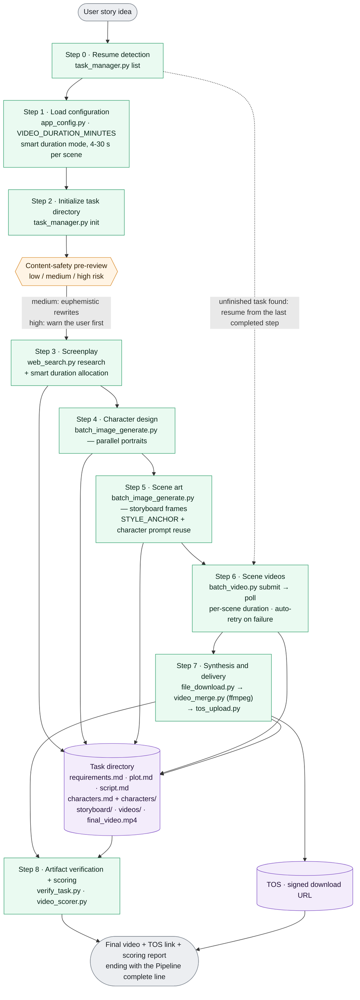
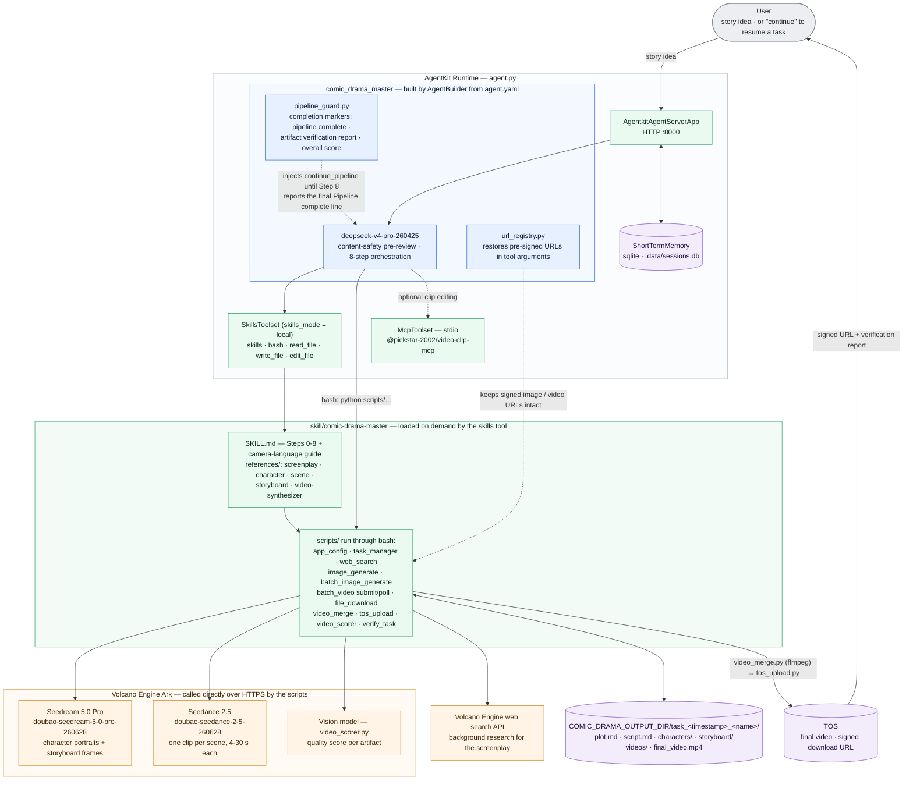

# Comic Drama Generator

**IMPORTANT**: This demo works with Python 3.12 but *not* Python 3.14. You can use a tool such as [mise](https://mise.jdx.dev/getting-started.html) to install and manage multiple Python versions.

An AI-powered comic drama production Agent built on Volcano Engine AgentKit. Simply input a story idea, and the agent will automatically complete the entire pipeline — from screenplay writing, character design, storyboard generation, scene video generation, to final video compositing — delivering a complete comic drama video with a TOS download link.

## Core Features

- **End-to-End Automation**: 8-step pipeline from creative concept to finished film, no manual intervention required
- **Intelligent Duration Allocation**: Dynamic 4~30 second allocation per scene for natural pacing
- **Professional Camera Language**: Built-in director-level camera strategies (speed ramps, 360° orbits, tracking shots, etc.)
- **Content Safety Pre-screening**: Automatic risk assessment with proactive handling of sensitive content
- **Style Consistency**: STYLE_ANCHOR maintained throughout the entire workflow with strict character prompt reuse
- **English by Default**: The agent works in English by default — its replies, the generated documents, the image and video prompts, and the dialogue the characters speak on screen. If you write to it in another language, it switches to that language for all of those outputs (and the characters speak it) so the results are easy for you to review
- **Output Verification**: Automatic file integrity checks + AI quality scoring after each step
- **Multi-Genre Support**: Mythology, martial arts, cultivation, urban, sci-fi, children's stories, and 10+ more genres
- **MCP Tool Integration**: Video editing capability via `@pickstar-2002/video-clip-mcp`
- **Checkpoint Resume**: Interrupted tasks can be resumed from the last completed step
- **Runs Unattended**: The pipeline runs from story idea to final video in a single turn. If the model ever ends a turn between steps (a text-only "moving on to Step N" reply, which would otherwise stop the run and force you to type "continue"), the runtime guard in `pipeline_guard.py` injects a `continue_pipeline` tool call so the run resumes on its own
- **Parallel Image Generation**: Character portraits and storyboard images support parallel generation for significantly improved efficiency
- **Auto-Retry on Failure**: Automatic retry on scene generation failures for higher success rates

## Production Pipeline



## System Architecture



## Quick Start

### Prerequisites

#### Node.js Environment

- Install Node.js 18+ and npm ([Node.js Installation](https://nodejs.org/en))
- Ensure the `npx` command is available in the terminal
- The MCP video tool (`@pickstar-2002/video-clip-mcp`) will be automatically started via `npx` when the agent is running — no manual installation required

#### Volcano Engine Access Credentials

Make sure you have configured an IAM user, created a new Access Key / Secret Key pair, and that you have assigned the following permissions to the user: 

- `AgentKitFullAccess` (AgentKit full access)
- `APMPlusServerFullAccess` (APMPlus full access)

In the web console, open the product search dropdown and search for "Ark" (方舟). Under "Model activation" make sure the following models are enabled: 

- **Text:** DeepSeek V4 Pro (model ID: `deepseek-v4-pro-260425`)
- **Images:** Seedream 5.0 Pro (model ID: `doubao-seedream-5-0-pro-260628`)
- **Video:** Seedance 2.5 (model ID: `doubao-seedance-2-5-260628`) — supports video clips up to 30 seconds long

**Finally, from the "API Keys" page, create a new key and save it, we'll need it later on (see *Configure Environment Variables* below).**

#### ffmpeg

Video merging (Step 7 of the pipeline) uses `ffmpeg` / `ffprobe`. Install it with your package manager, e.g.:

```bash
# macOS
brew install ffmpeg
# Debian/Ubuntu
sudo apt-get install -y ffmpeg
```

#### TOS Storage Bucket

Create a TOS storage bucket for storing generated images and video files. The default AgentKit bucket name has the form `agentkit-platform-{{your_account_id}}`.

### Install Dependencies

*We recommend using uv to manage Python dependencies*

Once uv is installed, set up with:

```bash
uv sync
```

If you are in China and have connectivity issues, you can use this command instead:

```bash
uv sync --index-url https://pypi.tuna.tsinghua.edu.cn/simple
```

### Configure Environment Variables

Two methods are supported:

#### Method 1: `.env` File (Recommended)

Copy [`.env.example`](.env.example) to `.env` in the `comic_drama_gen/` directory (or in the directory you launch from) and fill in the values:

```bash
VOLCENGINE_ACCESS_KEY=your_ak
VOLCENGINE_SECRET_KEY=your_sk
MODEL_AGENT_API_KEY=your_ark_api_key
DATABASE_TOS_BUCKET=agentkit-platform-{{your_account_id}}

# Optional
COMIC_DRAMA_OUTPUT_DIR=./my-comic-drama
VIDEO_DURATION_MINUTES=0.5
DEFAULT_VIDEO_MODEL_NAME=doubao-seedance-2-5-260628
```

> The `.env` file is loaded automatically at startup (via `python-dotenv`). Values in `.env` take precedence over variables exported in the shell; anything missing from `.env` falls back to the shell environment. The file is optional — if it does not exist, only the shell environment is used. `consts.py` looks for `.env` in the project directory first and then in the current working directory (the project-directory file wins for keys present in both).

#### Method 2: Direct Export

```bash
# Required
export VOLCENGINE_ACCESS_KEY=your_ak
export VOLCENGINE_SECRET_KEY=your_sk
export MODEL_AGENT_API_KEY=your_ark_api_key

# TOS bucket (for uploading generated videos)
export DATABASE_TOS_BUCKET=agentkit-platform-{{your_account_id}}

# Optional
export COMIC_DRAMA_OUTPUT_DIR=./my-comic-drama
export VIDEO_DURATION_MINUTES=0.5
export DEFAULT_VIDEO_MODEL_NAME=doubao-seedance-2-5-260628
```

**Environment Variables Reference:**

| Variable | Required | Default | Description |
|----------|----------|---------|-------------|
| `VOLCENGINE_ACCESS_KEY` | ✅ | — | Volcano Engine access key |
| `VOLCENGINE_SECRET_KEY` | ✅ | — | Volcano Engine secret key |
| `MODEL_AGENT_API_KEY` | ✅ | — | ModelArk API key (`ARK_API_KEY` also works — whichever is set is mirrored to the other) |
| `DATABASE_TOS_BUCKET` | ✅ | — | TOS bucket name |
| `COMIC_DRAMA_OUTPUT_DIR` | ❌ | `output/` under project dir | Output root directory |
| `VIDEO_DURATION_MINUTES` | ❌ | `0.5` | Video duration in minutes, supports 0.5/1/2/3/4 (0.5 = 30s) |
| `DEFAULT_VIDEO_MODEL_NAME` | ❌ | `doubao-seedance-2-5-260628` | Video generation model name |

## Local Execution

### Method 1: Use veadk web (Best for local test/debug)

> `veadk web` is a web service based on FastAPI for debugging Agent applications. It starts a web server that loads and runs your agent code, and provides a chat interface where you can interact with the agent and inspect its thought process, tool calls, and model input/output.

Run it from within the project directory (`comic_drama_gen`):

```bash
uv run veadk web
```

Open `http://localhost:8000` in your browser, select the `comic_drama_gen` agent, enter your story idea, and send.

### Method 2: Direct API Call (Not recommended)

```bash
uv run agent.py
# Service listens on 0.0.0.0:8000 by default
```

**Create a session:**
```bash
curl -X POST 'http://localhost:8000/apps/comic_drama_master/users/u_123/sessions/s_1' \
  -H 'Content-Type: application/json'
```

**Send a message:**
```bash
curl 'http://localhost:8000/run_sse' \
  -H 'Content-Type: application/json' \
  -d '{
    "appName": "comic_drama_master",
    "userId": "u_123",
    "sessionId": "s_1",
    "newMessage": {
      "role": "user",
      "parts": [{"text": "Sun Wukong battles Erlang Shen, Chinese anime 3D realistic style"}]
    },
    "streaming": true
  }'
```

### Example Prompts

| Genre | Example Prompt |
|-------|---------------|
| Chinese Mythology | `Sun Wukong battles Erlang Shen, Chinese anime 3D realistic style` |
| Martial Arts | `Legend of the Condor Heroes, Guo Jing vs Ouyang Feng, live-action version` |
| Cultivation | `Han Li forming his Nascent Soul in A Record of a Mortal's Journey to Immortality, 2 min video` |
| Historical | `Jing Ke's last night before assassinating the King of Qin` |
| Urban | `Office Showdown: Intern's rise to tech CEO, Japanese anime 2D style` |
| Sci-Fi | `Interstellar agents saving Earth` |
| Children's | `Little fox searching for star fragments` |

## Directory Structure

```
comic_drama_gen/
├── agent.py                # Agent entry (MCP tool registration, skill loading, session storage)
├── agent.yaml              # Agent configuration (model, system instructions)
├── consts.py               # Default constants + .env auto-loading
├── pipeline_guard.py       # Auto-continue guard: keeps the 8-step run going if the model ends a turn between steps
├── url_registry.py         # Signed-URL registry: restores TOS signed URLs the model truncated
├── .env.example            # Environment variable template (copy to .env)
├── .env                    # Environment variable config file (create from .env.example)
├── pyproject.toml          # Python project configuration
├── requirements.txt        # Dependency list
├── scripts/                # Helper scripts directory
│   └── setup.sh            # Cloud deployment build script (pre-installs video-clip-mcp)
├── img/                    # Image assets for README
└── skill/comic-drama-master/
    ├── SKILL.md             # Master director skill spec (8-step full pipeline)
    ├── examples/
    │   └── examples.md      # Complete usage examples
    ├── references/
    │   ├── character-designer.md     # Character design specification
    │   ├── scene-designer.md         # Scene art specification
    │   ├── screenplay-generator.md   # Screenplay generation specification
    │   ├── storyboard-director.md    # Storyboard direction specification
    │   └── video-synthesizer.md      # Video synthesis specification
    └── scripts/
        ├── app_config.py         # Video duration config reader
        ├── task_manager.py       # Task directory management (FIFO cleanup, max 16 tasks)
        ├── batch_video.py        # Batch video task submit/poll
        ├── batch_image_generate.py  # Batch parallel image generation
        ├── create_video_task.py  # Single video task creation
        ├── query_video_task.py   # Video task status query
        ├── image_generate.py     # Image generation (base64 direct save)
        ├── web_search.py         # Web search (for screenplay research)
        ├── video_merge.py        # ffmpeg video merging
        ├── video_scorer.py       # AI quality scoring (5 dimensions)
        ├── verify_task.py        # Output integrity verification
        ├── tos_upload.py         # TOS upload
        ├── file_download.py      # Batch file download
        └── get_aksk.py           # AK/SK credential retrieval
```

## Output Directory Structure

After each task completes, the `COMIC_DRAMA_OUTPUT_DIR` (defaults to `output/` under the project directory) will contain:

```
{COMIC_DRAMA_OUTPUT_DIR}/
└── task_20260222_143000_sun_wukong_battle/
    ├── requirements.md   # Requirements document (with web_search research summary)
    ├── plot.md           # Chapter-based plot outline (with smart duration allocation)
    ├── script.md         # Complete dialogue script (with per-second timestamps + per-chapter duration)
    ├── characters.md     # Character design (STYLE_ANCHOR + character prompts + portrait images)
    ├── cover.jpg         # Cover image
    ├── cover.md          # Cover information
    ├── final_video.md    # Final delivery document (with TOS link)
    ├── storyboard/       # Storyboards (scene_01.jpg ~ scene_NN.jpg)
    ├── characters/       # Character portraits (char_*.jpg)
    ├── videos/           # Scene videos (scene_01.mp4 ~ scene_NN.mp4, smart duration 4~30s)
    └── final/            # Composited drama (*_final.mp4)
```

## AgentKit Deployment

### Deploy to Volcano Engine AgentKit Runtime

**Step 0:** If you haven't installed agentkit yet, you can do it locally (inside the Python virtual environment) with:

```bash
uv pip install agentkit-sdk-python
```

**Step 1:** Make sure you are in the current directory (`comic_drama_gen`), then configure AgentKit:

**Note**: We assume here that `DATABASE_TOS_BUCKET` and `MODEL_AGENT_API_KEY` are defined in your environment

```bash
uv run agentkit config \
  --agent_name comic_drama_master \
  --entry_point 'agent.py' \
  --runtime_envs DATABASE_TOS_BUCKET=$DATABASE_TOS_BUCKET \
  --runtime_envs MODEL_AGENT_API_KEY=$MODEL_AGENT_API_KEY \
  --launch_type cloud
```

> **Important**: Environment variables exported in your shell are **not** uploaded to the cloud runtime automatically — only the `runtime_envs` entries in `agentkit.yaml` (plus the contents of a local `.env` file, which the deploy step merges in) reach the deployed runtime. If `MODEL_AGENT_API_KEY` is missing from `runtime_envs`, the deployed agent has no Ark API key and every image/video generation call fails with a 401. The `agent.py` startup mirrors `MODEL_AGENT_API_KEY` to `ARK_API_KEY`, so this single variable covers the LLM, image, and video calls.

**Step 2:** Modify the `agentkit.yaml` deployment configuration

> Purpose: After modification, it will pre-install video-clip-mcp during the image build phase to accelerate runtime startup.

```bash
# On Linux
sed -i 's/docker_build: {}/docker_build:\n  build_script: "scripts\/setup.sh"/' agentkit.yaml

# On macOS
sed -i '' 's/docker_build: {}/docker_build:/' agentkit.yaml && sed -i '' '/docker_build:/a\
  build_script: "scripts\/setup.sh"' agentkit.yaml
```

**Step 3:** Deploy the runtime:

```bash
uv run agentkit launch
```

### Test the Deployed Agent

After successful deployment:

1. Visit the [Volcano Engine AgentKit Console](https://console.volcengine.com/agentkit)
2. Click **Runtime** to view the deployed agent `comic_drama_master`
3. Obtain the public access domain and API Key to call via API

#### Test / Debug from the UI

You can utilize the "Online test" button from the AgentKit console to perform online testing and debugging of the freshly-deployed agent: 


#### Command-Line Debugging

Use `agentkit invoke` to initiate debugging directly:

```bash
uv run agentkit invoke '{"prompt": "Sun Wukong battles Erlang Shen, Chinese anime 3D realistic style"}'
```

#### API-Based Debugging

**Create a session:**

```bash
curl --location --request POST 'https://xxxxx.apigateway-cn-beijing.volceapi.com/apps/comic_drama_master/users/u_123/sessions/s_124' \
--header 'Content-Type: application/json' \
--header 'Authorization: <your_api_key>' \
--data ''
```

**Send a message:**

```bash
curl --location 'https://xxxxx.apigateway-cn-beijing.volceapi.com/run_sse' \
--header 'Authorization: <your_api_key>' \
--header 'Content-Type: application/json' \
--data '{
    "appName": "comic_drama_master",
    "userId": "u_123",
    "sessionId": "s_124",
    "newMessage": {
        "role": "user",
        "parts": [{
            "text": "Sun Wukong battles Erlang Shen, Chinese anime 3D realistic style"
        }]
    },
    "streaming": true
}'
```

## Cleanup / Teardown

You can remove your deployed AgentKit runtime with:

```bash
uv run agentkit destroy
```

## FAQ

**Video generation task failed (`OutputVideoSensitiveContentDetected`):**
- When the subject contains martial arts/war/violence elements, the Agent will automatically use euphemistic alternatives
- If it repeatedly fails, explicitly request "use gentle expressions" in your prompt

**`uv sync` failed:**
- Ensure Python 3.12+ is installed
- Try using a mirror: `uv sync --index-url https://pypi.tuna.tsinghua.edu.cn/simple --refresh`

**TOS upload failed:**
- Confirm that `VOLCENGINE_ACCESS_KEY`, `VOLCENGINE_SECRET_KEY`, and `DATABASE_TOS_BUCKET` are all correctly set
- Verify that the account has TOS bucket read/write permissions

**Too many task directories:**
- `task_manager.py` automatically retains the latest 16 tasks (FIFO cleanup policy)
- Use the `COMIC_DRAMA_OUTPUT_DIR` environment variable to separate test and production outputs

**`.env` file not taking effect:**
- Confirm the `.env` file is located in the `comic_drama_gen/` directory or in the directory you launch from
- `.env` values override variables set via `export`; if a value looks wrong, check for a stale entry in `.env`
- `python-dotenv` is a pinned dependency; re-run `uv sync` / `pip install -r requirements.txt` if the import fails

**`npx` command not found:**
- Install Node.js 18+ and npm
- Verify that `npx --version` runs correctly in the terminal

**MCP tool connection error:**
- Ensure the default MCP port does not conflict
- Check the Node.js process logs for detailed error messages

## Related Resources

- [AgentKit Official Documentation](https://www.volcengine.com/docs/86681/1844878)
- [TOS Object Storage](https://www.volcengine.com/product/TOS)
- [AgentKit Console](https://console.volcengine.com/agentkit)

## Code License

This project is licensed under the Apache 2.0 License

## Known issues

- Video style is not always consistent across the entire video because reference images are generated independently, which can lead to stylistic differences.
- Image and video generation will sometimes time out forcing a re-try