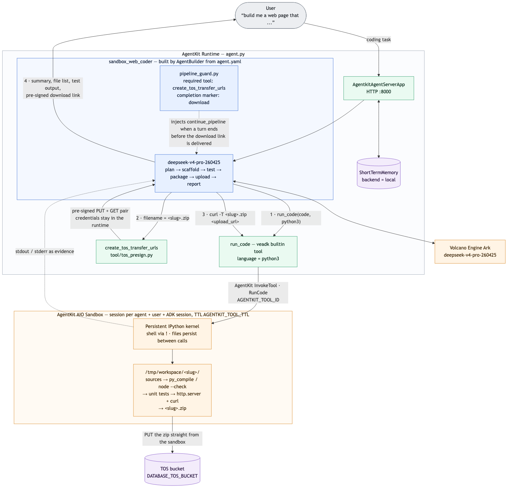

# 云端编程 Agent（AIO Sandbox 演示）

> English documentation: [README_en.md](README_en.md)

## 概述

本样例是一个基于火山引擎 AgentKit 的"云端编程 Agent"（Cloud Coding Agent），重点演示 **AgentKit AIO Sandbox**：一个安全隔离的云端执行环境，内置 shell、文件系统、Python / Node.js 运行时以及外网访问能力。

收到一个 Web 编程任务（例如"做一个带倒计时的落地页"）后，Agent 会：

- 规划项目并在 **AIO Sandbox 内**搭建脚手架（绝不在 Agent 自身运行的机器上写代码）
- 通过 shell 命令在沙箱内写入所有源码文件
- **在沙箱内真实测试代码**：语法检查、单元测试，并实际启动应用后用 `curl` 验证
- 在沙箱内将完成的项目打包为 zip
- 使用预签名 URL **直接从沙箱上传 zip 到 TOS**
- 返回一个签名的 TOS 下载链接，交付经过测试的完整代码



（架构图的 Mermaid 源码见 [README_en.md](README_en.md)）

## 核心功能

- **隔离代码执行**：所有代码都通过 veADK 内置的 `run_code` 工具在远端 AIO Sandbox 会话中编写和执行，`run_code` 底层调用 AgentKit `InvokeTool` API：shell 命令通过 `ExecBash` 操作执行，Python 代码通过 `RunCode` 操作（持久化 Python 内核）执行
- **有状态的沙箱会话**：沙箱会话在多次工具调用之间保持，Agent 可以跨多个步骤完成搭建、测试、修复与打包，并在后续对话轮次中继续迭代同一个项目
- **真实测试而非口头声明**：Agent 会在沙箱内启动 Web 服务器、用 `curl` 请求并断言响应内容，之后才宣布任务完成
- **无凭证的产物交付**：Agent 运行时生成预签名的 TOS PUT/GET URL 对，沙箱只需 `curl -T` 即可把 zip 推送到 TOS，云凭证从不进入沙箱
- **默认英文、跟随用户语言**：Agent 默认以英文规划、解释与汇报；用户使用其他语言时，所有面向用户的内容会自动切换为该语言（代码标识符、shell 命令与文件名保持不变），便于审阅（见 [`agent.yaml`](agent.yaml) 中的 `### Language` 一节）

## Agent 能力

| 组件 | 说明 |
| --- | --- |
| **Agent 服务** | [`agent.py`](agent.py) - 主程序入口 |
| **自动续跑守卫** | [`pipeline_guard.py`](pipeline_guard.py) - 保证多步流程在一个回合内跑完：若模型在请求并汇报 TOS 下载链接之前就以纯文本进度说明结束回合，守卫会注入 `continue_pipeline` 工具调用，用户无需手动输入"继续" |
| **Agent 配置** | [`agent.yaml`](agent.yaml) - 模型设置、系统提示词与工具列表 |
| **沙箱执行** | `veadk.tools.builtin_tools.run_code` - 在 AIO Sandbox 中运行 shell 命令与代码 |
| **自定义工具** | [`tool/tos_presign.py`](tool/tos_presign.py) - 预签名 TOS 上传/下载 URL 对生成器 |
| **短期记忆** | 维护会话上下文，保证多轮对话连续性 |

## 目录结构说明

```bash
sandbox_demo
├── LICENSE               # 代码许可（Apache 2.0）
├── README.md             # 中文说明文档（本文件）
├── README_en.md          # 英文说明文档
├── project.yaml          # 项目信息元数据
├── agent.py              # 主程序入口，定义 Agent 与 AgentKit 服务
├── agent.yaml            # 模型设置、系统提示词与工具列表
├── consts.py             # 默认模型名、API 地址与 .env 加载逻辑
├── pipeline_guard.py     # 自动续跑守卫回调
├── tool
│   └── tos_presign.py    # 预签名 TOS 上传/下载 URL 对生成工具
├── assets
│   └── images            # 架构图等静态资源
├── .env.example          # 环境变量示例文件
├── pyproject.toml        # 项目依赖管理文件（uv）
└── requirements.txt      # 项目依赖管理文件（pip）
```

## 本地运行

**注意**：本样例在 Python 3.12 下测试通过，仓库中其他样例可能需要不同的 Python 版本，推荐使用 [mise](https://mise.jdx.dev/getting-started.html) 管理多版本 Python。

### 前置准备

**火山引擎访问凭证**

请先配置 IAM 用户并创建 Access Key / Secret Key，同时为该用户授予以下权限：

- `AgentKitFullAccess`（AgentKit 完全访问）
- `TOSFullAccess`（TOS 完全访问，用于生成预签名 URL）

在火山引擎控制台的产品搜索中查找"方舟"（Ark），在"开通管理"页面确认以下模型已开通：

- **文本模型**：DeepSeek V4 Pro（模型 ID：`deepseek-v4-pro-260425`）

最后在方舟的 "API Key 管理" 页面创建并保存一个 API Key，后续配置环境变量时会用到。

**创建 AIO Sandbox 工具**

Agent 需要 AgentKit 账号中已存在一个 **All-in-one（AIO）沙箱工具**。可以在[火山引擎 AgentKit 控制台](https://console.volcengine.com/agentkit/region:agentkit+cn-beijing/tool)（Tools → Create → AIO Sandbox）创建，也可以通过代码创建。

工具创建后，其工具 ID（`t-...`）**必须以 `AGENTKIT_TOOL_ID` 环境变量导出**到运行 Agent 的 shell 中——`run_code` 工具在调用时通过该变量解析沙箱。下面的脚本一步完成创建工具并导出变量：

```bash
export AGENTKIT_TOOL_ID=$(uv run python - <<'EOF'
import sys
import uuid
from agentkit.sdk.tools.client import AgentkitToolsClient
from agentkit.sdk.tools import types as tt

resp = AgentkitToolsClient().create_tool(tt.CreateToolRequest(
    Name="sandbox_demo_aio",
    ToolType="All-in-one",
    Description="AIO sandbox for the sandbox_demo web coding agent",
    EnableSnapshot=True,
    AuthorizerConfiguration=tt.AuthorizerForCreateTool(
        KeyAuth=tt.AuthorizerKeyAuthForCreateTool(
            ApiKeyName=f"apikey_{uuid.uuid4().hex[:8]}",
            ApiKeyLocation="Header",
        )
    ),
))
print("Created sandbox tool:", resp.tool_id, file=sys.stderr)
# Only the tool ID goes to stdout, so the shell can capture it
print(resp.tool_id)
EOF
)
echo "AGENTKIT_TOOL_ID=$AGENTKIT_TOOL_ID"
```

`export` 只对当前 shell 会话生效——打开新终端时重新导出同一个工具 ID 即可（无需重新创建工具）。也可以把 `export AGENTKIT_TOOL_ID=t-...` 写进 shell 配置文件。

> **快照**（`EnableSnapshot=True`）：沙箱会话 TTL 到期时，AgentKit 会保存快照而不是直接销毁实例；下次访问同一会话时会从快照透明恢复。对本 Agent 而言，这意味着用户几小时后回到同一个对话，`/tmp/workspace/` 中的项目文件仍然存在。快照只能在创建工具时开启——没有更新入口，已有的非快照工具只能重建。

> **注意**：如果你已有的沙箱工具在调用时报 `SandboxCapabilityNotSupported: The current sandbox image does not support operation ExecBash`，说明该工具是用旧版沙箱镜像创建的，请按上面的方式新建一个工具。

### 依赖安装

推荐使用 `uv` 管理 Python 依赖：

```bash
uv sync
```

如果在中国大陆遇到网络问题，可以改用：

```bash
uv sync --index-url https://pypi.tuna.tsinghua.edu.cn/simple
```

### 环境准备

设置以下环境变量：可以直接在 shell 中 export，也可以将 [`.env.example`](.env.example) 复制为 `.env`（放在项目目录或启动目录）并填写。`.env` 会在启动时自动加载（见 [`consts.py`](consts.py)）且是可选的；其中的值优先于 shell 环境变量，缺失的值回退到 shell 环境。`.env` 只对本地运行生效，云端部署需通过 `agentkit config --runtime_envs ...` 传入（见下文）：

```bash
export VOLCENGINE_ACCESS_KEY={your_ak}
export VOLCENGINE_SECRET_KEY={your_sk}
export DATABASE_TOS_BUCKET=agentkit-platform-{{your_account_id}}
export MODEL_AGENT_API_KEY={{your_model_agent_api_key}} # 从火山引擎方舟（Ark）获取，本地调试必需
export AGENTKIT_TOOL_ID={{your_sandbox_tool_id}}        # 若在当前 shell 中执行过上面的创建脚本则已设置
```

**TOS 桶配置：**

- **默认桶**：`agentkit-platform-{{your_account_id}}`
  - 其中 `{{your_account_id}}` 需替换为你的火山引擎账号 ID
  - 示例：`DATABASE_TOS_BUCKET=agentkit-platform-12345678901234567890`
- **如需自定义，可修改 [`tool/tos_presign.py`](tool/tos_presign.py) 中的 `bucket_name` 参数，或在工具调用时传入。**

### 调试方法

本地调试最简单的方式是使用 `veadk web`：

> `veadk web` 是一个基于 FastAPI 的 Web 调试服务。运行后会启动一个加载了本 Agent 代码的 Web 服务器，并提供聊天界面；在界面侧边栏中可以查看 Agent 的思考过程、工具调用以及模型输入输出。

在项目目录内运行：

```bash
uv run veadk web
```

浏览器访问 `http://localhost:8000`，选择 `sandbox_demo` Agent，输入提示词并发送即可。

## AgentKit 部署

**第 0 步**：如尚未安装 agentkit CLI，可在 Python 虚拟环境中安装：

```bash
uv pip install agentkit-sdk-python
```

**第 1 步**：确认当前处于 `sandbox_demo` 目录，然后配置 AgentKit。

**注意**：下面的命令假设 `DATABASE_TOS_BUCKET`、`MODEL_AGENT_API_KEY` 与 `AGENTKIT_TOOL_ID` 已在 shell 环境中定义：

```bash
uv run agentkit config \
--agent_name sandbox_web_coder \
--entry_point 'agent.py' \
--runtime_envs DATABASE_TOS_BUCKET=$DATABASE_TOS_BUCKET \
--runtime_envs MODEL_AGENT_API_KEY=$MODEL_AGENT_API_KEY \
--runtime_envs AGENTKIT_TOOL_ID=$AGENTKIT_TOOL_ID \
--launch_type cloud
```

**第 2 步**：部署 Runtime：

```bash
uv run agentkit launch
```

部署成功后：

1. 访问[火山引擎 AgentKit 控制台](https://console.volcengine.com/agentkit/region:agentkit+cn-beijing/runtime)
2. 点击 **Runtime** 查看已部署的 `sandbox_web_coder`
3. 获取公网访问域名（形如 `https://xxxxx.apigateway-cn-beijing.volceapi.com`）与 API Key

Agent 运行时自带一个简单的 Web UI（聊天窗口），可以直接与 Agent 交互。也可以使用 `agentkit invoke` 触发 / 调试：

```bash
uv run agentkit invoke '{"prompt": "Build a single-page countdown timer that counts down to New Year 2027"}'
```

不再需要时，可以清理已部署的 Runtime：

```bash
uv run agentkit destroy
```

如需同时删除 AIO 沙箱工具：

```bash
uv run agentkit sandbox delete --tool-id {{your_sandbox_tool_id}}
```

## 示例提示词

- **静态页面**："Build a single-page countdown timer that counts down to New Year 2027"
- **小游戏**："Write a browser-based memory card matching game in plain HTML/CSS/JS"
- **API 服务**："Write a Flask JSON API for a todo list, with unit tests"
- **工具页面**："Build a markdown previewer web page with live rendering"
- **后续迭代**："Now add a dark mode toggle to it"（Agent 会复用同一个沙箱项目）

## 效果展示

Agent 的一次完整运行过程如下：

1. 复述任务并确定项目结构
2. 在 AIO Sandbox 的 `/tmp/workspace/<slug>/` 下搭建脚手架并写入所有文件
3. 运行语法检查与测试，在沙箱内启动应用并用 `curl` 验证（工具调用结果中可以看到真实的命令输出）
4. 在沙箱内打包项目，并通过预签名 URL 上传到 TOS
5. 返回签名的 TOS 下载链接，有效期 7 天

整体架构与数据流见上方架构图（`assets/images/architecture.png`）。

## 常见问题

**Agent 调用 run_code 时报 `ValueError: The environment variable AGENTKIT_TOOL_ID not exists`？**

运行 Agent 的 shell 中没有导出 `AGENTKIT_TOOL_ID`。请导出你的 AIO 沙箱工具的工具 ID（见上文"创建 AIO Sandbox 工具"）并重启 Agent。

**模型调用报 401 `AuthenticationError: The API key doesn't exist`？**

检查 shell 中是否残留了 `CLOUD_PROVIDER=byteplus`（例如运行过 BytePlus 版本样例后遗留）。该变量会让 veADK 把所有模型 Endpoint 默认切换到 BytePlus（`ark.ap-southeast.bytepluses.com`），火山引擎方舟的 API Key 在那里是无效的。本样例通过 [`consts.py`](consts.py) 显式设置 `MODEL_AGENT_API_BASE` 并刷新 veADK 配置，Agent 模型本身不受影响，但 veADK 的其他默认值（图片/视频模型、工具 Endpoint）仍会被切换——运行火山引擎系列样例前，请先执行 `unset CLOUD_PROVIDER AGENTKIT_CLOUD_PROVIDER`。

**如何查看更详细的调试日志？**

可以添加以下环境变量开启额外的调试输出：

```bash
export AGENTKIT_LOG_CONSOLE=true
export AGENTKIT_LOG_LEVEL=DEBUG
```

**第一次 run_code 调用为什么明显更慢？**

会话中的第一次 `run_code` 调用可能明显慢于后续调用，因为 AgentKit 需要按需创建全新的沙箱实例（或从快照恢复）。

**沙箱会话过期后项目文件还在吗？**

沙箱会话在 TTL 后过期（默认 30 分钟无活动，由 `AGENTKIT_TOOL_TTL` 控制）。若创建工具时开启了 `EnableSnapshot=True`（如上文配置），过期时会保存会话状态快照，下次调用时透明恢复，项目文件得以保留。如果工具创建时*没有*开启快照，过期后文件即丢失，Agent 必须重新搭建。

**沙箱是如何被使用的？**

- veADK 内置工具 [`run_code`](https://github.com/volcengine/veadk-python) 从 `AGENTKIT_TOOL_ID`（或 `AGENTKIT_TOOL_ID_SCRIPT`）解析沙箱工具 ID，并调用 AgentKit `InvokeTool` API：`language: "bash"` 时使用 `ExecBash` 操作，`language: "python3"` 时使用 `RunCode` 操作（Jupyter 内核）。
- 沙箱会话 ID 由 Agent 名 + 用户 ID + ADK 会话 ID 派生，因此每个聊天会话都有独立的沙箱会话，会话内文件在多次工具调用之间保持（会话 TTL 由 `AGENTKIT_TOOL_TTL` 控制，默认 1800 秒）。
- 沙箱有外网访问能力但没有云凭证。为了把产物取出来，[`tool/tos_presign.py`](tool/tos_presign.py) 在 Agent 侧生成预签名的 PUT/GET URL 对；沙箱用 `curl -T` 上传，用户拿到 GET 链接。

## 代码许可

本工程遵循 Apache 2.0 License
